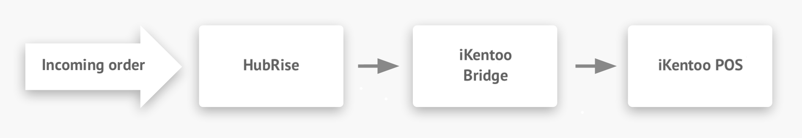

## Description

iKentoo Bridge is an app developed by HubRise that allows the communication between HubRise and the iKentoo EPOS.

iKentoo is now **Lightspeed K-Series**. For more information, read the [announcement on Lightspeed blog](https://www.lightspeedhq.co.uk/blog/lightspeed-restaurant-k-series/).

## Integration features

iKentoo connects to your HubRise account through iKentoo Bridge, an app developed by HubRise. iKentoo Bridge provides a user interface to see the requests sent to the EPOS and responses received.

Connecting iKentoo Bridge to HubRise allows iKentoo to:

- Pull orders from HubRise.
- Push paid orders into HubRise.
- Pull customer information from HubRise.
- Push customer information into HubRise.
- Push a menu into a HubRise catalog.

## Why Connect?

Connecting iKentoo to HubRise makes your EPOS and your other apps work as a cohesive whole. Synchronise your menu, your customer and order information with mobile ordering apps, ordering websites, loyalty systems, marketing or business intelligence solutions, delivery services. For more information on HubRise, see the [HubRise User Guide](/docs).

## Prerequisites

iKentoo Bridge can be connected from the HubRise back office. You will need a Lightspeed K-Series subscription to complete the connection.
