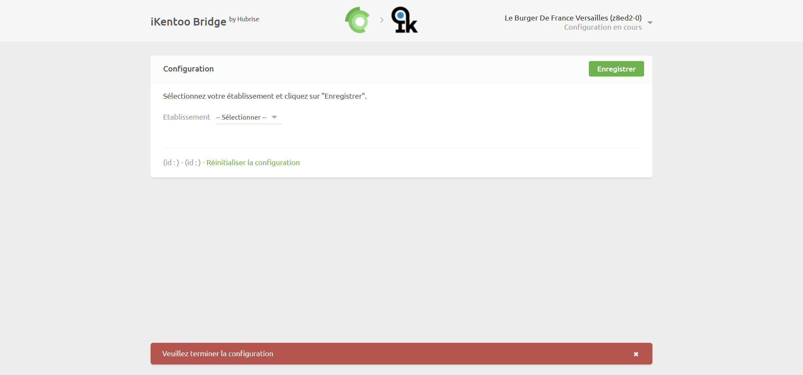
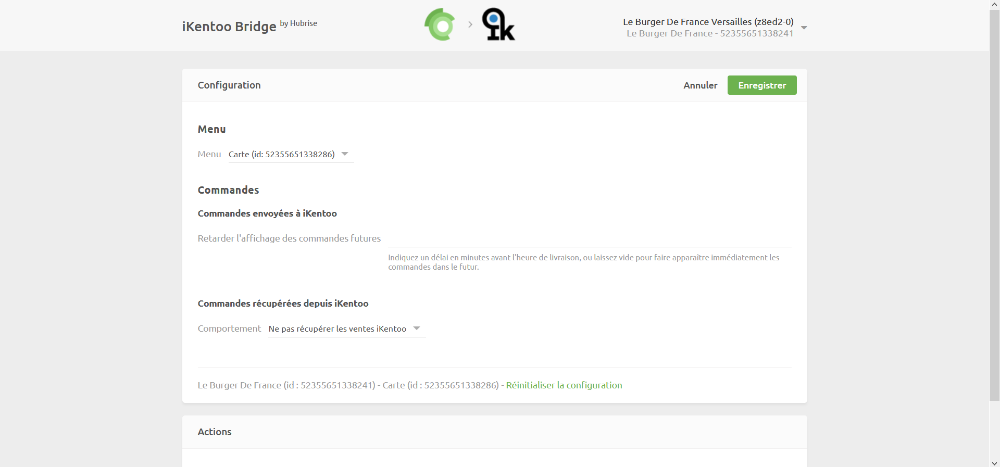

Pour profiter des fonctionnalités offertes par la nouvelle intégration avec iKentoo by Lightspeed, telles que la synchronisation de catalogue ou la remontée des commandes depuis votre caisse, vous devez mettre à jour iKentoo Bridge. Pour cela, suivez les étapes suivantes.

## Reconnexion de l'app iKentoo Bridge

1. Depuis votre espace HubRise, sélectionnez **CONNEXIONS**.

1. Dans la connexion **iKentoo Bridge**, cliquez sur **Actions** > **Déconnecter**.

1. Cliquez sur **Voir les apps disponibles**.

1. Recherchez l'app **iKentoo Bridge**, cliquez sur celle-ci puis sur **Connecter**.

1. Autorisez iKentoo Bridge à accéder à votre point de vente.

1. Cliquez sur **Connexion à iKentoo**. Si vous êtes redirigé vers votre espace Lightspeed, munissez-vous de vos identifiants et connectez-vous à votre compte Lightspeed.
   

1. Sélectionnez votre établissement et cliquez sur **Enregistrer**.
   

1. Optionnel : Si vous souhaitez synchroniser votre menu Lightspeed, sélectionnez un menu dans la section **Menu**.

1. Optionnel : Si vous souhaitez remonter les commandes Lightspeed vers HubRise, sélectionnez **Commandes récupérées depuis iKentoo** > **Comportement** > **Récupérer les ventes payées d'iKentoo**.

1. Cliquez sur **Enregistrer**.

Si vous possédez plusieurs points de vente, répétez les étapes précédentes pour chacun d'entre eux.

Pour plus d'informations, consultez les pages [Déconnecter une app](/docs/connections/#disconnect-app) (en anglais) et [Connecter une nouvelle app](/docs/connections/#connecting-a-new-app) (en anglais).