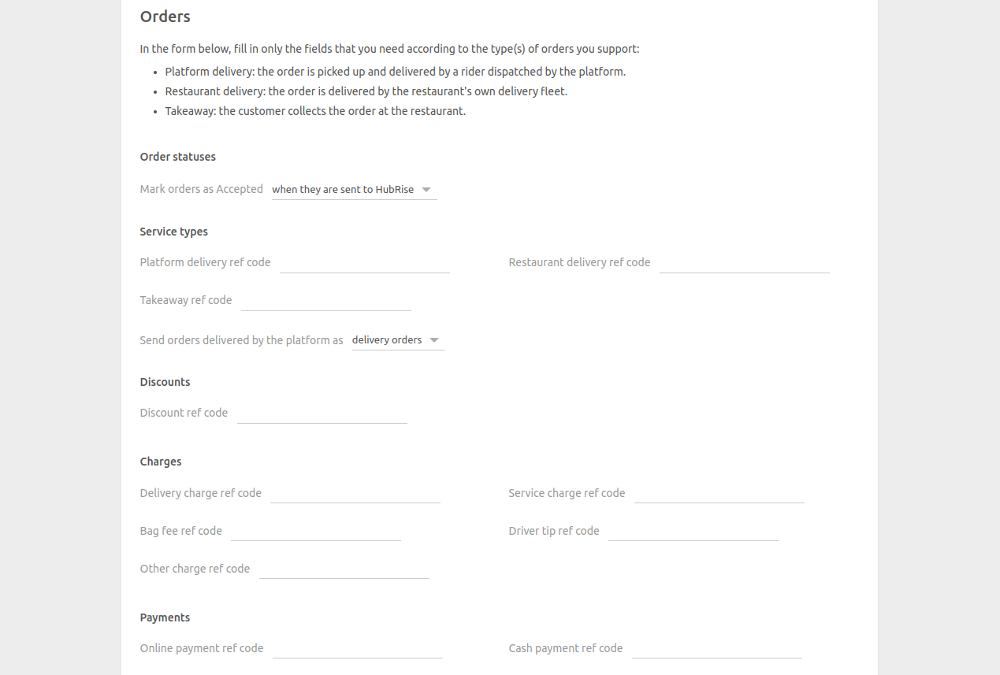
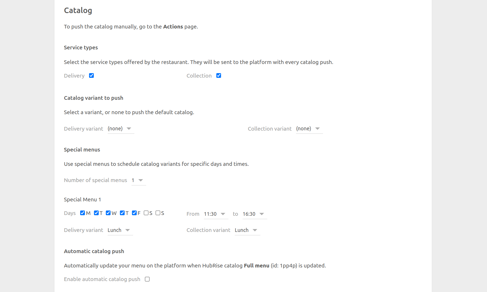
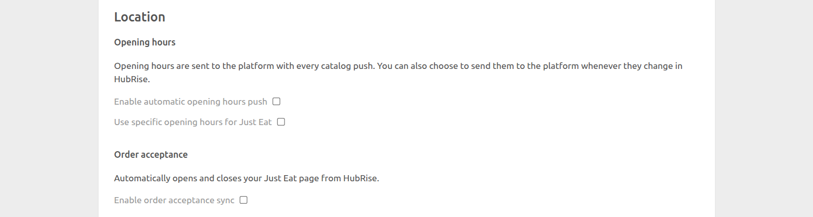
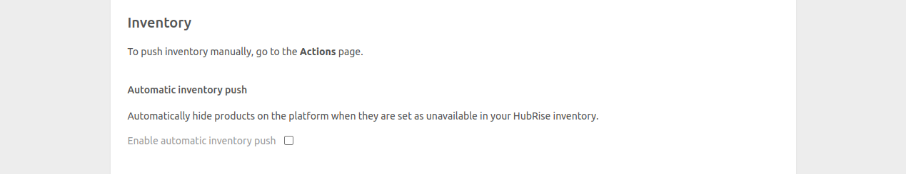

The configuration page allows you to customise the behaviour of Just Eat Flyt Bridge based on your preferences.
These are divided into different sections for an easier navigation.

## Language

Choose the language to use for generic items such as `Delivery charge`. These names may appear in your EPOS and in customer receipts.

## Orders

### Order Statuses

Just Eats requires you to acknowledge every order you receive. In this section, you can select which HubRise status sends an order confirmation back to Just Eats. Refer to your EPOS documentation on the HubRise website to verify the correct value.

### Service Types

Service types such as platform delivery, restaurant delivery or takeaway might require the corresponding ref code entry. Refer to your EPOS documentation on the HubRise website to verify.

Additionally, from this section, you can choose to categorise orders fulfilled by Just Eat as either delivery or collection orders. Orders fulfilled by the restaurant fleet are always marked as delivery orders. This feature is useful to address specific business requirements or to differentiate these orders in financial reports.

### Discounts

In this section, include the ref code associated with Just Eat discounts on your EPOS.
Refer to your EPOS documentation on the HubRise website to know how to handle discounts in your EPOS.

### Charges

If charges apply, a ref code might be required. Refer to your EPOS documentation on the HubRise website to verify.

In this section, you can specify the ref codes for the following charges:

- Delivery charge
- Service charge
- Bag fee
- Driver tip
- Other charge

### Payments

Just Eat customers can pay for their order either online or by cash for restaurant delivery orders.

This section of the configuration page allows you to specify the ref codes for these two payment methods. Refer to your EPOS documentation on the HubRise website to verify the correct codes to use.

## Customers

Enable the **Duplicate phone access code in delivery notes** option if your EPOS lacks native support for fetching phone access codes.

All EPOS systems integrated with HubRise can read delivery notes. If your EPOS has native support and this option is enabled, the code will appear duplicated. Refer to your EPOS documentation on the HubRise website to verify the correct value.

## Catalog {#catalog}

### Catalog Variant to Push

Catalog variants give you the flexibility to disable specific items or adjust prices for Just Eat.

If your catalog includes variants, you have the option to select which one to use. When **(none)** is selected, the default items along with their standard prices are used.

### Service Types

In this section, you can specify the service types that your restaurant offers, such as delivery, collection, or both. Your preferences will be sent to Just Eat on the next catalog push.

### Automatic Catalog Push

Select the **Enable automatic catalog push** checkbox to synchronise your HubRise catalog with Just Eat whenever it gets updated.

## Location

Select **Enable automatic opening hours push** to synchronise your HubRise opening hours with Just Eat. To enable this option, you must first set your opening hours in HubRise, and enable automatic catalog push.

If you use specific opening hours for Just Eat, you can set them for Just Eat only by selecting **Use specific opening hours for Just Eat**, then entering your opening hours for Delivery and Collection, depending on the service types you offer. This option will override the opening hours set in HubRise.

---

**IMPORTANT NOTE:** By default, closing times for delivery will be set half an hour earlier on the Just Eat store than the value you set on Just Eat Flyt Bridge or HubRise. Closing times for collection, however, are not modified.

---

## Inventory

Through inventory synchronisation, products and options that have a stock quantity of zero can be hidden can be hidden on your Just Eat store.

Select the **Enable automatic inventory push** checkbox to synchronise your HubRise inventory with Just Eat whenever it gets updated.

## Save the Configuration

To save the configuration, click **Save** at the top of the page.

## Reset the Configuration

If you need to reset the configuration, click **Reset the configuration** at the bottom of the page.

---

**IMPORTANT NOTE:** Resetting the configuration will instantly disconnect the bridge from Just Eat. You will need your Just Eat API keys and restaurant ID to reestablish the connection.

---

Resetting the configuration does not delete the operation logs displayed in the main page.
