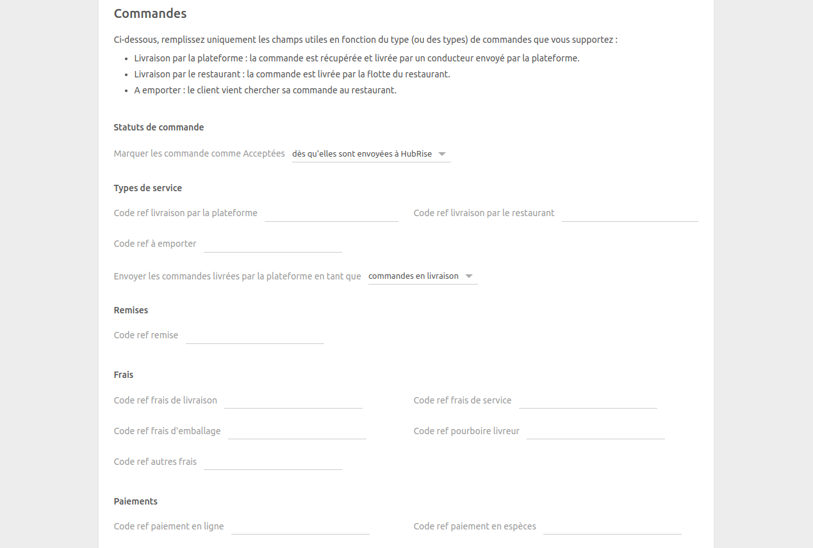
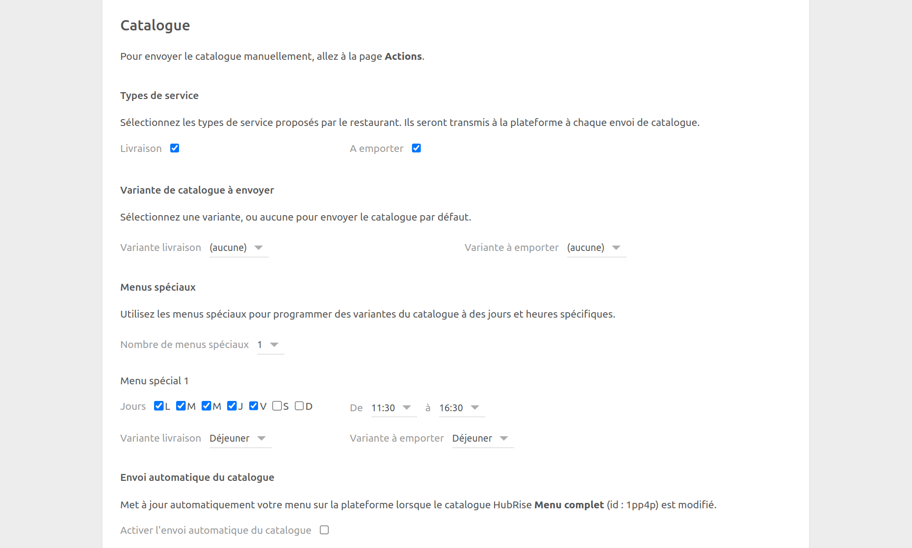
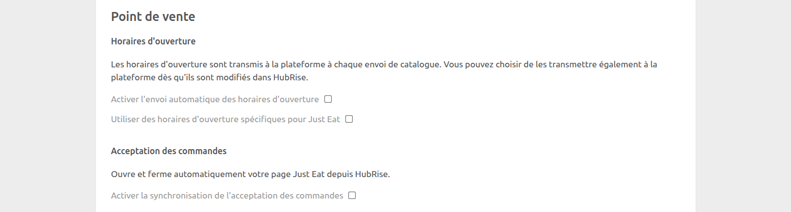
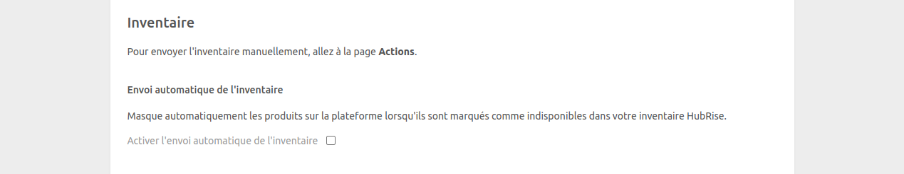

Cette page de configuration vous permet de personnaliser le comportement de Just Eat Flyt Bridge selon vos préférences.
Elle est divisée en plusieurs sections pour faciliter la navigation.

## Langue

Choisissez la langue à utiliser pour les éléments génériques tels que `Delivery charge` (Frais de livraison). Ces noms peuvent apparaître dans votre logiciel de caisse et sur les reçus des clients.

## Commandes

### Statuts de commande

Just Eat exige un accusé de réception pour chaque commande envoyée. Dans cette section, vous pouvez sélectionner le statut HubRise qui envoie l'accusé de réception à Just Eat. Reportez-vous à la documentation de votre logiciel de caisse sur le site internet de HubRise pour trouver la valeur à utiliser.

### Types de service

Les types de service tels que la livraison via la plateforme, la livraison par le restaurant ou la vente à emporter peuvent nécessiter la saisie du code ref correspondant. Pour vérifier, reportez-vous à la documentation de votre logiciel de caisse sur le site internet de HubRise.

Dans cette section, vous pouvez également choisir de marquer les commandes livrées par Just Eat comme étant en livraison ou à emporter. Les commandes livrées par le restaurant sont toujours marquées comme des commandes en livraison. Cette fonctionnalité permet de répondre à des besoins spécifiques de votre entreprise ou à différencier ces commandes dans les rapports d'activité.

### Articles spéciaux

Certains marchés comme l'Irlande exigent des consignes sur certains articles. Si votre activité l'exige, vous pouvez spécifier le code ref de la consigne dans cette section. La consigne doit d'abord être créée en tant qu'option dans votre logiciel de caisse. Une fois configurée, elle est automatiquement ajoutée à tous les articles la nécessitant.

### Remises

Dans cette section, incluez le code ref associé aux remises Just Eat dans votre logiciel de caisse.
Pour savoir comment gérer les remises dans celui-ci, reportez-vous à sa documentation sur le site internet de HubRise.

### Frais

Si des frais s'appliquent, un code ref peut être nécessaire. Pour vérifier, reportez-vous à la documentation de votre logiciel de caisse sur le site internet de HubRise.

Dans cette section, vous pouvez spécifier les codes ref relatifs aux frais suivants :

- Frais de livraison
- Frais de service
- Frais d'emballage
- Pourboire livreur
- Supplément petite commande
- Autres frais

### Paiements

Les clients Just Eat peuvent régler leur commande en ligne, ou en espèces en cas de livraison par le restaurant.

Cette section de la page de configuration permet de spécifier les codes ref pour les deux méthodes de paiement. Pour connaître les codes à utiliser, consultez la documentation de votre logiciel de caisse sur le site internet de HubRise.

## Clients

Activez l'option **Dupliquer le code d'accès téléphone dans les notes de livraison** si votre logiciel de caisse ne supporte pas nativement la récupération des codes d'accès au téléphone.

Tous les systèmes de caisse intégrés à HubRise peuvent lire les notes de livraison. Si votre logiciel de caisse présente un support natif et que cette option est activée, le code apparaîtra en double. Reportez-vous à la documentation de votre logiciel de caisse sur le site internet de HubRise pour trouver la valeur à utiliser.

## Catalogue {#catalog}

### Variante de catalogue à envoyer

Les variantes de catalogue vous donnent la flexibilité de désactiver des articles ou d'ajuster les prix spécifiquement pour Just Eat.

Si votre catalogue comprend des variantes, vous pouvez sélectionner celles que vous souhaitez utiliser. Vous pouvez choisir des variantes différentes pour les menus livraison et vente à emporter, ou utiliser la même pour les deux menus. Lorsque la valeur **(aucune)** est sélectionnée, tous les articles ainsi que leurs prix standards sont envoyés à Just Eat.

### Menus spéciaux

Les menus spéciaux vous permettent de planifier des variantes de catalogue à des jours et des heures spécifiques. Cette fonctionnalité est utile pour proposer des menus distincts pour le petit déjeuner et le déjeuner, par exemple.

Pour configurer des menus spéciaux :

1. Assurez-vous que votre catalogue contient les variantes nécessaires.
2. Sélectionnez le nombre de menus spéciaux que vous souhaitez configurer (jusqu'à 5) dans le menu déroulant.
3. Pour chaque menu spécial :

- Sélectionnez les jours de la semaine où le menu doit être actif.
- Sélectionner l'heure de début (**De**) et l'heure de fin (**A**) du menu.
- Choisissez les variantes de catalogue à utiliser pour la livraison et le retrait durant cette période.

Lorsque des menus spéciaux sont configurés, Just Eat basculera automatiquement vers la variante de catalogue appropriée en fonction de l'heure souhaitée de la commande, que ce soit pour la livraison ou le retrait.

S'il n'y a pas de menu spécial actif à un moment donné, Just Eat utilisera les variantes de catalogue par défaut configurées dans les paramètres **Variante de catalogue à envoyer** pour la livraison et la vente à emporter.

### Types de service

Dans cette section, vous pouvez spécifier les types de service que votre restaurant propose, tels que la livraison, la vente à emporter, ou les deux. Vos préférences seront envoyées à Just Eat lors du prochain envoi du catalogue.

### Envoi automatique du catalogue

Sélectionnez la case **Activer l'envoi automatique du catalogue** pour synchroniser votre catalogue HubRise avec Just Eat chaque fois qu'il est mis à jour.

## Point de vente

### Horaires d'ouverture

Sélectionnez **Activer l'envoi automatique des horaires d'ouverture** pour synchroniser vos horaires d'ouverture HubRise avec Just Eat. Pour activer cette option, vous devez d'abord définir vos horaires d'ouverture dans HubRise, puis activer l'envoi automatique du catalogue.

Si vous utilisez des horaires d'ouverture spécifiques pour Just Eat, vous pouvez les définir comme tels en sélectionnant **Utiliser des horaires d'ouverture spécifiques pour Just Eat**, puis en saisissant vos horaires d'ouverture pour la livraison et la vente à emporter, en fonction des types de service que vous proposez. Cette option remplacera les horaires définis dans HubRise.

---

**REMARQUE IMPORTANTE :** Par défaut, les heures de fermeture pour la livraison sont définies une demi-heure plus tôt sur le restaurant Just Eat par rapport à la valeur que vous avez spécifiée dans Just Eat Flyt Bridge ou HubRise. Les heures de fermeture pour la vente à emporter, en revanche, restent inchangées.

---

### Acceptation des commandes

Sélectionnez **Activer l'acceptation des commandes** pour synchroniser la disponibilité de votre magasin Just Eat avec HubRise.

Lorsque cette option est activée, vous pouvez mettre en pause et réactiver votre magasin Just Eat depuis votre logiciel de caisse ou d'autres applications connectées.

---

**REMARQUE IMPORTANTE :** La synchronisation de l'acceptation des commandes n'est disponible que dans certains pays, notamment l'Australie, l'Espagne, le Royaume-Uni, l'Irlande et l'Italie.

---

## Inventaire

Grâce à la synchronisation de l'inventaire, les produits et options dont la quantité en stock est nulle peuvent être masqués sur votre restaurant Just Eat.

Sélectionnez la case **Activer l'envoi automatique de l'inventaire** pour synchroniser votre inventaire HubRise avec Just Eat chaque fois qu'il est mis à jour.

## Enregistrer la configuration

Pour enregistrer la configuration, cliquez sur **Enregistrer** en haut de la page.

## Réinitialiser la configuration

Si vous avez besoin de réinitialiser la configuration, cliquez sur **Réinitialiser la configuration** en bas de la page.

---

**REMARQUE IMPORTANTE :** La réinitialisation de la configuration déconnecte instantanément le bridge de Just Eat. Vous aurez besoin de vos clés d'API Just Eat et de votre identifiant de restaurant pour rétablir la connexion.

---

La réinitialisation de la configuration ne supprime pas les logs des opérations affichés sur la page principale.
