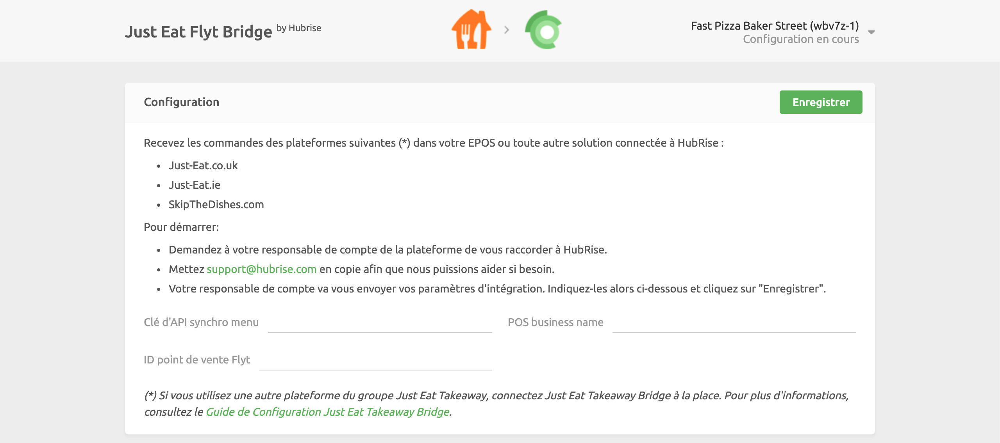

La connexion de Just Eat à HubRise s'effectue en quelques étapes.

---

**REMARQUE IMPORTANTE :** Si vous ne possédez pas encore de compte HubRise, rendez-vous sur la [page d'inscription à HubRise](https://manager.hubrise.com/signup). L'inscription ne prend qu'une minute !

---

## 1. Activez HubRise sur Just Eat Flyt

Pour commencer, l'équipe d'intégration Just Eat doit activer l'intégration de l'API HubRise pour vos restaurants.

Contactez-nous par e-mail à l'adresse support@hubrise.com en précisant les informations suivantes :

- Le lien URL renvoyant à la page de votre restaurant sur le site internet de Just Eat. Par exemple : https://www.just-eat.ie/restaurants-saba-to-go-rathmines.
- Indiquez si l'acceptation automatique doit être activée (`Activated`) ou désactivée (`Deactivated`). Pour plus d'informations, voir [Pourquoi activer l'acceptation automatique sur Just Eat ?](/apps/just-eat-flyt/faqs/auto-accept)
- Indiquez si votre restaurant Just Eat est déjà connecté à un autre middleware ou logiciel de caisse.
- Le nom et l'identifiant de votre point de vente HubRise. Par exemple : `Sushi My! Paris Étoile z6q31-0`.

Avec ces informations, nous demanderons à l'équipe d'intégration Just Eat d'activer la connexion HubRise pour votre restaurant.

## 2. Connectez Just Eat Flyt Bridge

Pour connecter Just Eat Flyt Bridge à HubRise, procédez comme suit :

1. Connectez-vous à votre [compte HubRise](https://manager.hubrise.com).
2. Dans le menu déroulant, sélectionnez le point de vente que vous souhaitez connecter.
3. Sélectionnez **CONNEXIONS**, puis **Voir les apps disponibles**.
4. Sélectionnez **Just Eat Flyt Bridge** dans la liste des applications.
5. Cliquez sur **Connecter**.
6. Cliquez sur **Autoriser** pour donner à Just Eat Flyt Bridge la permission d'accéder au point de vente enregistré sur HubRise. Si votre compte possède plusieurs points de vente, développez **Choisissez le point de vente**, sélectionnez le point de vente à connecter, puis cliquez sur **Autoriser**.
7. Sur la page qui s'affiche, vous êtes invité à fournir vos informations d'identification :
   - **Menu API key** (Clé d'API menu) : clé d'API utilisée par HubRise pour importer le menu
   - **Order API key** (Clé d'API commande) : clé d'API utilisée par HubRise pour recevoir et mettre à jour les commandes
   - **Restaurant ID** (ID restaurant) : votre identifiant unique de magasin.
     HubRise fournira les identifiants ci-dessus. Copiez et collez-les dans les champs correspondants, puis cliquez sur **Enregistrer** pour terminer le processus de connexion.

## 3. Configurez vos préférences

Une fois la connexion du bridge effectuée, vous devez renseigner quelques paramètres sur la page **Configuration** afin que les commandes soient transmises correctement à votre logiciel de caisse.

Pour plus d'informations sur la page Configuration et la manière d'y accéder, voir la [page Configuration](/apps/just-eat-flyt/user-interface#configuration). Pour plus de détails sur la configuration des paramètres de Just Eat Flyt Bridge, voir [Configuration](/apps/just-eat-flyt/configuration).

## 4. Envoyez votre menu

Pour que l'intégration de Just Eat Flyt soit activée, vous devez envoyer votre catalogue HubRise dans Just Eat Flyt.

Pour savoir comment envoyer votre catalogue HubRise dans Just Eat, voir [Envoyer le catalogue](/apps/just-eat-flyt/push-catalog). Pour plus d'informations sur les catalogues HubRise, voir [Catalogues](/docs/catalog).
