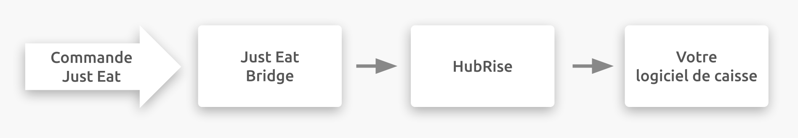

## Description

Just Eat est une plateforme de commande et de livraison de repas en ligne destinée aux restaurants et aux commerces de proximité. Les clients commandent en ligne ou via une application mobile. Le siège de Just Eat est situé au Royaume-Uni, mais l'entreprise est présente dans 13 pays en Europe, en Asie, en Amérique et en Océanie.

Flyt est la plateforme d'intégration utilisée pour connecter les sites internet de commande et de livraison de repas exploités par Just Eat Takeaway.com sur certains marchés. Flyt a récemment changé de raison sociale pour devenir JET Connect.

Au Royaume-Uni, en Irlande et au Canada, Just Eat se connecte à votre compte HubRise via l'application Just Eat Flyt Bridge développée par HubRise.

## Plateformes disponibles

Flyt est disponible sur les plateformes Just Eat suivantes :

- Just-Eat.co.uk
- Just-Eat.es
- Just-Eat.ie
- Just-Eat.it
- Menulog.com.au
- SkipTheDishes.com

---

**REMARQUE IMPORTANTE :** Pour connecter un restaurant sur un marché Just Eat différent, vous devez passer par l'application [Just Eat Takeaway Bridge](/apps/just-eat-takeaway/overview).

---

Flyt offre davantage de fonctionnalités que l'ancienne plateforme d'intégration Just Eat Takeaway. Elle permet d'envoyer un menu dans Just Eat ou de configurer l'acceptation automatique.

Si vous exercez votre activité sur un marché non desservi par Flyt, vous pouvez connecter votre restaurant via Flyt à condition que l'équipe Flyt approuve la connexion. Elle étudie les situations au cas par cas, en fonction de sa capacité interne. Les enseignes indépendantes peuvent être connectées, mais les chaînes et franchises sont prioritaires. En revanche, la disponibilité de toutes les fonctions d'intégration n'est pas garantie, selon le marché concerné. Pour plus d'informations, contactez HubRise à l'adresse support@hubrise.com.

## Fonctionnalités de l'intégration

La connexion avec Just Eat Flyt Bridge vous permet de :

- Recevoir les commandes de Just Eat, dont le statut de commande.
- Recevoir les informations clients de Just Eat, pour les commandes livrées par le restaurant.
- Envoyer un catalogue vers Just Eat, avec support des variantes.
- Synchroniser l'inventaire avec HubRise.

---

**REMARQUE IMPORTANTE :** La tablette Just Eat Orderpad doit rester allumée pour recevoir les commandes dans HubRise. Sur certains marchés, l'acceptation automatique peut être activée.  Pour plus d'informations, voir [Puis-je désactiver la tablette ?](/apps/just-eat-flyt/faqs/turn-off-orderpad)

---

Just Eat Flyt Bridge peut être connecté à HubRise depuis le back-office de HubRise.

## Pourquoi se connecter ?

Le fait de connecter votre restaurant ou votre commerce de proximité Just Eat à HubRise permet de recevoir vos commandes Just Eat directement dans votre logiciel de caisse, sur votre écran cuisine ou dans votre système de gestion de livreurs également connecté à HubRise.
Vous pouvez ainsi gérer les commandes Just Eat parallèlement à vos autres commandes, en utilisant vos outils habituels. Les commandes Just Eat transiteront par votre installation existante, comme vos autres commandes.

Grâce à HubRise, synchronisez votre menu, vos informations clients et vos commandes avec votre logiciel de caisse, les plateformes de livraison de repas (dont Deliveroo, Uber Eats et Just Eat), les solutions de gestion de livreurs ou de services de livraison, les solutions d'e-marketing (SMS/e-mailing) et de business intelligence, les systèmes de gestion de stock et de fidélisation client, et bien d'autres encore. Le nombre d'applications compatibles augmente chaque mois. Pour voir les applications que vous pouvez connecter, consultez notre [page Apps](/apps).

## Prérequis

Pour établir une connexion entre Just Eat et HubRise via Just Eat Flyt Bridge, vous devez être partenaire Just Eat au sein d'un des marchés mentionnés précédemment, ou Just Eat doit avoir approuvé la connexion de votre enseigne via Flyt.
