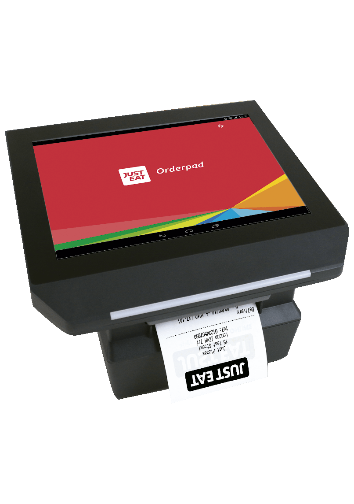
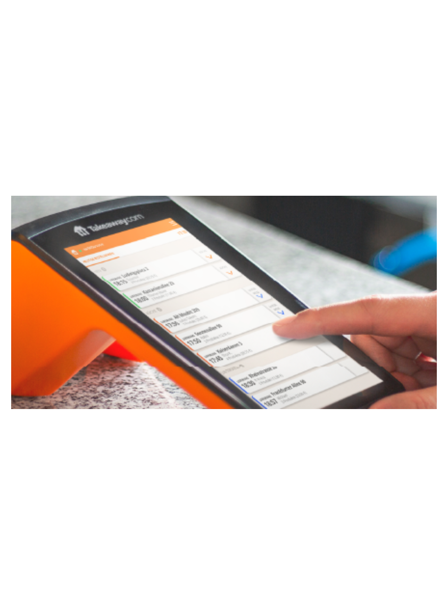
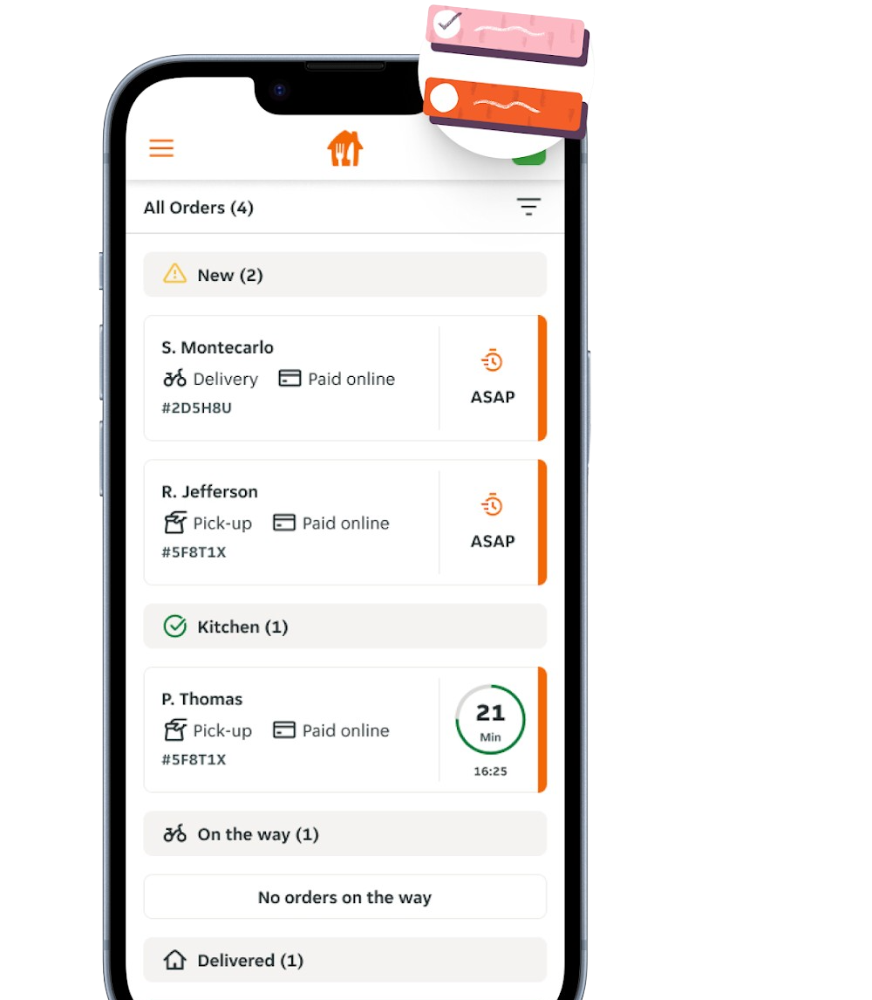

## Just Eat Takeaway Terms

The following table explains the terms that are specific to Just Eat Takeaway.

| Term        | Description                                                                                |
|-------------|--------------------------------------------------------------------------------------------|
| Orderpad    | A device with a touch screen and a built-in printer. Phased out and replaced by T-Connect. |
| T-Connect   | A portable device, with a printer and display.                                             |
| Live Orders | Application used to manage orders on your own smartphone or tablet.                        |

## Orderpad, T-Connect and Live Orders

If you are not sure which device you use, check the following pictures:

| Orderpad                                                  | T-Connect                                   | Live Orders                                                                                                                              |
|-----------------------------------------------------------|---------------------------------------------|------------------------------------------------------------------------------------------------------------------------------------------|
|                    |    |                                                                                          |
| The Orderpad is a legacy device, still used in some markets. | The T-Connect is a more recent, smaller device. | Live Orders is an application that you can download from the Apple App Store or Google Play, used to manage orders from your own device. |

