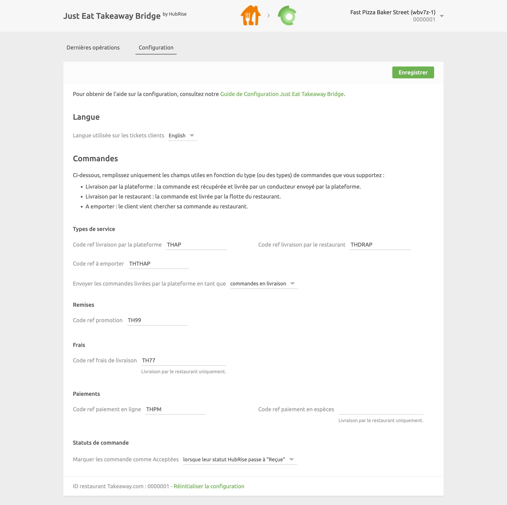

La page de configuration vous permet de personnaliser le comportement de Just Eat Takeway Bridge selon vos préférences.
Elle est divisée en plusieurs sections pour faciliter la navigation.

## Langue

Choisissez la langue à utiliser pour les éléments génériques tels que `Delivery charge` (Frais de livraison). Ces noms peuvent apparaître dans votre logiciel de caisse et sur les reçus des clients.

## Types de service

Les types de service tels que la livraison via la plateforme, la livraison par le restaurant ou la vente à emporter peuvent nécessiter la saisie du code ref correspondant. Pour le vérifier, reportez-vous à la documentation de votre logiciel de caisse sur le site internet de HubRise.

De plus, dans cette section, vous pouvez choisir de marquer les commandes livrées par Just Eat comme étant en livraison ou à emporter. Les commandes livrées par le restaurant sont toujours marquées comme des commandes en livraison. Cette fonctionnalité permet de répondre à des besoins spécifiques de votre entreprise ou à différencier ces commandes dans les rapports d'activité.

## Remises

Cette section permet de spécifier le code ref de la remise appliquée à vos produits, dans le cas où vous auriez une remise active sur votre point de vente Just Eat Takeaway. Pour obtenir le code ref correspondant, reportez-vous à la documentation de votre logiciel de caisse sur le site internet de HubRise.

## Frais

Si des frais s'appliquent, un code ref peut être nécessaire. Pour le vérifier, reportez-vous à la documentation de votre logiciel de caisse sur le site internet de HubRise.

Dans cette section, vous pouvez spécifier le code ref des frais de livraison et frais de service appliqués par la plateforme de livraison.

## Paiements

Les clients Just Eat Takeaway peuvent régler leur commande en ligne ou en espèces lorsque le restaurant prend en charge la livraison.

Cette section de la page de configuration permet de spécifier les codes ref pour les deux types de paiement. Pour connaître les codes à utiliser, consultez la documentation de votre logiciel de caisse sur la [page Apps](/apps).

## Statuts de commande

Just Eat Takeaway vous demande de marquer chaque commande réussie comme `confirmée`. Cette section vous permet de sélectionner le changement de statut HubRise utilisé pour envoyer la confirmation à Just Eat Takeaway.

## Enregistrer la configuration

Pour enregistrer la configuration, cliquez sur **Enregistrer** en haut de la page.

## Réinitialiser la configuration

Si vous avez besoin de réinitialiser la configuration, cliquez sur **Réinitialiser la configuration** en bas de la page.

---

**REMARQUE IMPORTANTE :** La réinitialisation de la configuration effacera également vos paramètres d'intégration. Pour continuer à recevoir les commandes Just Eat Takeaway, vous devrez les saisir à nouveau.

---

La réinitialisation de la configuration ne supprime pas les logs des opérations affichés sur la page principale.
