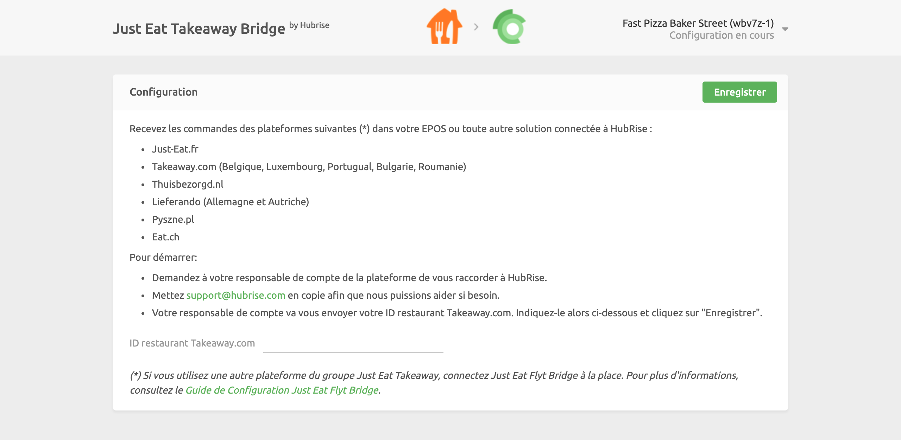

La connexion de Just Eat Takeaway à HubRise s'effectue en quelques étapes seulement.

---

**REMARQUE IMPORTANTE :** Si vous ne possédez pas encore de compte HubRise, rendez-vous sur la [page d'inscription à HubRise](https://manager.hubrise.com/signup). L'inscription ne prend qu'une minute !

---

## 1. Activez HubRise sur Just Eat Takeaway

Pour commencer, l'équipe d'assistance de Just Eat Takeaway doit activer l’intégration HubRise pour vos restaurants.

Contactez-nous par e-mail à l'adresse support@hubrise.com en précisant les informations suivantes :

- Le lien URL renvoyant à la page de votre restaurant sur le site internet de Just Eat. Par exemple : https://www.just-eat.ie/restaurants-saba-to-go-rathmines/.
- Indiquez si votre restaurant Just Eat est déjà connecté à un logiciel de caisse ou un autre middleware.
- Le nom et l'identifiant de votre point de vente HubRise. Par exemple : `Fast Pizza Baker Street z6q31-0`.

Avec ces informations à disposition, nous demanderons à l'équipe d'assistance de Just Eat Takeaway d'activer la connexion HubRise pour votre restaurant et de fournir l'ID Just Eat Takeaway, par exemple: `8736550`.

## 2. Associez les codes ref des produits dans Just Eat

La plupart des applications ont besoin des codes ref des produits pour que les commandes soient correctement traitées. Vous pouvez soit saisir les codes ref des produits manuellement dans le back-office de Just Eat Takeaway, soit confier cette tâche à leur équipe d'assistance.

Pour plus d'informations, voir [Associer les codes ref](/apps/just-eat-takeaway/map-ref-codes).

## 3. Connectez Just Eat Takeaway Bridge

Pour connecter Just Eat Takeaway Bridge à HubRise, procédez comme suit :

1. Connectez-vous à votre [compte HubRise](https://manager.hubrise.com).
2. Dans le menu déroulant, sélectionnez le point de vente que vous souhaitez connecter.
3. Sélectionnez **CONNEXIONS**, puis **Voir les apps disponibles**.
4. Sélectionnez **Just Eat Takeaway Bridge** dans la liste des applications.
5. Cliquez sur **Connecter**.
6. Cliquez sur **Autoriser** pour autoriser Just Eat Takeaway Bridge à accéder à votre point de vente enregistré sur HubRise. Si votre compte possède plusieurs points de vente, développez **Choisissez le point de vente**, sélectionnez le point de vente à connecter, puis cliquez sur **Autoriser**.
7. Dans une nouvelle page qui s'affiche, vous êtes invité à indiquer l'ID restaurant Just Eat Takeaway fourni par l'équipe d'assistance Just Eat Takeaway. Saisissez l'identifiant, puis cliquez sur **Enregistrer** pour terminer le processus de connexion.

## 4. Configurez vos préférences

Une fois la connexion du bridge effectuée, vous devez renseigner quelques paramètres sur la page **Configuration** afin que les commandes soient transmises correctement à votre logiciel de caisse.

Pour plus d'informations sur la page Configuration et la manière d'y accéder, voir [Page de configuration](/apps/just-eat-takeaway/user-interface#configuration) dans la rubrique Interface utilisateur. Pour plus de détails sur la configuration des paramètres de Just Eat Takeaway Bridge, voir [Configuration](/apps/just-eat-takeaway/configuration).
