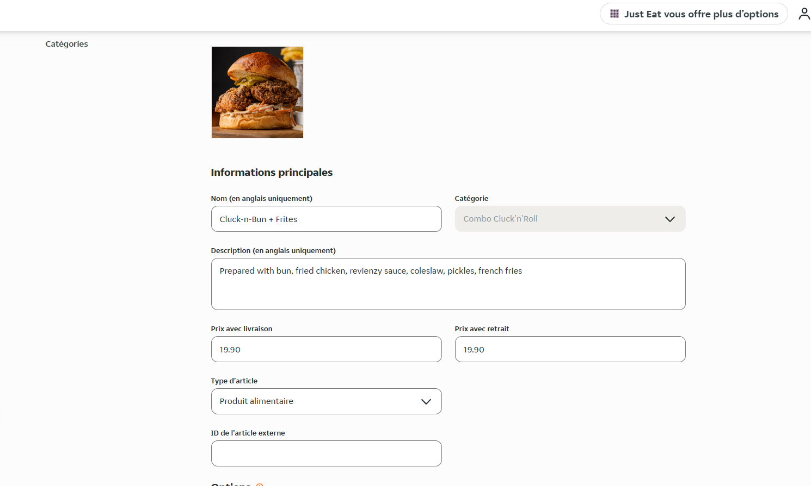

Pour traiter correctement les commandes, la plupart des logiciels de caisse exigent un code ref pour chaque produit. Lorsque vous créez votre menu sur Just Eat Takeaway, vous devez donc vous assurer que chaque produit est associé à un code ref correct.

Pour attribuer des codes ref à vos produits, veuillez contacter votre gestionnaire de compte Just Eat Takeaway en lui adressant la liste des produits et des codes ref que vous trouverez dans votre logiciel de caisse.

Vous pouvez également associer les codes ref de façon autonome à partir du back-office Just Eat Takeaway. Accédez à l'onglet **Menu**, puis ouvrez un article et indiquez les codes ref dans le champ **ID de l'article externe**. La capture d'écran suivante montre comment saisir les codes ref dans le back-office. L'interface peut varier légèrement en fonction de votre plateforme locale Just Eat Takeaway.

