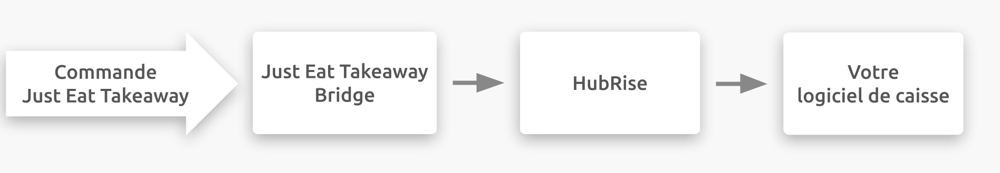

## Description

Just Eat Takeaway.com est une plateforme de commande en ligne et de livraison de repas destinée aux restaurants et aux commerces de proximité. Les clients commandent en ligne ou via une application mobile. L'équipe d'assistance à l'intégration est basée aux Pays-Bas, mais elle opère dans 21 pays différents en Europe, en Asie, en Amérique et en Océanie.

Just Eat Takeaway.com se connecte à votre compte HubRise via l'application Just Eat Takeaway Bridge développée par HubRise.

## Plateformes disponibles

Just Eat Takeaway Bridge vous permet de connecter les plateformes suivantes à HubRise :

- Just-Eat.ch
- Just-Eat.fr
- Takeaway.com (Belgique, Luxembourg, Portugual, Bulgarie, Roumanie)
- Thuisbezorgd.nl
- Lieferando (Allemagne, Autriche)
- Pyszne.pl
- Vietnammm.com

---

**REMARQUE IMPORTANTE :** Pour connecter un restaurant à une autre plateforme Just Eat Takeaway.com, vous devez passer par l'application [Just Eat Flyt Bridge](/apps/just-eat-flyt/overview).

---

## Fonctionnalités de l'intégration

La connexion de Just Eat Takeaway Bridge permet à HubRise de :

- Recevoir les commandes de Just Eat, dont le statut de commande.
- Recevoir les informations de livraison de Just Eat, pour les commandes livrées par le restaurant.

Just Eat Takeaway Bridge peut être connecté à HubRise depuis le back-office de HubRise.

## Pourquoi se connecter ?

Le fait de connecter votre magasin ou votre restaurant en ligne Just Eat Takeaway à HubRise permet de recevoir vos commandes Just Eat Takeaway directement dans votre logiciel de caisse, sur votre écran cuisine ou dans votre solution de gestion de livreurs également connectée à HubRise. Vous pouvez ainsi gérer les commandes Just Eat Takeaway parallèlement à vos autres commandes, en utilisant vos outils habituels. Elles transiteront par votre installation existante, comme vos autres commandes.

Grâce à HubRise, synchronisez votre menu, vos informations clients et vos commandes avec votre logiciel de caisse, de commande en ligne, les plateformes de livraison de repas (dont Deliveroo, Uber Eats et Just Eat), les solutions de gestion de livreurs ou de services de livraison, les solutions d'e-marketing (SMS/e-mailing) et de business intelligence, les systèmes de gestion de stock et de fidélisation client, et bien d'autres encore. Le nombre d'applications compatibles augmente chaque mois. Pour voir les applications que vous pouvez connecter, consultez notre [page Apps](/apps).

## Prérequis

Pour permettre la connexion entre Just Eat Takeaway et HubRise, votre restaurant doit être partenaire de Just Eat Takeaway.
