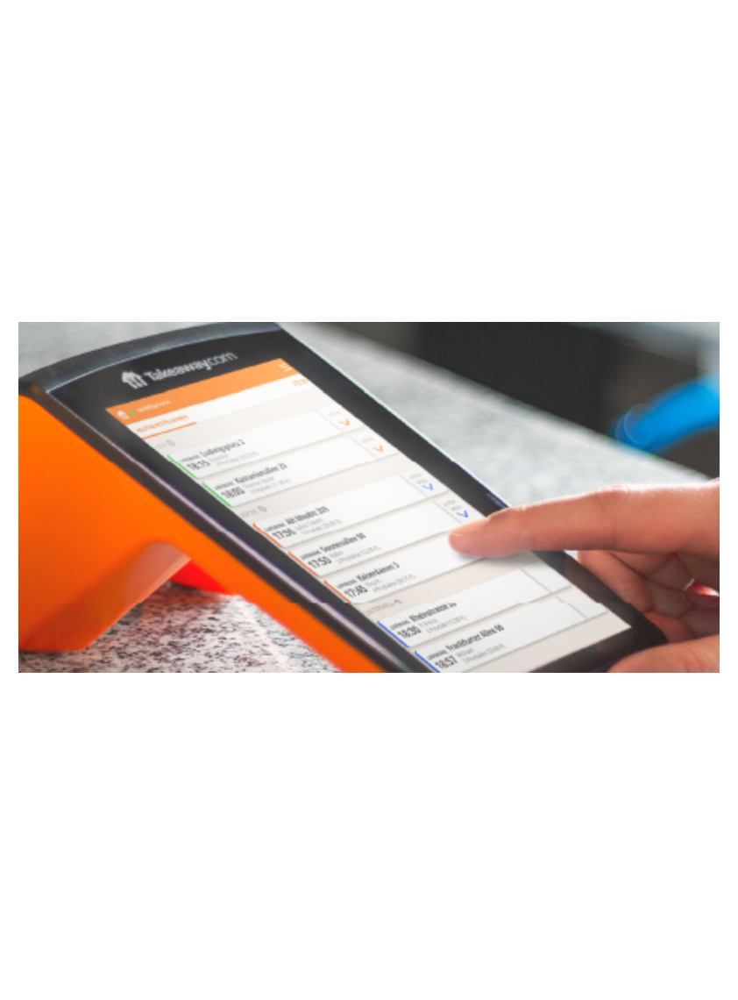
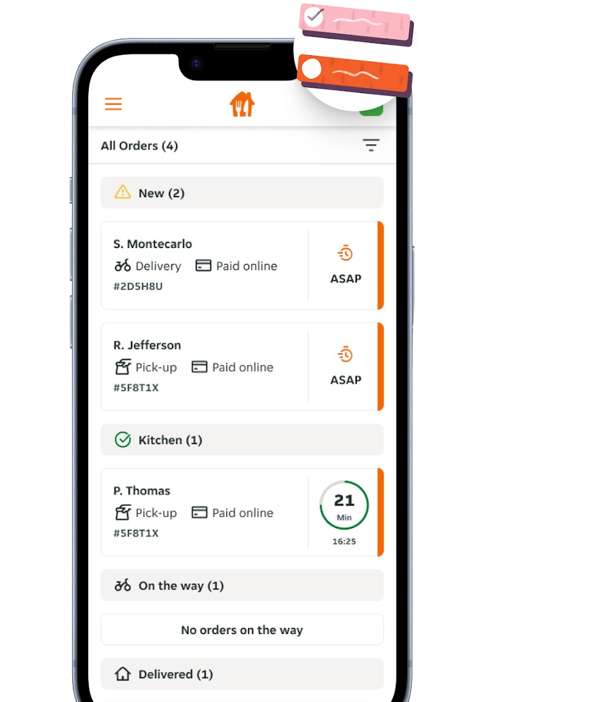

## Terminologie dans Just Eat Takeaway

Le tableau suivant explique les termes spécifiques à Just Eat Takeaway.

| Terme       | Description                                                                                                                                     |
| ----------- | ----------------------------------------------------------------------------------------------------------------------------------------------- |
| Orderpad    | Appareil avec un écran tactile et une imprimante intégrée. Progressivement abandonné et remplacé par T-Connect. |
| T-Connect   | Appareil portable doté d'une imprimante et d'un écran.                                                                          |
| Live Orders | Application de gestion de commandes sur votre smartphone ou tablette. Utilisée comme solution de sauvegarde.    |

## Orderpad, T-Connect et Live Orders

Si vous ne savez pas quel appareil vous utilisez, consultez les images suivantes :

| Orderpad                                                                              | T-Connect                                                            | Live Orders                                                                                                                                                            |
| ------------------------------------------------------------------------------------- | -------------------------------------------------------------------- | ---------------------------------------------------------------------------------------------------------------------------------------------------------------------- |
|                                                |                             |                                                                                                                        |
| Orderpad est un appareil ancien, encore utilisé sur certains marchés. | T-Connect est un appareil plus récent et plus petit. | Live Orders est une application disponible sur l'App Store d'Apple ou sur Google Play, utilisée pour gérer les commandes depuis votre propre appareil. |
