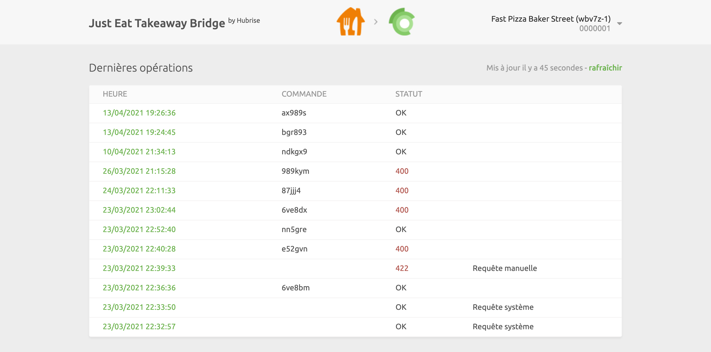
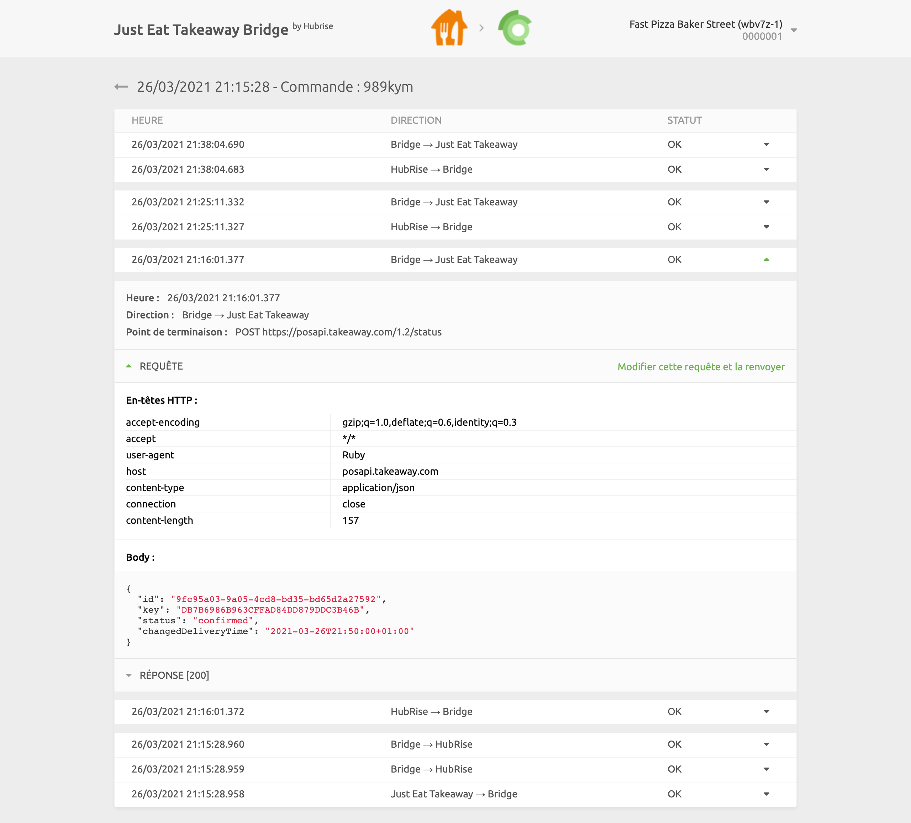
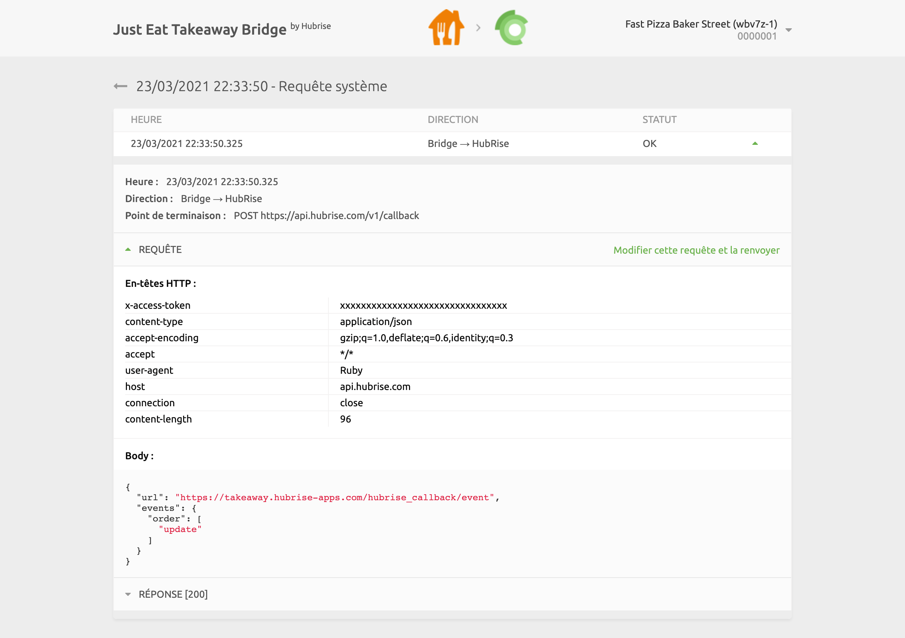

Dans Just Eat Takeaway Bridge, vous pouvez consulter les logs de toutes les opérations entre HubRise et Just Eat, et accéder à la page de configuration de l'intégration.

## Dernières opérations

Il s'agit de la page qui s'affiche lorsque vous ouvrez Just Eat Takeaway Bridge. Elle contient les dernières opérations d'API échangées entre HubRise, PrestaShop et Just Eat Takeaway Bridge.

Ces opérations peuvent soit être liées à une commande spécifique, soit être des requêtes système génériques exécutées par Just Eat Takeaway Bridge.

Chaque ligne de la page affiche les informations relatives à une opération :

- **HEURE** : date et heure de la commande
- **COMMANDE** : identifiant HubRise de la commande, pour les opérations de commande
- **DESCRIPTION** : description facultative pour les opérations qui ne sont pas liées à une commande spécifique. Cette colonne peut être vide, ou afficher `Requête système` ou `Envoi catalogue`.
- **STATUT** : statut de la commande. La valeur `OK` indique que la commande a bien été envoyée. Dans le cas contraire, un code d'erreur s'affiche en rouge.

Le libellé **Requête système** indique que l'opération n'est pas liée à une commande spécifique.

Cliquez sur une ligne pour afficher une page avec les logs associés à l'opération.

### Opération de commande

Sélectionnez une opération de commande dans la liste de la page principale pour afficher tous les logs des requêtes d'API échangées entre HubRise et Just Eat via Just Eat Takeaway Bridge.

Les requêtes sont classées par ordre chronologique inverse, et celles liées au même événement de commande (commande reçue, commande annulée, etc.) sont regroupées.

Dans les logs, chaque ligne contient les informations suivantes :

- **Heure** : date et heure d'envoi de la requête
- **Direction** : applications qui envoient et reçoivent la requête, selon le format Origine → Destination
- **Point de terminaison** : statut de la requête. La valeur `OK` indique que la requête a bien été reçue. Dans le cas contraire, un message précise le type d'erreur survenue.

Cliquez sur une requête pour la développer et afficher le détail des échanges.

Les logs constituent un puissant outil de débogage en cas d'incident. Pour comprendre comment les lire, voir [Comprendre les logs HubRise](/docs/hubrise-logs/overview).

### Opération de requête système

Une page de requête système est présentée de la même manière qu'une page de commande.

Les requêtes système sont généralement envoyées par Just Eat Takeaway Bridge pour informer HubRise d'une modification de la configuration ou pour récupérer les informations les plus récentes. À titre d'exemple, l'image suivante illustre une requête de mise à jour du callback de Just Eat Takeaway Bridge après un changement de configuration.

Les pages de requête système fournissent des informations de débogage utiles aux équipes d'assistance. Mais elles ont généralement peu d'intérêt pour les autres utilisateurs.

## Configuration {#configuration}

Pour accéder à la page de configuration de Just Eat Takeaway Bridge, cliquez sur **Configuration** en haut de l'écran.

Cette page vous permet de personnaliser le comportement de Just Eat Takeaway Bridge. Pour plus de détails, voir [Configuration](/apps/just-eat-takeaway/configuration).

## Langue et navigation

En haut à droite de l'écran, vous pouvez cliquer sur la flèche <InlineImage width="20" height="20"></InlineImage> pour développer le menu et modifier la langue de la page en anglais ou en français.

Un clic sur le logo de Just Eat ou de HubRise en haut de n'importe quelle page de Just Eat Takeaway Bridge vous ramène à la page **Dernières opérations**.
