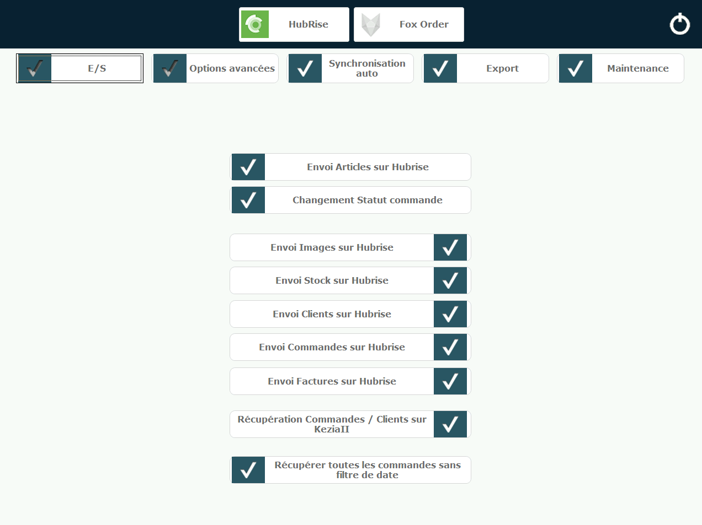
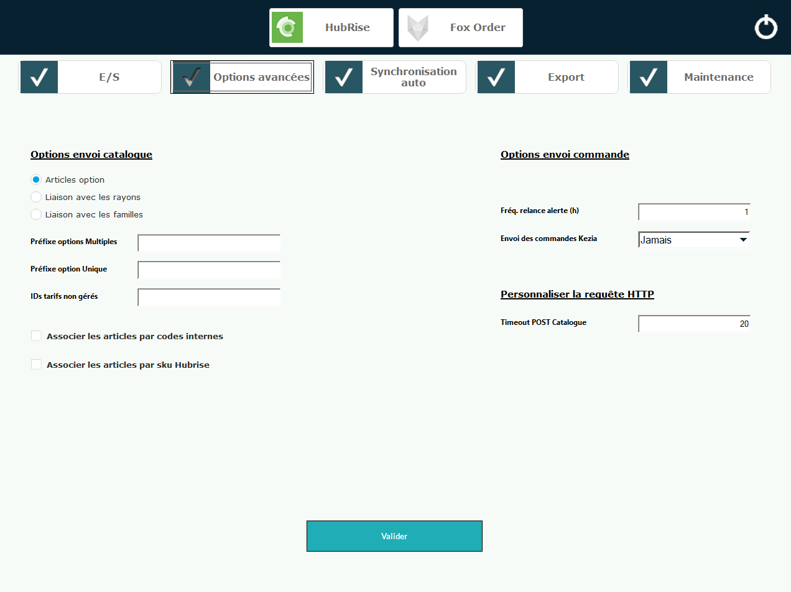
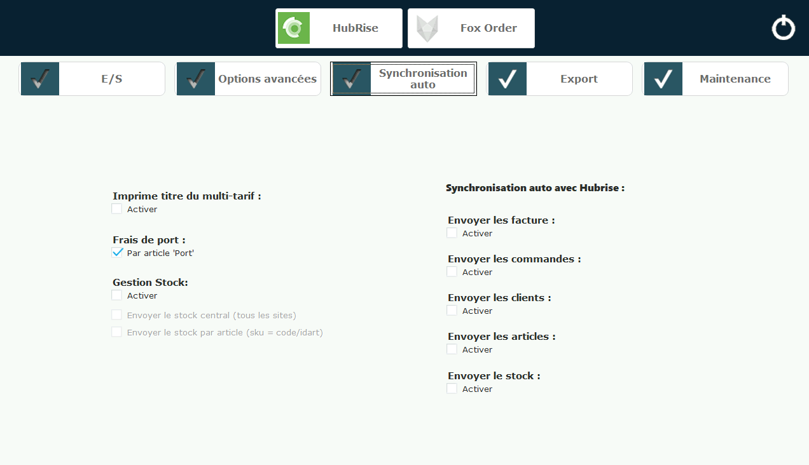
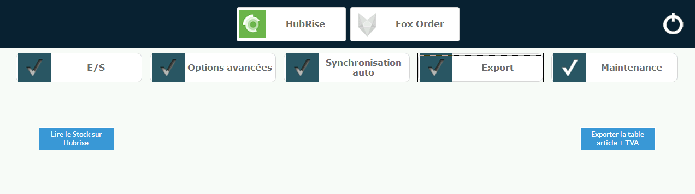
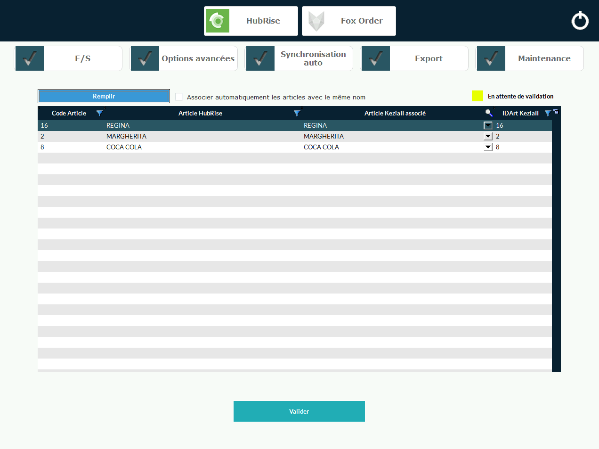

La page de configuration HubRise dans Kezia II permet de gérer tous les paramètres de synchronisation avec les autres applications connectées.

## Ouvrir la page de configuration

Pour accéder aux paramètres de configuration HubRise :

1. Dans la barre de menu de Kezia II, sélectionnez **Fichier** > **Paramètres** > **Commandes Web**.
2. Dans la section **HubRise**, cliquez sur **Configurer**.
3. Dans la fenêtre qui s'affiche, cliquez sur l'icône en forme de roue dentée en haut à droite.
4. Cliquez sur **HubRise** pour accéder à la configuration complète.

La fenêtre de configuration HubRise s'ouvre avec plusieurs onglets : **E/S**, **Options avancées**, **Synchronisation auto**, **Export** et **Maintenance**.

## E/S (Entrées/Sorties)

L'onglet E/S permet de déclencher des actions d'envoi et de réception de données entre Kezia II et HubRise. Voici les actions les plus courantes :

- **Envoi Articles sur HubRise** : Exporte les produits vers le catalogue HubRise connecté à Kezia II
- **Envoi Stock sur HubRise** : Envoie les quantités de stock des articles à HubRise. Pour que cet envoi fonctionne, vous devez préalablement cocher la case **Activer** dans la section **Gestion Stock** de l'onglet **Options avancées**.
- **Envoi Clients sur HubRise** : Envoie les fiches clients à HubRise. Les clients sont identifiés par leur adresse e-mail. S'ils existent déjà dans HubRise, ils sont mis à jour ; sinon, ils sont créés.

Les actions suivantes sont également disponibles, mais elles sont généralement réservées aux équipes de support :

- **Changement Statut commande** : Permet de changer le statut d'une commande dans HubRise. Dans le champ **IDCDE**, indiquez l'identifiant HubRise de la commande, puis sélectionnez le nouveau statut dans la liste déroulante et validez.
- **Envoi Images sur HubRise** : (action obsolète) Envoie les images des articles à HubRise
- **Envoi Commandes sur HubRise** : Envoie une commande spécifique à HubRise. Dans le champ **IDCDE**, indiquez le numéro de commande Kezia II, puis validez.
- **Envoi Factures sur HubRise** : Envoie les factures Kezia II en tant que commandes à HubRise. Cette action déclenche l'affichage d'une fenêtre de sélection des factures à envoyer. Choisissez les factures souhaitées, puis cliquez sur **Valider** pour les envoyer.
- **Récupération Commandes / Clients sur KeziaII** : (action obsolète) Récupère les commandes et les clients depuis HubRise.
- **Récupérer toutes les commandes sans filtre de date** : (action obsolète) Récupère l'historique des commandes depuis HubRise.

## Options avancées {#advanced-options}

Cet onglet contient notamment l'option **Associer les articles par codes internes** :

- **Option décochée (par défaut)** : Utilise les IDART pour identifier les produits
- **Option cochée** : Utilise les codes internes si définis, les IDART sinon

Pour comprendre l'impact de ce paramètre sur la gestion des codes ref, consultez la section [Produits](/apps/kezia/map-ref-codes#products) de la page Associer les codes ref.

## Synchronisation auto

L'onglet Synchronisation auto permet d'activer l'envoi automatique des données vers HubRise lorsqu'elles sont modifiées dans Kezia II.

Les options disponibles sont :

- **Envoyer les factures** : Envoie automatiquement les factures (qui regroupent les commandes de type Deliveroo/Uber et les ventes sur place) à HubRise
- **Envoyer les commandes** : Envoie automatiquement les commandes créées dans Kezia II à HubRise
- **Envoyer les clients** : Envoie automatiquement les fiches clients lors de leur création ou modification
- **Envoyer les articles** : Met à jour automatiquement le catalogue HubRise lors de modifications d'articles
- **Envoyer le stock** : Synchronise automatiquement les niveaux de stock

La section **Gestion Stock** doit être activée pour permettre l'envoi des stocks.

## Export

_A COMPLETER_

## Maintenance

_A COMPLETER_

### Association automatique des articles

La fonction **Remplir** permet d'associer automatiquement les articles ayant le même nom. Le tableau affiche :

- **Code Article** : Le code ref dans HubRise
- **Article HubRise** : Le nom de l'article dans HubRise
- **Article KeziaII associé** : Menu déroulant pour sélectionner l'article correspondant dans Kezia II
- **IDArt KeziaII** : L'identifiant de l'article dans Kezia II

Le statut **En attente de validation** (en jaune) indique que les associations proposées doivent être validées avant d'être appliquées.
