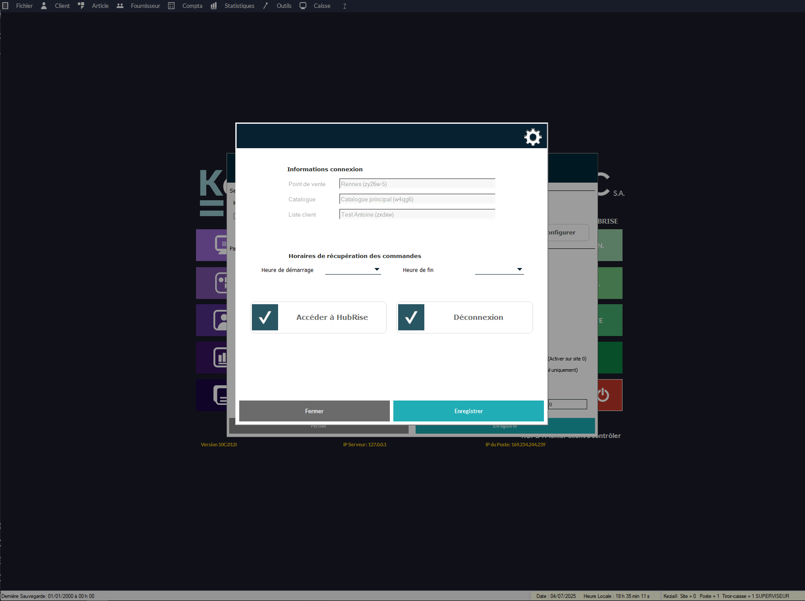
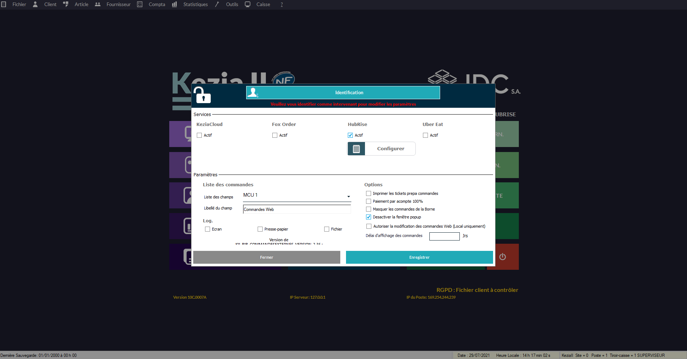

---

**REMARQUE IMPORTANTE :** Si vous ne possédez pas encore de compte HubRise, commencez par en ouvrir un sur la [page d'inscription à HubRise](https://manager.hubrise.com/signup). L'inscription ne prend que quelques minutes !

---

## Connecter Kezia II

Pour établir la connexion entre Kezia II et HubRise, vous devez d'abord contacter le support de JDC pour installer le module HubRise sur Kezia II.

Suivez ensuite ces étapes :

1. Dans la barre de menu de Kezia II, sélectionnez **Fichier** > **Paramètres** > **Commandes Web**.
1. Cochez la case **Actif** en-dessous de **HubRise**.
1. En-dessous de cette case, cliquez sur **Configurer**.
1. Cliquez sur **Nouvelle Connexion à HubRise**. Vous êtes redirigé vers HubRise dans votre navigateur Internet.
1. Si vous avez plusieurs points de vente, choisissez le point de vente à connecter. Si le point de vente sélectionné possède plusieurs listes de clients ou catalogues, cliquez sur **Suivant** pour afficher les listes déroulantes correspondantes, puis sélectionnez les options voulues.
1. Cliquez sur **Autoriser**.
1. Copiez le code affiché et collez-le dans la fenêtre prévue à cet effet dans Kezia II.
1. Cliquez sur **OK**.
   
1. Cliquez sur **Enregistrer**.
1. De nouveau, cliquez sur **Enregistrer**.
1. En cas de besoin, l'éditeur du logiciel Kezia II peut vous venir en aide. Pour leur donner accès à votre compte HubRise, [ajoutez les permissions nécessaires](/apps/kezia/connect-hubrise#donner-acc-s-au-support-de-kezia-ii).

## Donner accès au support Kezia II

Pour faciliter la prise en charge de vos demandes de support, nous vous recommandons de donner accès à votre compte HubRise à l'éditeur de la solution Kezia II.

Pour donner accès à Kezia II, procédez comme suit :

1. Depuis le back-office de HubRise, sélectionnez **CONFIGURATION** dans le menu de gauche.
1. Dans la section **Permissions**, ajoutez licencekezia@jdc.fr en sélectionnant l'option **Manager** dans la liste déroulante des rôles.
1. Cliquez sur l'icône **+** pour ajouter le nouvel utilisateur.

L'ajout d'un utilisateur est le moyen recommandé de donner accès à un tiers à votre point de vente. Le partage de mot de passe est déconseillé pour des raisons de sécurité.

## Configurer les actions de caisse

Pour recevoir les commandes HubRise, vous devez configurer les actions de caisse dans Kezia II. Pour cela, suivez les étapes suivantes :

1. Dans la barre de menu de Kezia II, sélectionnez **Fichier** > **Paramètres** > **Commandes Web**.
1. Dans la section **Paramètres**, dans la partie **Liste des commandes**, sélectionnez _MCU 1_ dans la **Liste des champs** et entrez le nom _Commandes Web_ pour **Libellé du champ**.
   
1. Cliquez sur **Enregistrer**.

## Déconnecter Kezia II

1. Dans la barre de menu de Kezia II, sélectionnez **Fichier** > **Paramètres** > **Commandes Web**.
1. Sous **HubRise**, en dessous de la case **Actif**, cliquez sur **Configurer**.
1. Cliquez sur **Déconnexion**.
