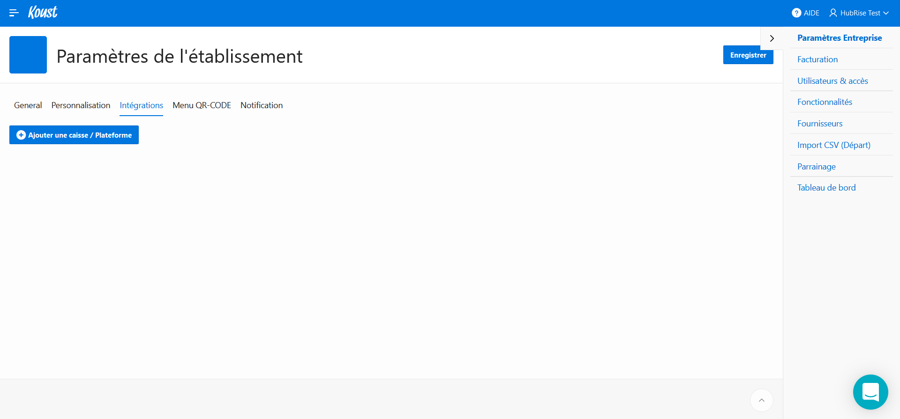
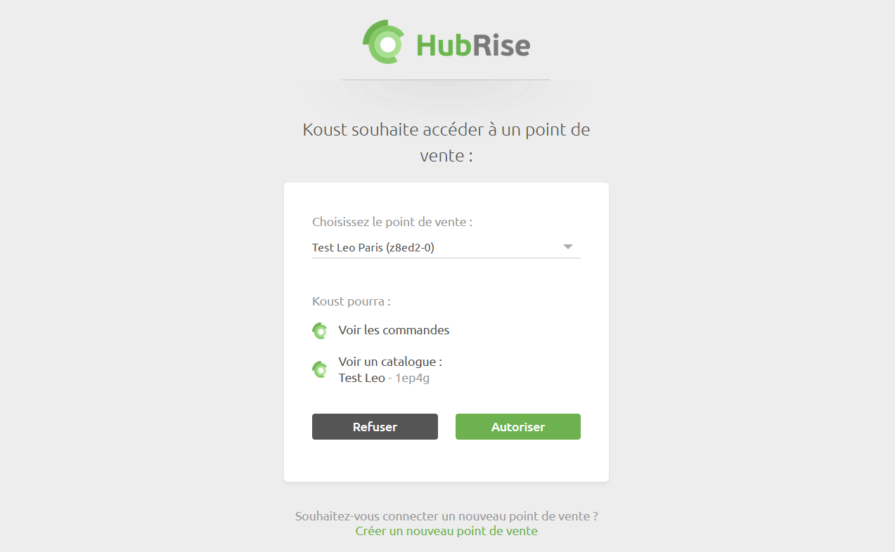
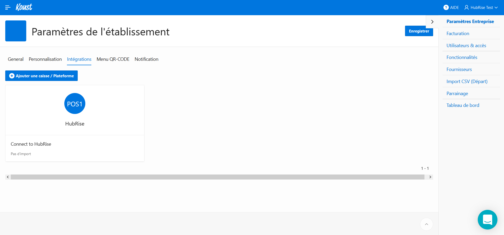

Vous pouvez connecter Koust à HubRise de manière autonome, en seulement quelques étapes.

## Connecter Koust

Pour établir la connexion entre Koust et HubRise :

1. Assurez-vous d'avoir un compte HubRise. Pour plus d'informations sur la création d'un compte HubRise, consultez le [Guide de prise en main](/docs/getting-started/).
1. Ouvrez le tableau de bord Koust, puis cliquez sur le nom de votre entreprise dans la barre de menu (en haut à droite). Un menu déroulant s'affiche.
1. Sélectionnez **Paramètres**. La page **Paramètres de l'établissement** s'affiche.
1. Sélectionnez l'onglet **Intégrations**.
   
1. Cliquez sur **+ Ajouter une caisse / Plateforme**. Une boîte de dialogue nommée **POS** s'affiche.
1. Dans le champ **Caisse**, sélectionnez **HubRise**. Une section **HubRise** s'affiche en-dessous.
   
1. Cliquez sur **Se connecter à hubrise**. L'interface HubRise s'affiche dans un nouvel onglet.
1. Choisissez le point de vente que vous désirez connecter et cliquez sur **Autoriser** pour donner à Koust l'accès à vos informations. Si plusieurs catalogues sont disponibles, cliquez sur **Suivant** afin d'afficher les listes déroulantes correspondantes avant de cliquer sur **Autoriser**.
   
1. Vous êtes redirigé vers l'écran de connexion de Koust et le message suivant s'affiche : _HubRise connecté avec succès, veuillez vous reconnecter._

## Tester la connexion

Pour vérifier que la connexion entre Koust et HubRise est correctement établie, vous devez disposer d'une autre application connectée au même point de vente HubRise, et capable d'envoyer des commandes vers HubRise. Il peut s'agir par exemple d'une solution de commande en ligne ou de votre logiciel de caisse.

1. Passez une commande depuis l'autre application connectée.
1. Dans votre espace Koust, dans le menu latéral, sélectionnez **Ventes - Conso.** > **Historique ventes**. La commande doit apparaître dans la liste des commandes.
1. Si la commande n'apparaît pas dans Koust, vérifiez qu'elle a bien été envoyée à HubRise. Pour cela, allez dans le back-office de HubRise, dans le menu latéral, sélectionnez **DONNÉES** > **COMMANDES**. Vérifiez que la commande est présente dans la liste des commandes.

## Donner accès au support de Koust

Pour faciliter la prise en charge de vos demandes de support, nous vous recommandons de donner accès à votre compte HubRise à l'éditeur de la solution Koust.

Pour donner accès à Koust, procédez comme suit :

1. Depuis le back-office de HubRise, sélectionnez **CONFIGURATION** dans le menu de gauche.
1. Dans la section **Permissions**, ajoutez contact@koust.fr en sélectionnant l'option **Manager** dans la liste déroulante des rôles.
1. Cliquez sur l'icône **+** pour ajouter le nouvel utilisateur.

L'ajout d'un utilisateur est le moyen recommandé de donner accès à un tiers à votre point de vente. Le partage de mot de passe est déconseillé pour des raisons de sécurité.

## Déconnecter Koust

1. Suivez les 3 premières étapes de la partie [Se connecter](/apps/koust/connexion-hubrise#se-connecter).
   
1. Cliquez sur le bloc **HubRise** présent dans la liste des intégrations. Une boîte de dialogue s'affiche.
   
1. Cliquez sur **Se déconnecter**.
