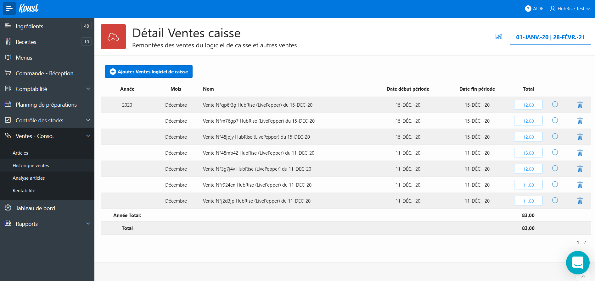

Le tableau de bord Koust permet de consulter les commandes, et les articles provenant de votre catalogue et des commandes HubRise.

## Commandes

Pour accéder à l'historique de vos commandes passées depuis d'autres applications, consultez la page **Détail Ventes caisse**. Pour y accéder, dans le menu latéral, sélectionnez **Ventes - Conso.** > **Historique ventes**.

Pour accéder au détail d'une commande, cliquez sur son nom ou son montant total.

## Articles

Après avoir importé un catalogue HubRise, vous pouvez retrouver les articles dans la page **Articles caisse**. Pour y accéder, dans le menu latéral, sélectionnez **Ventes - Conso.** > **Articles**.

Lors de la réception d'une commande, Koust utilise les codes ref des articles pour rechercher les produits correspondants dans le catalogue importé depuis HubRise. Les articles non trouvés sont créés automatiquement et peuvent être consultés sur cette page.

Pour vous assurer que les articles des commandes soient associés aux bons produits du catalogue, vérifiez la valeur des codes ref en suivant les étapes de la page [Associer les codes ref](/apps/koust/associer-codes-ref#products).
