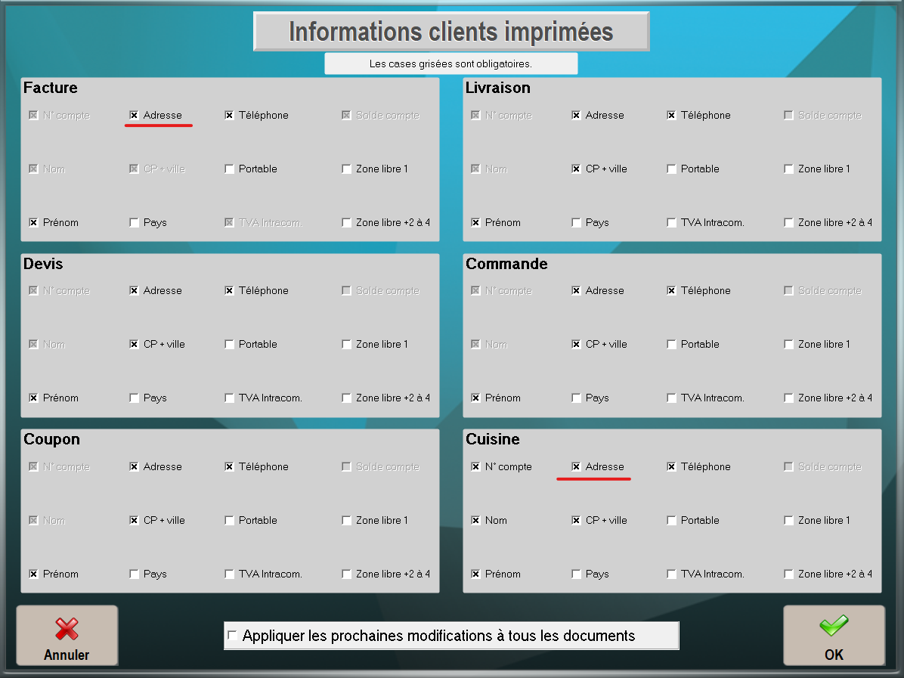

Si vous constatez que certaines informations client ne sont pas imprimées sur vos tickets dans LEO2, voici les étapes à suivre pour résoudre ce problème.

## Informations client non cochées

LEO2 offre la possibilité de sélectionner les informations client à imprimer. Si une information est manquante, il est probable qu'elle n'ait pas été cochée dans les paramètres d'impression.

1. Accédez aux paramètres généraux en cliquant sur le bouton **Paramètres et Réglages** dans l'interface principale de LEO2.
2. Dans l'onglet **Clients**, cliquez sur **Impression infos clients**.
3. Dans la section **Facture** ou **Cuisine** (selon où vous souhaitez que les informations apparaissent), cochez les cases correspondant aux informations que vous souhaitez voir figurer sur les tickets.
4. Validez en cliquant sur **OK**.

Effectuez un test d'impression pour confirmer que les informations manquantes sont désormais incluses.

## Autres problèmes d'impression

Si le problème persiste, ou si vous rencontrez d'autres problèmes d'impression, contactez le support technique de votre revendeur LEO2.
