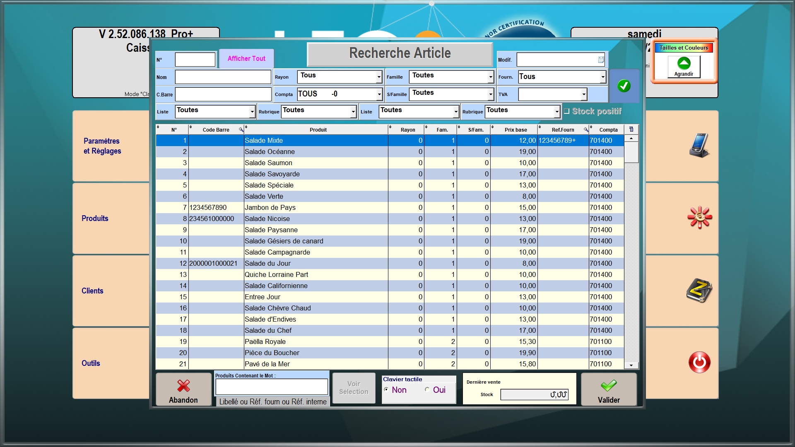

Une fois votre logiciel de caisse LEO2 connecté à HubRise, vous devez configurer vos autres applications connectées, afin que les différents éléments présents dans les commandes soient bien identifiés par LEO2.

LEO2 identifie chaque élément d'une commande par un code ref. Vous devez indiquer les codes ref fournis par LEO2 dans vos autres applications, afin que les commandes puissent être réceptionnées.

Il y a deux façons de procéder :

- Vous pouvez exporter le catalogue LEO2 vers HubRise, puis importer ce catalogue dans vos autres applications.
- Ou vous pouvez saisir manuellement les codes ref dans vos autres applications.

Seules certaines applications permettent l'import d'un catalogue depuis HubRise. Pour les autres, il faudra saisir manuellement les codes ref.

## Exporter le catalogue

Pour exporter manuellement un catalogue vers HubRise, suivez les étapes suivantes :

1. Depuis l'écran d'accueil, cliquez sur **Gestion**.
1. Entrez le mot de passe que vous avez choisi lors de l'installation de LEO2. Par défaut, ce mot de passe est **1234**.
1. Cliquez sur **Paramètres et Réglages**.
1. Cliquez sur **HubRise**.
   
1. Cliquez sur **Envoi catalogue**.
1. Cliquez sur **Oui**.

Vous devez maintenant importer le catalogue HubRise dans vos autres applications connectées à HubRise. Pour effectuer cette opération, référez-vous à la documentation de ces applications sur le site de HubRise.

## Produits

Pour retrouver le code ref d'un produit, suivez les étapes suivantes :

1. Depuis l'écran d'accueil, cliquez sur **Gestion**.
1. Entrez le mot de passe que vous avez choisi lors de l'installation de LEO2. Par défaut, ce mot de passe est **1234**.
1. Cliquez sur **Produits**.
1. Cliquez sur **Rechercher** ou appuyez sur la touche **F1**.
   
1. Sélectionnez dans la liste le produit désiré. Le code ref s'affiche en haut à droite de la fenêtre **FICHE PRODUIT**, dans le champ **Clé unique**.
   

## SKUs

LEO2 ne permet pas de créer de SKU. Pour remplacer cette fonctionnalité, il est nécessaire de créer un nouveau produit pour chaque variante d'un même produit.

## Options

Les options dans HubRise correspondent aux messages cuisine dans LEO2.

Pour retrouver le code ref d'une option, suivez les étapes suivantes :

1. Depuis l'écran d'accueil, cliquez sur **Gestion**.
1. Entrez le mot de passe que vous avez choisi lors de l'installation de LEO2. Par défaut, ce mot de passe est **1234**.
1. Cliquez sur **Produits**.
1. Cliquez sur **Messages Cuisine**.
1. Cliquez sur **Saisie Comment**.
1. Dans le champ **Libellé**, sélectionnez la liste d'options à laquelle appartient l'option désirée. Le code ref de cette option est égal au préfixe `TEXT_`, suivi de la valeur du champ **Id** de la liste d'options, puis du symbole `_`, et enfin de la valeur de la colonne **ID** de l'option. Par exemple, dans la capture d'écran ci-dessous, le code ref de l'option _Sauce Ciboulette_ est égal à `TEXT_3_20`.
   

## Promotions

Les promotions dans HubRise correspondent aux menus dans LEO2, et sont gérés comme des produits. Pour retrouver leur code ref, suivez les mêmes étapes que pour un [produit](/apps/leo2/associer-codes-ref#produits).

## Méthodes de paiement

Les méthodes de paiement dans HubRise correspondent aux modes de règlement dans LEO2. Pour retrouver leur code ref, suivez les étapes suivantes :

1. Depuis l'écran d'accueil, cliquez sur **Gestion**.
1. Entrez le mot de passe que vous avez choisi lors de l'installation de LEO2. Par défaut, ce mot de passe est **1234**.
1. Cliquez sur **Paramètres et Réglages**.
1. Cliquez sur **Modes de Règlement**. Le code ref s'affiche dans la colonne **No**.
   
