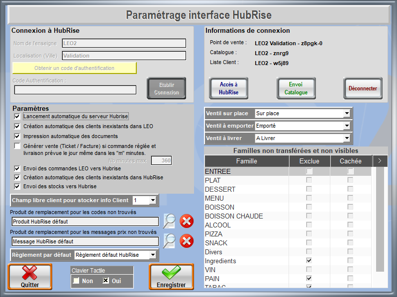

La page de paramétrage de l'interface HubRise permet de connecter LEO2 à HubRise et de personnaliser le fonctionnement de l'intégration. Après avoir modifié les paramètres, cliquez sur **Enregistrer** pour enregistrer les modifications.

---

**REMARQUE IMPORTANTE :** Toute modification de la configuration nécessite le redémarrage du serveur HubRise pour être prise en compte. Pour redémarrer le serveur, double-cliquez sur le raccourci vers le serveur, créé en suivant les étapes décrites dans la section [Créer un raccourci sur le bureau](/apps/leo2/connect-hubrise#shortcut).

---

Pour accéder à la page de paramétrage de l'interface HubRise, suivez ces étapes :

1. Depuis l'écran d'accueil de LEO2, cliquez sur **Gestion**.
1. Entrez le mot de passe que vous avez choisi lors de l'installation de LEO2. Par défaut, ce mot de passe est **1234**.
1. Cliquez sur **Paramètres et Réglages**.
1. Dans l'onglet **Généraux**, cliquez sur **HubRise**.

Cette page est divisée en plusieurs sections.

## Connexion à HubRise

Cette section permet d'établir la connexion entre LEO2 et HubRise.

- Si la connexion est déjà établie, le contenu de la section apparaît en grisé.
- Si la connexion n'est pas établie, reportez-vous à la section [Connexion à HubRise](/apps/leo2/connect-hubrise) pour plus d'informations sur la procédure de connexion.

## Informations de connexion

Cette section indique les identifiants du point de vente, du catalogue et de la liste de clients utilisés par la connexion HubRise.

La section vous permet également d'accéder aux actions suivantes :

- **Accès à HubRise** : ouvre le back-office HubRise dans une page de votre navigateur.
- **Envoi catalogue** : envoie votre menu depuis LEO2 vers HubRise. Pour plus d'informations, voir la section [Exporter le catalogue](/apps/leo2/map-ref-codes#export-catalog).
- **Déconnecter** : déconnecte le point de vente de HubRise. Pour plus d'informations, voir la section [Déconnecter ubRise](/apps/leo2/connect-hubrise#connect).

## Paramètres

### Automatisation des tâches

Les cases à cocher suivantes permettent de configurer l'automatisation des tâches :

- **Lancement automatique du serveur HubRise** : lance le serveur automatiquement au démarrage de LEO2. Il est recommandé de cocher cette option.
- **Création automatique des clients inexistants dans LEO2** : lors de la réception d'une commande HubRise, si la référence du client n'existe pas dans LEO2, ajoute automatiquement ce dernier au fichier clients de LEO2. Si cette option n'est pas cochée, la commande sera affectée au client "Divers".
- **Impression automatique des documents** : lors de la réception d'une commande HubRise, imprime automatiquement le document (commande, bon de livraison ou ticket).
- **Générer vente (Ticket / Facture) si commande réglée et livraison prévue le jour même dans les "m" minutes** : si la
  commande est réglée intégralement, que la date de livraison prévue est le jour même, que la durée entre l'heure de livraison prévue
  et l'heure actuelle est inférieure de "Nb minutes Max", génère automatiquement le bon de livraison et la facture (si client LEO2) ou le ticket (si client Divers).
- **Envoi des commandes LEO2 vers HubRise** : envoie vers HubRise les commandes créées et modifiées dans LEO2.
- **Création automatique des clients inexistants dans HubRise** : lors de l'envoi d'une commande, si la référence du client n'existe pas dans HubRise, crée automatiquement ce dernier dans HubRise.
- **Envoi des stocks vers HubRise** : envoie les stocks LEO2 en temps réel vers HubRise.

### Comportement en cas de code ref absent ou invalide {#missing-ref}

Les champs suivants permettent de définir le comportement de LEO2 en cas d'incohérence entre les codes ref de LEO2 et HubRise :

- **Produit de remplacement pour les codes non trouvés** : si un code produit d'une ligne de commande HubRise n'existe pas dans LEO2, il est remplacé par ce produit, tout en conservant son libellé, son prix et sa TVA tels que définis dans HubRise. Si ce paramètre n'est pas renseigné et qu'un code produit n'est pas trouvé dans LEO2, la commande n'est pas traitée.
- **Produit de remplacement pour les messages avec prix non trouvés** : si une option payante d'une ligne de commande HubRise n'existe pas dans LEO2, elle est remplacée par ce message produit. Si ce dernier n'est pas défini, l'options payante est ignorée.
- **Règlement par défaut** : si une méthode de paiement d'une commande HubRise n'est pas associée à un code règlement existant dans LEO2, on lui affecte ce règlement par défaut. Si ce dernier n'est pas défini, la commande n'est pas affectée à un règlement.

### Autres champs pour les commandes

- **Champ libre client pour stocker info Client** : le commentaire de la fiche client HubRise est stocké dans l'onglet **Infos libres** de la fiche client dont le numéro est indiqué dans ce champ.
- **Ventil** : Hubrise fonctionne avec 3 types de services : livraison, sur place et emporté. Chaque liste de choix permet d'associer un type de service à un tarif LEO2.

### Envoi du catalogue

La rubrique **Familles non transférées et non visibles** permet de définir la visibilité des familles de produits lorsque le catalogue est envoyé vers HubRise.

- Les familles exclues ne sont pas envoyées, ainsi que les produits s'y rattachant.
- Les familles cachées sont envoyées à HubRise, ainsi que leur produits, mais ils n'apparaissent pas sur le site.
