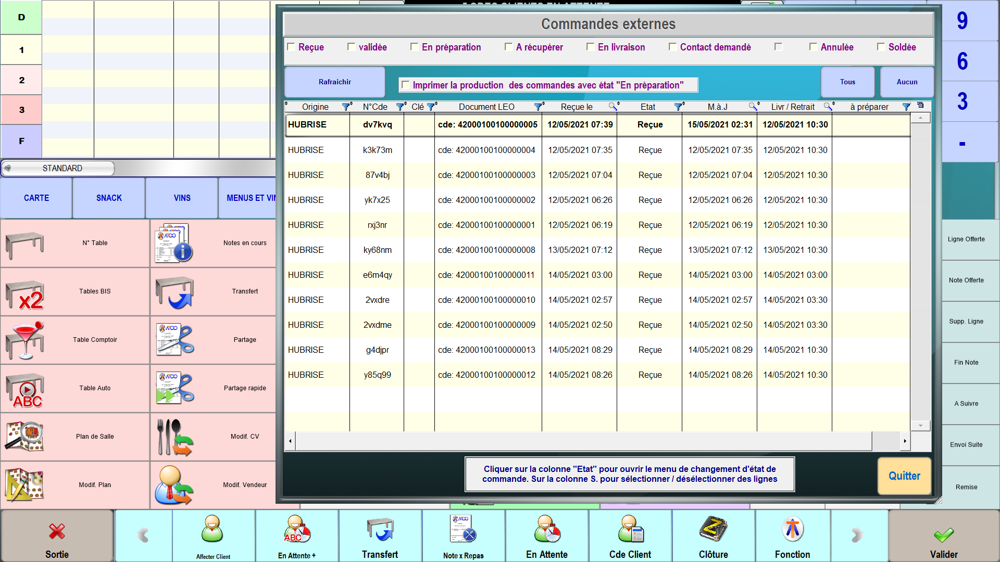

Lorsque LEO2 est connecté à HubRise, les commandes envoyées à HubRise arrivent automatiquement dans votre logiciel de caisse. Si cela n'est pas le cas, vérifiez que votre serveur HubRise est bien lancé.

## Affichage des commandes

LEO2 vérifie l'arrivée de nouvelles commandes toutes les 30 secondes.

Pour voir la liste des commandes, suivez les étapes suivantes :

1. Depuis l'écran d'accueil, cliquez sur **Caisse**.
1. Sélectionnez un vendeur.
1. Cliquez sur la flèche grise en bas de l'écran pour faire défiler les actions possibles, puis cliquez sur **Fonction**.
1. Cliquez sur les flèches bleues pour faire défiler les boutons, puis cliquez sur **Leo2Click - Commandes**.
   

Si vos commandes HubRise n'arrivent pas dans LEO2, consultez notre FAQ: [Les commandes HubRise n'arrivent pas dans LEO2. Que faire ?](/apps/leo2/faqs/commandes-non-recues).

## Détails de la commande

Pour voir les détails d'une commande :

1. Depuis l'écran d'accueil, cliquez sur **Caisse**.
1. Sélectionnez un vendeur.
1. Cliquez sur la flèche grise en bas de l'écran pour faire défiler les actions possibles, puis cliquez sur **Cde Client**.
   

## Commande avec des produits inconnus

Pour que LEO2 prenne en compte les produits dont le code ref n'est pas reconnu, vous devez créer un produit de remplacement et configurer LEO2 pour que ce dernier remplace les produits inconnus. Sans cette configuration, les produits dont le code ref n'est pas reconnu sont supprimés de la commande. Pour faire cette configuration, suivez les étapes suivantes :

1. Depuis l'écran d'accueil, cliquez sur **Gestion**.
1. Entrez le mot de passe que vous avez choisi lors de l'installation de LEO2. Par défaut, ce mot de passe est **1234**.
1. Cliquez sur **Paramètres et Réglages**.
1. Cliquez sur **HubRise**.
   
1. Dans le champ **Produit de remplacement pour les codes non trouvés**, cliquez sur l'icône en forme de loupe pour accéder à l'écran **Recherche Article**.
1. Sélectionnez le produit de remplacement. Ce produit remplace chaque produit dont le code ref n'est pas reconnu contenu dans une commande, et prend toutes les informations du produit inconnu, telles que son nom et son prix.

## Produits avec des prix différents

Lorsqu'une commande contient des articles ou des options dont les prix ne correspondent pas à ceux de LEO2, les prix indiqués dans HubRise remplacent ceux de LEO2.

## Statut de la commande

Les statuts que LEO2 envoie à HubRise sont les suivants :

- _Reçue_ : la commande a été reçue.
- _Validée_ : la commande a été acceptée.
- _En préparation_ : la commande est en cours de préparation.
- _A récupérer_ : la commande est prête à être récupérée.
- _En livraison_ : la commande est en cours de livraison.
- _Annulée_ : la commande a été annulée.
- _Soldée_ : la commande a été payée.

Pour modifier le statut d'une commande :

1. Suivez les étapes décrites dans [Affichage des commandes](/apps/leo2/recevoir-commandes#affichage-des-commandes) pour accéder à la liste des commandes.
1. Cliquez sur la colonne **Etat**.
   
1. Sélectionnez le nouveau statut de la commande.

La mise à jour du statut dans HubRise peut prendre jusqu'à 30 secondes.
