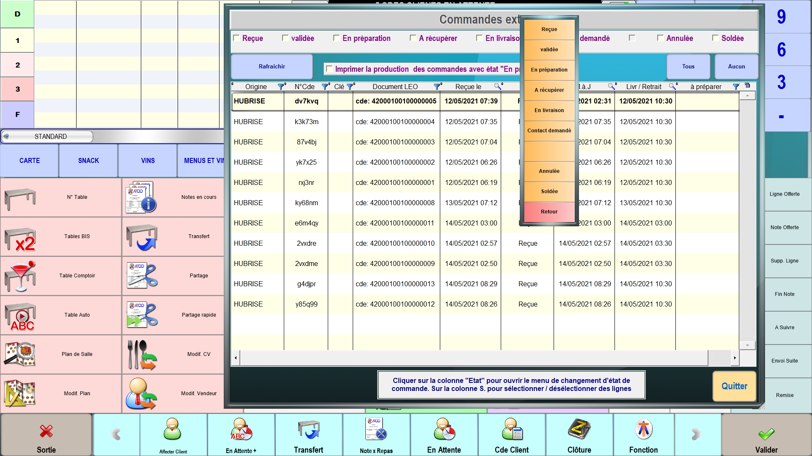

Lorsque LEO2 est connecté à HubRise, les commandes envoyées à HubRise arrivent automatiquement dans votre logiciel de caisse.

LEO2 vérifie l'arrivée de nouvelles commandes toutes les 30 secondes. Si vous ne recevez aucune commande, consultez [Les commandes HubRise n'arrivent pas dans LEO2. Que faire ?](/apps/leo2/faqs/commandes-non-recues).

## Interface utilisateur

### Voir la liste des commandes

Pour voir la liste des commandes, suivez les étapes suivantes :

1. Depuis l'écran d'accueil, cliquez sur **Caisse**.
1. Sélectionnez un vendeur.
1. Cliquez sur la flèche grise en bas de l'écran pour faire défiler les actions possibles, puis cliquez sur **Fonction**.
1. Cliquez sur les flèches bleues pour faire défiler les boutons, puis cliquez sur **Leo2Click - Commandes**.
   

Si vos commandes HubRise n'arrivent pas dans LEO2, consultez notre FAQ: [Les commandes HubRise n'arrivent pas dans LEO2. Que faire ?](/apps/leo2/faqs/commandes-non-recues).

### Voir les détails d'une commande

Pour voir les détails d'une commande, suivez les étapes suivantes :

1. Depuis l'écran d'accueil, cliquez sur **Caisse**.
1. Sélectionnez un vendeur.
1. Cliquez sur la flèche grise en bas de l'écran pour faire défiler les actions possibles, puis cliquez sur **Cde Client**.
   

### Modifier le statut d'une commande

Pour modifier le statut d'une commande, suivez les étapes suivantes :

1. Accédez à la liste des commandes en suivant les étapes décrites dans [Affichage des commandes](/apps/leo2/recevoir-commandes#liste-des-commandes).
1. Cliquez sur la colonne **Etat**.
1. Sélectionnez le nouveau statut de la commande.
   

## Articles et options

### Traitement des articles inconnus

Si une commande contient un article dont le code ref est inconnu, LEO2 permet de choisir un article par défaut pour le remplacer. Pour configurer cet article, consultez la section [Configuration](/apps/leo2/configuration#comportement-en-cas-de-code-ref-absent-ou-invalide). Si aucun article par défaut n'est configuré, LEO2 ignore la commande.

Si une commande contient une option payante dont le code ref est inconnu, LEO2 ae remplace par le message produit par défaut, si celui-ci est configuré comme indiqué à la section [Configuration](/apps/leo2/configuration#comportement-en-cas-de-code-ref-absent-ou-invalide). Si aucun message par défaut n'est configuré, LEO2 ignore l'option.

### Traitement des différences de prix

En cas de différence de prix entre les articles d'une commande HubRise et les produits dans LEO2, les prix indiqués dans HubRise remplacent ceux de LEO2.

## Types de service

Le type de service permet d'associer un tarif aux lignes de la commande. Pour plus d'informations, voir [Types de service](/apps/leo2/associer-codes-ref#types-de-service).

Le code ref du type de service permet d'associer un vendeur à la commande. Pour plus d'informations, voir [Codes ref des types de service](/apps/leo2/associer-codes-ref#codes-ref-des-types-de-service).

## Statuts de commande

LEO2 utilise les mêmes statuts de commande que HubRise.

LEO2 passe automatiquement le statut des nouvelle commandes à **Reçue**. Lorsque vous modifiez le statut d'une commande dans LEO2, la commande est automatiquement mise à jour dans HubRise. La mise à jour du statut dans HubRise peut prendre jusqu'à 30 secondes.

## Remises

Les remises sont appliquées par LEO2 sans tenir compte de leurs codes ref.

LEO2 additionne le montant des remises de la commande, et applique le résultat sur chaque article au prorata de son prix.

## Frais

Les frais dans les commandes HubRise apparaissent comme des produits dans les commandes LEO2.

LEO2 utilise le code ref des frais pour trouver le produit correspondant. Si le code ref n'est pas trouvé, LEO2 utilise le produit par défaut défini dans la section [Configuration](/apps/leo2/configuration#comportement-en-cas-de-code-ref-absent-ou-invalide), si celui-ci est configuré.

## Paiements

La présence d'un paiement dans une commande HubRise génère un ticket dans LEO2 si la commande HubRise est anonyme, ou une facture si la commande est liée à un client.

LEO2 utilise le code ref du paiement pour trouver le règlement correspondant. Si le code ref n'est pas trouvé, LEO2 utilise le règlement par défaut défini dans la section [Configuration](/apps/leo2/configuration#comportement-en-cas-de-code-ref-absent-ou-invalide). Si aucun règlement par défaut n'est configuré, LEO2 ignore le paiement et considère la commande comme non payée.

## Notes de préparation

Les notes de préparation au niveau de la commande et des articles sont prises en compte par LEO2.
