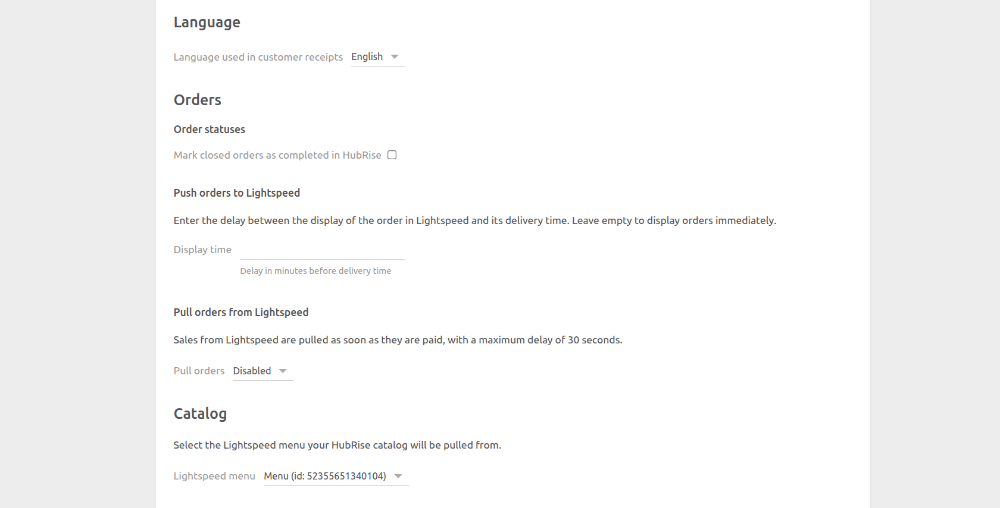

The configuration page allows you to customise the behaviour of Lightspeed Restaurant Bridge based on your preferences.
These are divided into different sections for an easier navigation.

## Language

Choose the language to use for generic items such as `Delivery charge`. These names may appear in customer receipts.

## Orders

From this section, you can customise how Lightspeed Restaurant Bridge handles orders.

### Order Statuses {#order-statuses}

Lightspeed closes orders as soon as they are paid. By default, Lightspeed Restaurant Bridge marks orders as `completed` in HubRise when they are closed in Lightspeed.

If you use a different app to update order statuses in HubRise, for example a Kitchen Display System, you can unselect **Mark closed orders as completed in HubRise**.

### Push Orders to Lightspeed

Orders are pushed to Lightspeed as soon as they are created in HubRise.

If you want to delay orders until shortly before the delivery time, you can set the **Display time** field. If you leave it empty, orders will be displayed immediately on Lightspeed.

### Pull orders from Lightspeed {#pull-orders-from-lightspeed}

By default, Lightspeed Restaurant Bridge does not pull Lightspeed sales into HubRise.

To enable this feature, select **Enabled for dine-in sales** or **Enabled for all sales** from **Pull orders**.

When pulling orders is enabled, an additional **Delivery account profiles** field appears. Use this field to specify which Lightspeed account profile codes should be treated as delivery orders. Enter one or more codes, separated by commas (for example: `DELIVERY, UBER_EATS, DELIVEROO`).

## Catalog

This section allows you to choose which Lightspeed menu to use when you want to pull your catalog to HubRise. Select a value from the drop-down list.

## Save the Configuration

To save the configuration, click **Save** at the top of the page.

## Reset the Configuration

If you need to reset the configuration, click **Reset the configuration** at the bottom of the page.

---

**IMPORTANT NOTE:** Resetting the configuration will instantly disconnect the bridge from Lightspeed Restaurant.

---

Resetting the configuration does not delete the operation logs displayed in the main page.
