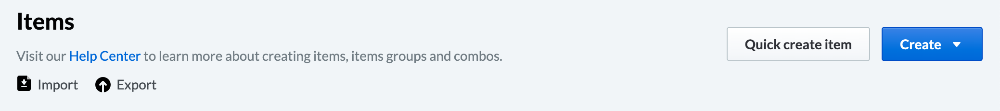
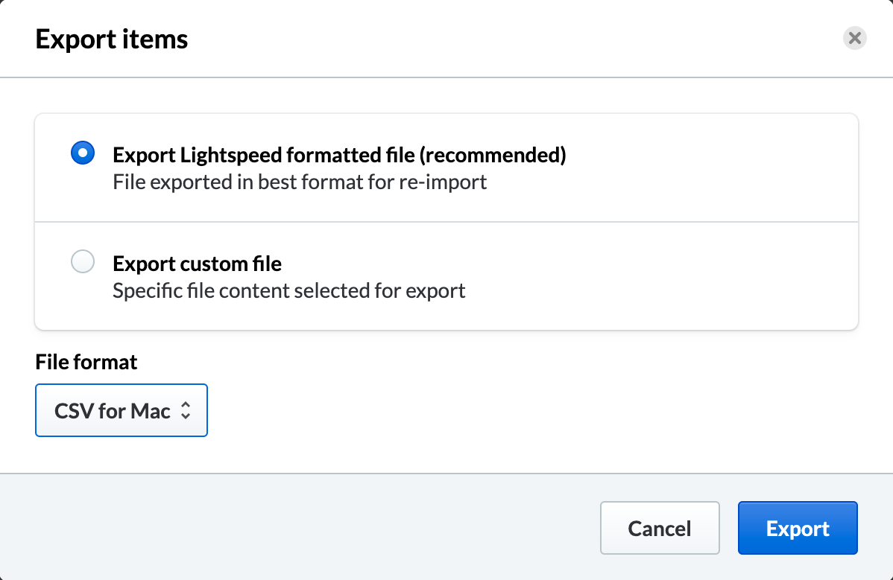
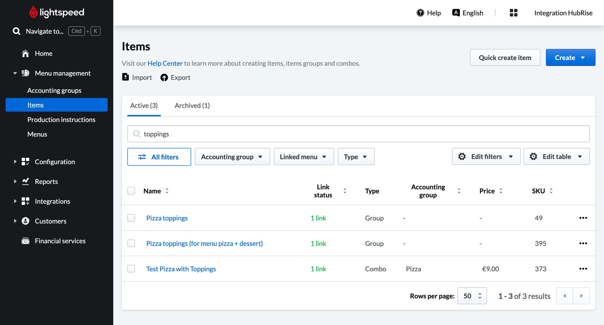

Lightspeed expects all incoming orders to contain specific ref codes for each sku, option, deal, discount, charge, service type, and payment present. You must ensure that all connected apps use the correct ref codes if you want your orders to be correctly processed.

This page explains how to find the ref codes by either downloading your Lightspeed catalog in bulk, or by checking individual items in the back office.

You can also export your Lightspeed catalog directly into HubRise with Lightspeed Restaurant Bridge.
Some connected apps offer the ability to import the catalog directly from HubRise, and therefore to autopopulate the ref codes.
For more details about this feature and its limitations in Lightspeed Restaurant Bridge, see [Pull the Catalog](/apps/lightspeed-restaurant/pull-catalog).

## Download the Catalog in Bulk

You can download your Lightspeed catalog to manage the items and the ref codes with a separate software.

To download the Lightspeed catalog, follow these steps:

1. From your Lightspeed back office, select **Menu management**, then select **Items**.
1. Click the **Export** button.
   
1. On the popup window that appears, do the following:
   1. Leave the default option selected: **Export Lightspeed formatted file**.
   1. From the **File format** list, select the format for your output file. 
   1. To confirm, click **Export**.
   
1. When prompted, choose the location where you want to save the file.

To check the ref codes for the items, you can open the downloaded file in Excel or in a text editor.
The ref codes appear under the **SKU** column.

## Find Ref Codes for Individual Items

You can find the ref codes for skus, options, deals, discounts, charges, service types, and payments from your Lightspeed back office.

### Skus, Options, Discounts, and Charges

To find the ref codes for specific skus, options, discounts, and charges, follow these steps:

1. From the menu in your Lightspeed back office, select **Menu management** > **Items**.
1. On the **Items** page, the ref codes appear under the **SKU** column.
   

You can then copy the codes in the connected app. For detailed instructions, follow the documentation for the connected app in the HubRise website.

Note that charges and discounts must be created as items to be compatible with the HubRise data model. For more information see [Create Ref Codes](/apps/lightspeed-restaurant/faqs/create-ref-codes).

### Production Instructions

Production instructions in Lightspeed can be mapped to HubRise options. To find the ref codes for production instructions, follow these steps:

1. From the menu in your Lightspeed back office, select **Configuration** > **Production instructions**.
2. To download the complete list of production instructions, click **Export to CSV**.
3. In the CSV file, ref codes appear under the **identifier** column.

When you map production instructions to connected apps, add `+` before the ref code. For example, if your instruction has ref code `52355651338378`, use `+52355651338378` to map it to connected apps.

---

**IMPORTANT NOTE:** Production instructions have no associated price. Adding a price in a connected app can cause [price differences errors](/apps/lightspeed-restaurant/troubleshooting/price-differences-errors).

---

### Service Types {#service-types}

Service types are called _account profiles_ on Lightspeed. To find the ref code for a specific service type, follow these steps:

1. From the menu in your Lightspeed back office, select **Configuration**, then select **Settings** > **Account profiles**.
1. For each service type available under the **Name** column, you can find the corresponding ref code under the **Code** column.

### Payment Methods {#payment-methods}

To find the ref code for a payment method, follow these steps:

1. From the menu in your Lightspeed back office, select **Configuration**, then select **Settings** > **Payment methods**.
1. For each payment method available under the **Name** column, you can find the corresponding ref code under the **Code** column.
