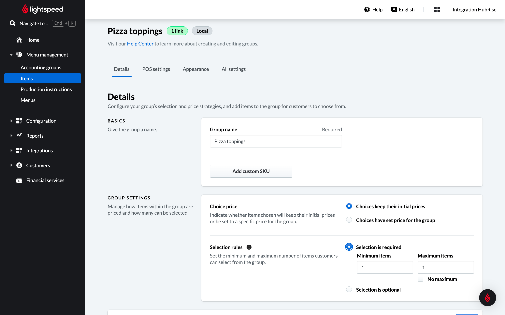

This page describes how to pull a catalog from Lightspeed into HubRise and what information is received in HubRise.

## Pulling the Catalog into HubRise

There are two methods to pull a catalog from Lightspeed into HubRise:

- Using Lightspeed Restaurant Bridge
- Using a third-party solution

### Pulling from Lightspeed Restaurant Bridge

To pull a catalog using the Lightspeed Restaurant Bridge, follow these steps:

1. From the Lightspeed Restaurant Bridge main page, select the **Actions** tab.
2. Click **Pull catalog**.
3. Click **Confirm** when prompted.

---

**IMPORTANT NOTE:** This operation will replace your current HubRise catalog.

---

Depending on the size of your catalog, it might take a few minutes for your HubRise catalog to be fully updated.

### Pulling from a Third-Party Solution

Some integrated solutions, such as digital ordering systems, offer a catalog pull feature. If your solution supports this feature, you will typically find a button labeled "Update Catalog" or something similar in their back office.

To use this feature:

1. Check with your solution provider to see if they support catalog pulls from Lightspeed.
2. If supported, look for the catalog update option in your solution's back office.
3. Use this option whenever you want. The catalog pull may take a few minutes to complete, depending on the size of your catalog.

## Information Sent to HubRise

The following sections provide more details on how your Lightspeed catalog is mapped to HubRise.

### Categories

The categories in the Lightspeed catalog are mapped one-to-one to categories of products on HubRise.

The category name is sent to HubRise, while category ref code and descriptions are not supported on Lightspeed.

### Products and Skus

Lightspeed supports skus, but not products. For every item in the Lightspeed catalog, Lightspeed Restaurant Bridge creates a corresponding sku in HubRise with the following information (if available):

- Sku name.
- Sku ref code.
- Description.
- Images.
- Price.
- Options.

### Options

Lightspeed supports groups of items, which are sent to HubRise as option lists and options.

### Lightspeed Production Instructions

Lightspeed supports production instructions, which are generally preparation instructions for the kitchen. These are sent to HubRise as multiple-choice options with no associated price.

## Technical Reference

The following sections provide technical details on how your Lightspeed catalog is encoded in HubRise.

### Categories

For every category, the following fields are sent to HubRise:

- `name`: The name of the category.
- `ref`: A sequential numerical number is generated automatically for every category.

### Skus

For every sku, Lightspeed sends the following information to HubRise:

- `name`: The name of the sku.
- `description`: The description of the sku.
- `image_ids`: The list of image IDs associated with the sku.
- `skus`: A list containing a single sku.
  - `skus[0].ref`: The ref code of the sku, which will be passed along in orders.
  - `skus[0].price`: The price of the sku.
  - `skus[0].option_list_refs`: The list of options attached to the sku.

### Options

Every option list has a sequential `ref` that starts with `deal_`. For every option, the following information is sent to HubRise:

- `name`: The name of the option.
- `ref`: The ref code of the option.
- `price`: The price of the option.

Every production instruction group is mapped to HubRise as an option list. For every instruction, the following information is sent to HubRise:

- `name`: The name of the instruction.
- `ref`: The ref code of the instruction, preceded by a `+` sign.
- `price`: Always 0.
