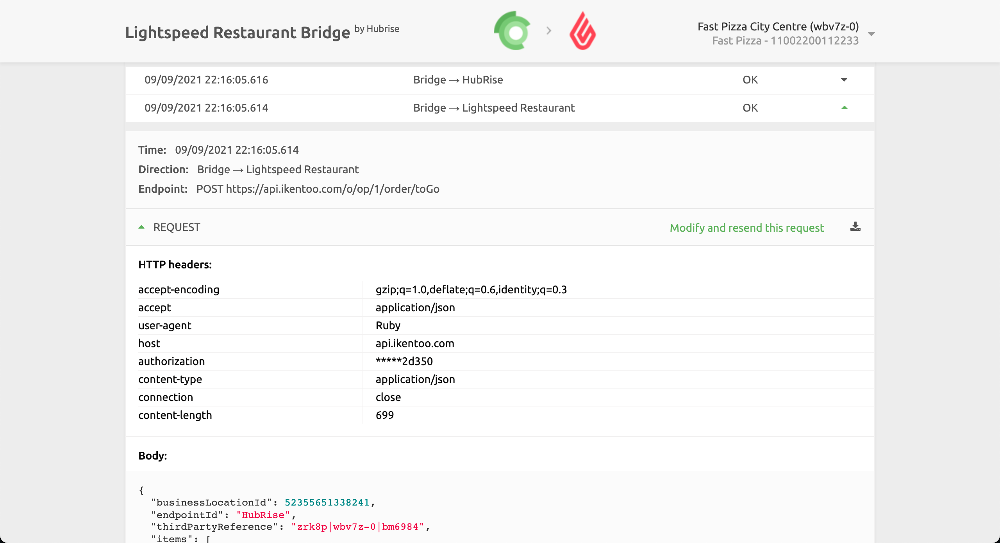

If some orders on HubRise did not reach your Lightspeed Restaurant EPOS, because the EPOS was switched off for instance, you can resend them from Lightspeed Restaurant Bridge.

If you want to resend an order to Lightspeed Restaurant, follow these steps:

1. Open the **Lightspeed Restaurant Bridge** from the **CONNECTIONS** page of your HubRise back office.
1. On the [**Operation page**](/apps/lightspeed-restaurant/user-interface#operation), click on the order that you want to resend.
1. Identify the request sent from the Bridge to Lightspeed Restaurant by checking that the **Direction** is **Bridge → Lightspeed Restaurant**.
   
1. Click **Modify and resend this request**.
1. Do not modify the request in the text editor and click **Resend**.
