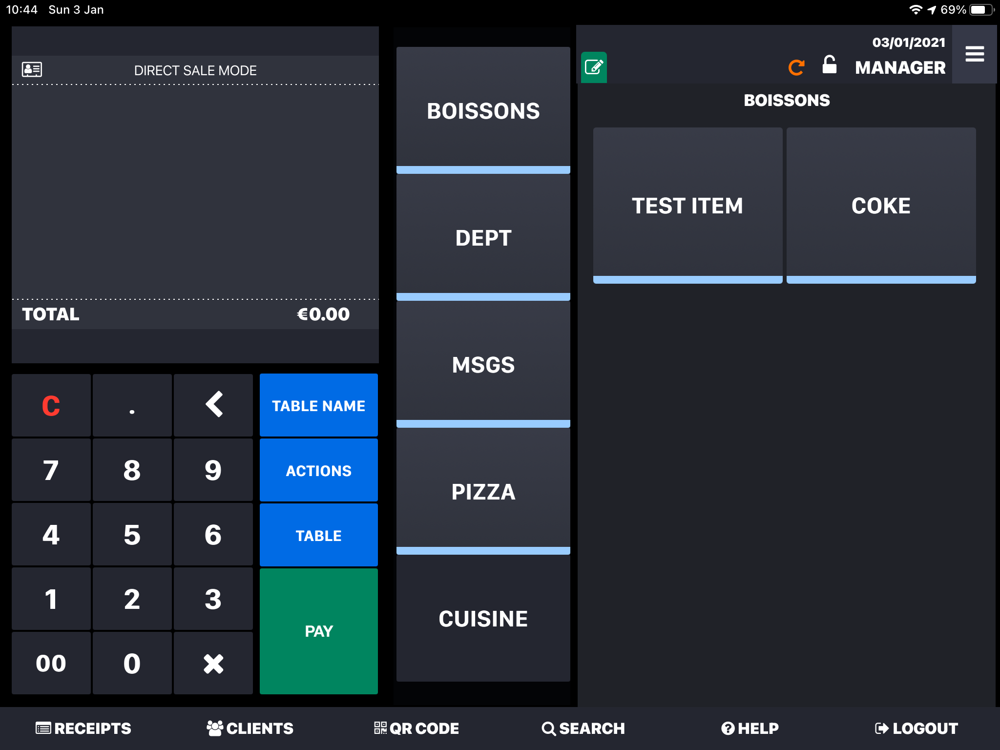

There might be different reasons why an order is not successfully sent to your Lightspeed Restaurant EPOS. In this page, we discuss some of the typical cases.

## Incorrect Ref Codes

If you receive orders from a connected app, for example a food delivery platform or an online ordering solution, you need to make sure that ref codes are properly configured there. An incorrect ref code in your menu can cause a whole order to be rejected by the Lightspeed Restaurant EPOS.

To troubleshoot an incorrect ref code in an order, you can look at the logs for Lightspeed Restaurant Bridge:

- Log in to your [HubRise account](https://manager.hubrise.com/connections).
- Open the **CONNECTIONS** page.
- Click **Open** next to the Lightspeed Restaurant Bridge connection. This opens a new window with all your recent orders.
- In the list, find the order you had an issue with.
- Click the corresponding row and identify the transaction coming from Lightspeed, that is the one whose direction is **Lightspeed -> Bridge**.
- In the request boby, if you see `FAILURE` as the status value and `Could not add item <id> (not found)` as the reason for the error, then the order rejection is probably due to an incorrect ref code in your connected app. The `<id>` value in the error message will indicate the problematic item.

## API Activation in the Tablet {#api-activation}

To connect Lightspeed Restaurant, the Lightspeed API needs to be activated by the Lightspeed support team. For more information, see [Connect Lightspeed to HubRise](/apps/lightspeed-restaurant/connect-hubrise).

Once the Lightspeed API has been properly configured, if you are still unable to receive orders in your tablet, check if the API connection is enabled on your tablet. On the main screen of the Lightspeed app, if you see a green pencil icon at the top of the right hand-side block, it means that your API connection is activated. If that icon is not green, tap on it and then tap the **Enable** button to activate the API.

