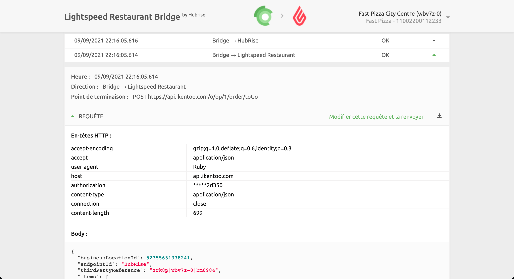

Si des commandes visibles sur HubRise ne sont pas parvenues à votre caisse Restaurant Lightspeed, parce que votre caisse était éteinte par exemple, vous pouvez les renvoyer depuis Lightspeed Restaurant Bridge.

Pour renvoyer une commande à Lightspeed Restaurant, suivez ces étapes :

1. Ouvrez **Lightspeed Restaurant Bridge** depuis la page **CONNECTIONS** de votre back-office HubRise.
1. Depuis la [**page Opération**](/apps/lightspeed-restaurant/user-interface#operation) de Lightspeed Restaurant Bridge, cliquez sur la commande que vous souhaitez renvoyer.
1. Identifiez la requête envoyée depuis le Bridge vers Lightspeed Restaurant en vérifiant que la **Direction** est **Bridge → Lightspeed Restaurant**. 
1. Cliquez sur **Modifier cette requête et la renvoyer**.
1. Ne modifiez pas la requête dans l'éditeur de texte et cliquez sur **Renvoyer**.
