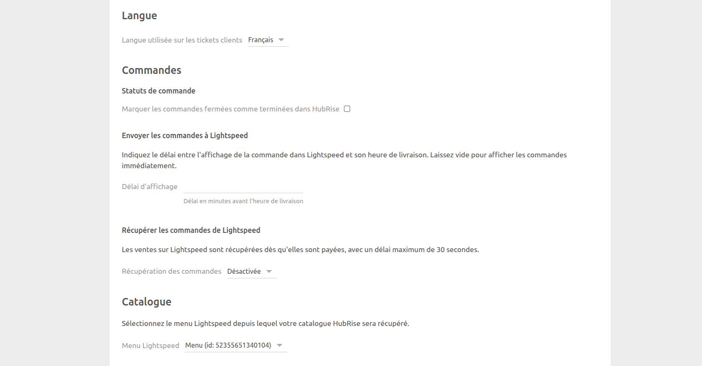

La page de configuration vous permet de personnaliser le comportement de Lightspeed Restaurant Bridge selon vos préférences. Elle est divisée en plusieurs sections pour faciliter la navigation.

## Langue

Choisissez la langue à utiliser pour les éléments génériques tels que les `Frais de livraison`. Ces noms peuvent apparaître sur les reçus des clients.

## Catalogue

Cette section vous permet de choisir le menu Lightspeed à utiliser lorsque vous souhaitez récupérer votre catalogue sur HubRise. Sélectionnez une valeur dans la liste déroulante.

## Commandes

Dans cette section, vous pouvez personnaliser la façon dont Lightspeed Restaurant Bridge gère les commandes.

Pour retarder les commandes jusqu'à peu avant l'heure de livraison, vous pouvez renseigner le champ **Délai d'affichage**. Si vous le laissez vide, les commandes seront affichées immédiatement dans Lightspeed.

Par défaut, Lightspeed Restaurant Bridge ne récupère pas les ventes de Lightspeed dans HubRise. Pour activer cette fonctionnalité, sélectionnez **Activée pour les ventes en consommation sur place** ou **Activée pour toutes les ventes** dans le champ **Récupération des commandes**.

## Enregistrer la configuration

Pour enregistrer la configuration, cliquez sur **Enregistrer** en haut de la page.

## Réinitialiser la configuration

Si vous avez besoin de réinitialiser la configuration, cliquez sur **Réinitialiser la configuration** en bas de la page.

---

**REMARQUE IMPORTANTE :** La réinitialisation de la configuration déconnectera instantanément le bridge de Lightspeed Restaurant.

---

La réinitialisation de la configuration ne supprime pas les logs des opérations affichés sur la page principale.
