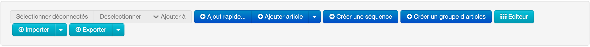
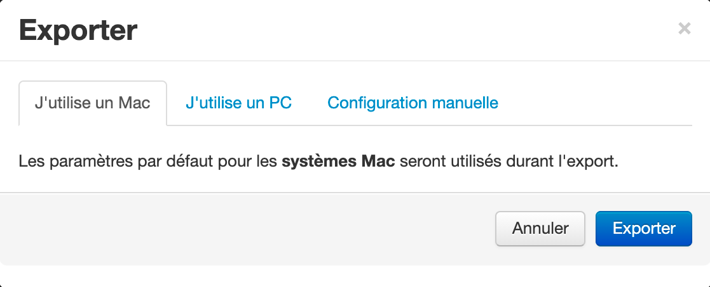
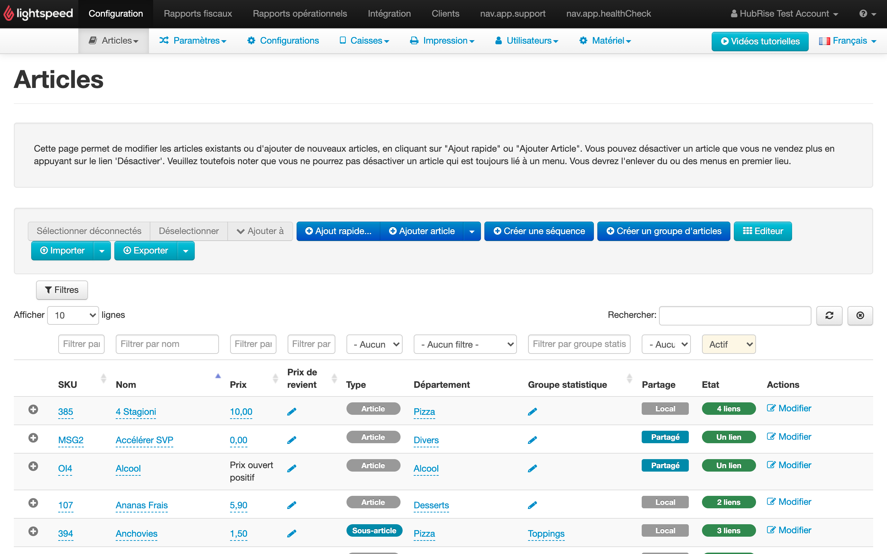

Lightspeed s'attend à ce que toutes les commandes entrantes contiennent des codes ref spécifiques pour chaque SKU, option, promotion, remise, frais, type de service et paiement. Pour que vos commandes soient correctement traitées, vous devez vous assurer que toutes les applications connectées utilisent les codes ref adéquats.

Cette page explique comment trouver les codes ref en téléchargeant la totalité de votre catalogue Lightspeed ou en consultant des articles spécifiques dans le back-office.

Vous pouvez également exporter votre catalogue Lightspeed directement dans HubRise avec Lightspeed Restaurant Bridge. Certaines applications connectées permettent d'importer le catalogue directement depuis HubRise et donc de renseigner automatiquement les codes ref. Pour plus de détails sur cette fonctionnalité et ses limites dans Lightspeed Restaurant Bridge, consultez [Récupérer le catalogue](/apps/lightspeed-restaurant/pull-catalog).

## Télécharger le catalogue complet

Vous pouvez télécharger votre catalogue Lightspeed pour gérer les articles et les codes ref avec un logiciel distinct.

Pour télécharger le catalogue Lightspeed, suivez ces étapes :

1. Dans votre back-office Lightspeed, sélectionnez **Configuration**, puis **Articles** > **Articles**.
1. Cliquez sur le bouton **Exporter**.
1. 
1. Dans la popup, choisissez votre type de système d'exploitation : Mac ou Windows (ou configuration manuelle), puis cliquez sur **Exporter**. 
1. Une fois l'exportation terminée, sélectionnez **Cliquez ici pour télécharger le fichier exporté** pour télécharger le fichier CSV avec votre menu. 

Pour vérifier les codes ref des articles, vous pouvez ouvrir le fichier CSV téléchargé dans Excel ou dans un éditeur de texte. Les codes ref figurent dans la colonne **SKU**.

## Trouver les codes ref d'articles spécifiques

Vous pouvez trouver les codes ref de SKU, options, promotions, remises, frais, types de service et paiements dans votre back-office Lightspeed.

### SKU, options, remises et frais

Pour trouver les codes ref de SKU, options, remises et frais, suivez ces étapes :

1. Dans votre back-office Lightspeed, sélectionnez **Configuration**, puis **Articles** > **Articles**.
1. Les codes ref figurent dans la colonne **SKU**. 

Copiez les codes dans l'application associée. Pour des instructions détaillées, suivez la documentation de l'application connectée sur le site internet de HubRise.

Notez que les frais et les remises doivent être créés en tant qu'articles pour être compatibles avec le modèle de données de HubRise. Pour plus d'informations, consultez [Create Ref Codes](/apps/lightspeed-restaurant/create-ref-codes).

### Instructions de production

Les instructions de production dans Lightspeed peuvent être associées aux options HubRise. Pour trouver les codes ref des instructions de production, suivez ces étapes :

1. Dans votre back-office Lightspeed, sélectionnez **Configuration**, puis **Paramètres** > **Instructions de production**.
1. Pour télécharger la liste complète des instructions de production, cliquez sur **Exporter au format CSV**.
1. Dans le fichier CSV, les codes ref figurent dans la colonne **identifiant**.

Lorsque vous associez les instructions de production aux applications connectées, ajoutez `+` avant le code ref. Par exemple, si votre instruction présente le code ref `52355651338378`, utilisez `+52355651338378` pour l'associer aux applications connectées.

---

**REMARQUE IMPORTANTE** : Aucun prix n'est associé aux instructions de production. L'ajout d'un prix dans une application connectée peut générer des [erreurs liées à une différence de prix](/apps/lightspeed-restaurant/troubleshooting/price-differences-errors/).

---

### Types de service

Dans Lightspeed, les types de services sont appelés _profils de compte_. Pour trouver le code ref d'un type de service spécifique, suivez ces étapes :

1. Dans votre back-office Lightspeed, sélectionnez **Configuration**, puis **Paramètres** > **Profils de compte**.
1. Pour chaque type de service disponible dans la colonne **Nom**, vous trouverez un code ref dans la colonne **Code**.

### Modes de paiement

Pour trouver le code ref d'un mode de paiement, suivez ces étapes :

1. Dans votre back-office Lightspeed, sélectionnez **Configuration**, puis **Paramètres** > **Modes de paiement**.
1. Pour chaque mode de paiement disponible dans la colonne **Nom**, vous trouverez un code ref dans la colonne **Code**.
