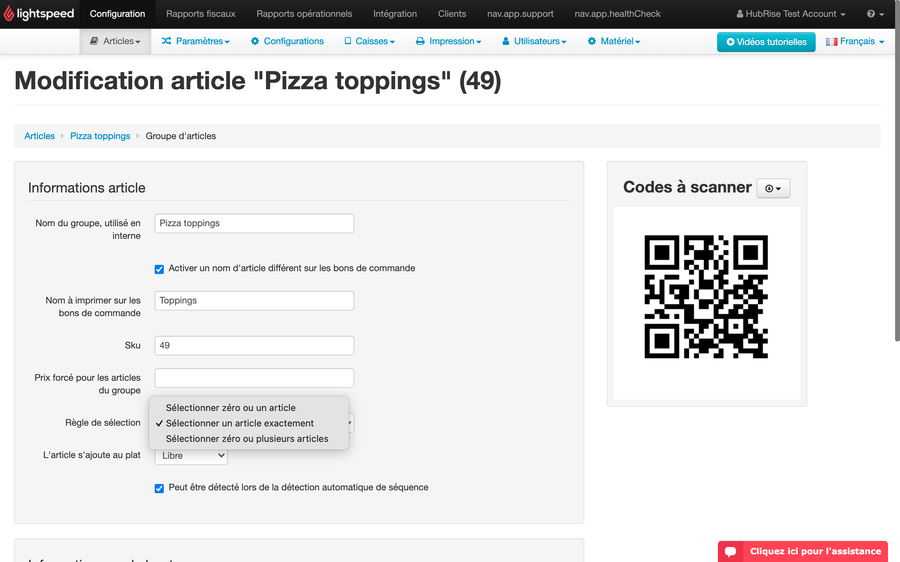

Cette page décrit comment récupérer un catalogue depuis Lightspeed dans HubRise et détaille les informations reçues dans HubRise.

## Récupérer le catalogue dans HubRise

Pour récupérer un catalogue depuis Lightspeed, suivez ces étapes :

1. Depuis la page principale de Lightspeed Restaurant Bridge, sélectionnez l'onglet **Actions**, puis cliquez sur **Récupérer le catalogue**.
2. Cliquez sur **Confirmer** lorsque vous y êtes invité.

---

**REMARQUE IMPORTANTE** : Cette opération remplacera votre catalogue HubRise actuel.

---

Selon la taille du catalogue, la mise à jour complète de votre catalogue HubRise peut durer quelques minutes.

## Informations envoyées à HubRise

Les sections suivantes expliquent en détail comment votre catalogue Lightspeed est associé à HubRise.

### Catégories

Les catégories du catalogue Lightspeed sont associées une à une à celles des produits sur HubRise.

Le nom de la catégorie est envoyé à HubRise, mais son code ref et ses descriptions ne sont pas pris en charge par Lightspeed.

### Produits et SKU

Lightspeed prend en charge les SKU, mais pas les produits. Pour chaque article du catalogue Lightspeed, Lightspeed Restaurant Bridge crée une SKU correspondante dans HubRise avec les informations suivantes (si elles sont disponibles) :

- Nom de la SKU
- Code ref de la SKU
- Description
- Images
- Prix
- Options

### Options

Lightspeed prend en charge des groupes d'articles, qui sont envoyés à HubRise sous forme d'options et de listes d'options.

Le type d'option HubRise est sélectionné de la manière suivante :

- Un groupe avec la règle de sélection **Sélectionner un article exactement** est converti en une liste d'options à choix unique.
- Un groupe avec une règle de sélection différente est converti en une liste d'options à choix multiple.

### Instructions de production Lightspeed

Lightspeed prend en charge les instructions de production, qui sont généralement des instructions de préparation pour la cuisine. Elles sont envoyées à HubRise sous forme d'options à choix multiple sans prix associé.

## Références techniques

Les sections suivantes fournissent des informations techniques sur l'encodage de votre catalogue Lightspeed dans HubRise.

### Catégories

Pour chaque catégorie, les champs suivants sont envoyés à HubRise :

- `name` : nom de la catégorie.
- `ref` : Un numéro séquentiel est automatiquement généré pour chaque catégorie.

### SKU

Pour chaque SKU, Lightspeed envoie les informations suivantes à HubRise :

- `name` : nom de la SKU
- `description` : description de la SKU
- `image_ids` : liste des ID d'images associées à la SKU
- `skus` : liste contenant une seule SKU
  - `skus[0].ref` : code ref de la SKU, transmis dans les commandes
  - `skus[0].price` : prix de la SKU
  - `skus[0].option_list_refs` : liste d'options rattachées à la SKU

### Options

Chaque liste d'options a une `ref` séquentielle qui commence par `deal_`. Pour chaque option, les informations suivantes sont envoyées à HubRise :

- `name` : nom de l'option
- `ref` : code ref de l'option
- `price` : prix de l'option

Chaque groupe d'instructions de production est associé à HubRise sous forme de liste d'options. Pour chaque instruction, les informations suivantes sont envoyées à HubRise :

- `name` : nom de l'instruction
- `ref`: The ref code of the instruction, preceded by a `+` sign.
- `price` : toujours 0
