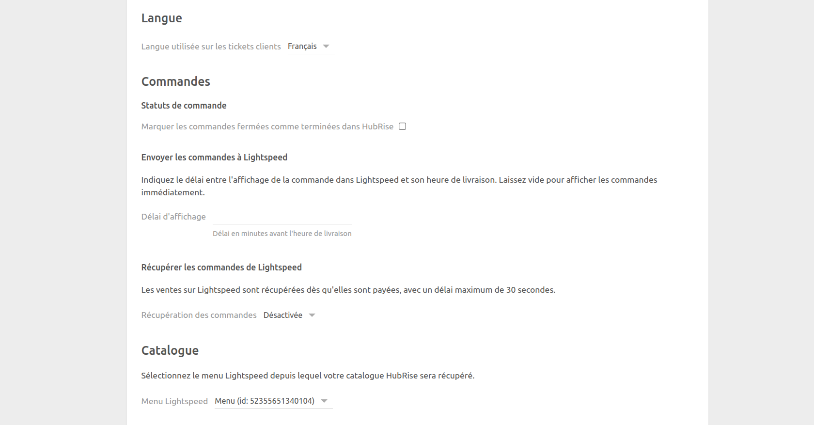

HubRise peut récupérer des commandes depuis votre logiciel de caisse Lightspeed Restaurant dès qu'elles sont payées.

Cette page explique comment activer cette fonctionnalité et détaille les informations envoyées à HubRise.

## Activer la récupération des commandes

Pour commencer à récupérer les commandes Lightspeed dans HubRise, vous devez activer la fonctionnalité en suivant ces étapes :

1. Ouvrez Lightspeed Restaurant Bridge.
1. Ouvrez la page **Configuration**.
1. Dans la section **Récupérer les commandes de Lightspeed**, sélectionnez l'option **Activée pour les ventes en consommation sur place** ou **Activée pour toutes les ventes payées**, en fonction de vos besoins.
1. Cliquez sur **Enregistrer** pour confirmer.

Lightspeed Restaurant Bridge récupère de nouvelles commandes toutes les 30 secondes. Il peut y avoir un délai allant jusqu'à 30 secondes entre le moment où une commande est payée et le moment où elle apparaît dans HubRise.

---

**REMARQUE IMPORTANTE** : Seules les ventes payées sont récupérées dans HubRise.

---

## Informations reçues dans HubRise

Les sections suivantes décrivent les informations sur les commandes Lightspeed qui sont reçues dans HubRise.

### Articles et options

Lightspeed Restaurant Bridge reçoit des informations complètes sur les articles et les options, y compris le nom, le code ref du produit, la quantité et le prix.

Les informations sur le numéro de plat ne sont pas reçues dans HubRise.

### Statuts de commande

Les commandes sont créées dans HubRise avec le statut par défaut `accepted`.

### Paiements

Lightspeed Restaurant Bridge reçoit des informations complètes sur le paiement d'une commande locale, y compris le nom, le code ref du produit et le montant.

### Types de service

Les ventes sur place dans Lightspeed sont créées dans HubRise en tant que commandes `eat-in`, et les ventes à emporter en tant que commandes `collection`. Il n'y a aucun moyen de différencier les commandes à emporter des livraisons.

### Informations supplémentaires

Lightspeed Restaurant Bridge reçoit des informations supplémentaires sur la commande, par exemple le numéro de table et l'heure à laquelle la commande a été payée.
