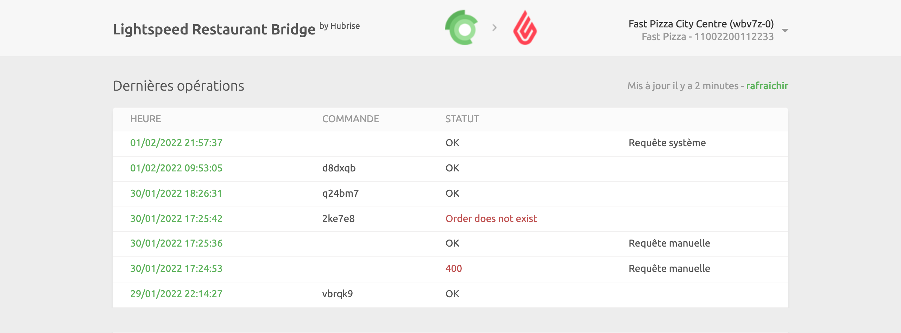
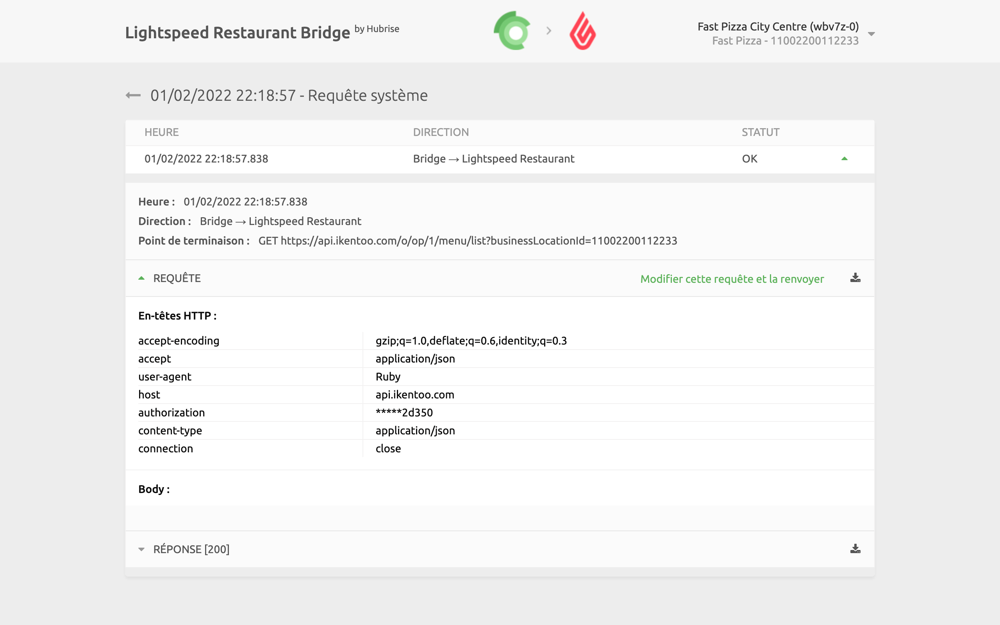

Dans l'interface utilisateur de Lightspeed Restaurant Bridge, vous trouverez des informations de diagnostic de base sur votre connexion avec Lightspeed Restaurant. Un lien vers les logs des dernières requêtes HubRise envoyées au logiciel de caisse y figure également.

## Page d’accueil

La page d'accueil de Lightspeed Restaurant Bridge affiche les dernières opérations. Chaque ligne fournit les données suivantes :

- **HEURE** : date et heure de l'opération.
- **STATUT** : statut de l'opération. La valeur OK indique que l'opération a réussi. Dans le cas contraire, un message précise le type d'erreur survenue.

Cliquez sur une ligne pour afficher une nouvelle page contenant plus d'informations sur l'opération.

En haut à droite de la page d'accueil de Lightspeed Restaurant Bridge figurent l'utilisateur et le point de vente connectés, ainsi que l'établissement Lightspeed actuellement utilisé. Cliquez sur la flèche vers le bas pour développer un menu où vous pourrez modifier la langue de l'interface et accéder à la **page Configuration**.

---

**REMARQUE IMPORTANTE :** La première fois que vous accédez aux logs depuis Lightspeed Restaurant Bridge, il vous est demandé d'**autoriser** le Bridge à accéder aux informations de votre compte HubRise.

---

## Page des opérations {#operation}

Sélectionnez une opération dans la liste pour afficher tous les logs des requêtes d'API échangées entre HubRise et le logiciel de caisse Lightspeed Restaurant via Lightspeed Restaurant Bridge.

Les requêtes sont classées par ordre chronologique inverse, et chacune d'elles affiche les informations suivantes :

- **Heure** : date et heure d'envoi de la commande.
- **Direction** : applications qui envoient et reçoivent la requête, selon le format Origine → Destination.
- **Point de terminaison** : statut de la requête. La valeur `OK` indique que la requête a bien été reçue. Dans le cas contraire, un message précise le type d'erreur survenue.

Cliquez sur une requête pour la développer et afficher le détail des échanges.

Les logs sont un bon outil de débogage en cas de problème. Pour comprendre comment les lire, consultez [Comprendre les logs HubRise](/docs/hubrise-logs/overview).

## Page de configuration

Sur la **page Configuration**, personnalisez le comportement de Lightspeed Restaurant Bridge. Pour plus d'informations, consultez [Configuration](/apps/lightspeed-restaurant/configuration).
