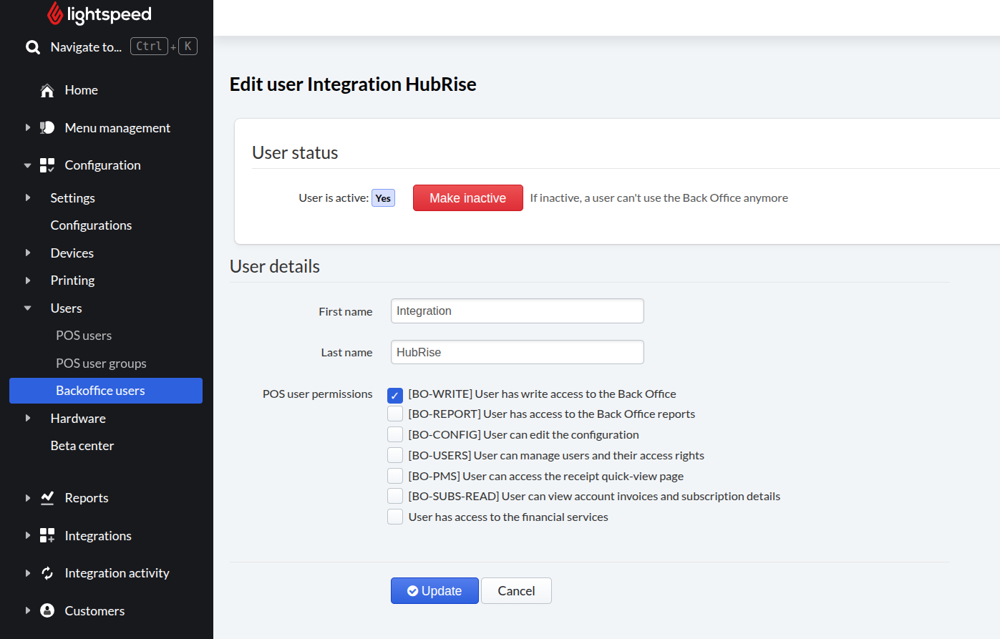

This page explains how to resolve the "403 Forbidden" error that can occur when you attempt to pull the menu (catalog) from Lightspeed Restaurant into HubRise.

When you trigger a catalog pull from Lightspeed Restaurant Bridge, the operation might fail with status `400` and a body similar to the following in the [operation logs](/apps/lightspeed-restaurant/user-interface#operation):

```json
{
  "url": "https://api.lsk.lightspeed.app/o/op/1/menu/load/1064713802743855",
  "ex": "403 Forbidden from GET http://backend:8086/integration/3/menus/1064713802743855"
}
```

The reason is that the Lightspeed user account employed by Lightspeed Restaurant Bridge does not have sufficient rights in the Lightspeed back office. Specifically, the permission **BO-WRITE** is required for the API endpoint that exports the menu.  
This situation is common when the connection is made with a dedicated technical user rather than the main Lightspeed administrator.

To solve the problem:

1. Sign in to the Lightspeed back office with an administrator account.
2. In the left-hand menu, choose **Configuration** › **Users** › **Backoffice users**.
3. Locate the user used to connect Lightspeed Restaurant Bridge (for example, `Integration HubRise`) and click **Configure**.
4. In the permissions area, tick **[BO-WRITE] User has write access to the Back Office**.
5. Click **Save**.



After the permission has been saved, reconnect Lightspeed Restaurant Bridge and retry the catalog pull. The operation should now complete successfully.
