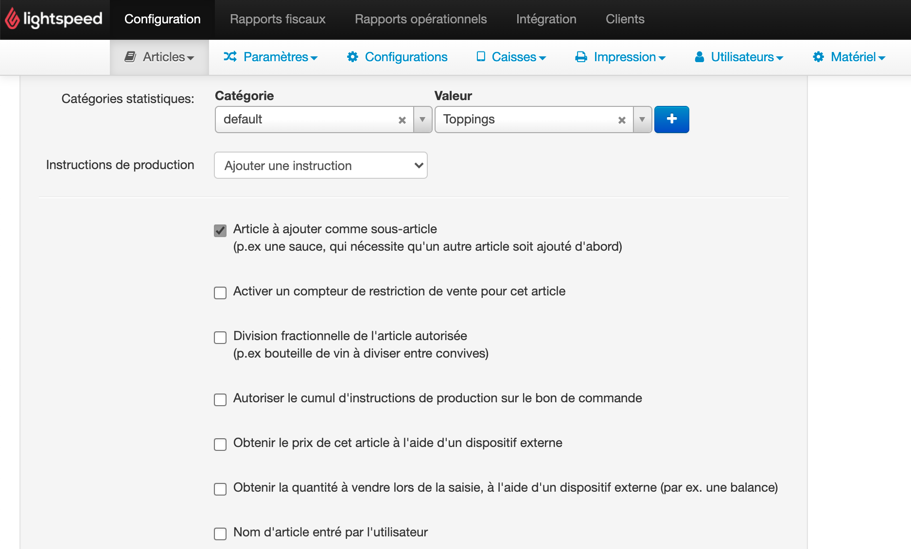

Cette page explique comment résoudre les erreurs d'échec de commandes causées par des produits avec des restrictions de vente.

## Erreur "Check Restrictions" (Vérifier les restrictions)

Il peut arriver que des commandes envoyées à Lightspeed Restaurant échouent en affichant l'erreur suivante dans les [logs de Lightspeed Restaurant Bridge](/apps/lightspeed-restaurant/user-interface/#operation-page) :

```json
{
  "status": "FAILURE",
  "reason": "Could not add item Topping 1 (check sales restrictions)",
  "thirdPartyReference": "xxx|xxx-0|yyy"
}
```

Cette erreur se produit lorsque des restrictions de vente appliquées à un produit empêchent les clients de le commander. Les restrictions de vente ne sont pas compatibles avec les commandes en ligne.

Le message d'erreur du champ `reason` précise l'article ayant généré l'erreur (dans ce cas, `Topping 1`). Pour résoudre le problème, supprimez les restrictions de vente du produit.

## Supprimer les restrictions de vente

Pour supprimer les restrictions de vente d'un produit, suivez ces étapes :

1. Connectez-vous à votre [back-office Lightspeed](https://console.ikentoo.com/).
1. Dans la barre de menus, sélectionnez **Articles > Articles**.
1. Dans la liste des produits, trouvez le produit mentionné dans le message d'erreur, puis cliquez sur l'icône **Modifier** dans la colonne **Actions**.
1. Dans les **détails sur l'article**, décochez la case **Activer un compteur de restriction de vente pour cet article**. 
1. Cliquez sur **Enregistrer**.
