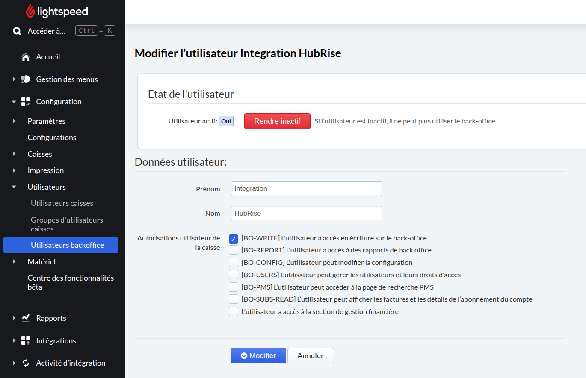

Cette page explique comment résoudre l'erreur "403 Forbidden" qui peut survenir lorsque vous tentez d'importer le menu (catalogue) Lightspeed Restaurant dans HubRise.

Lorsque vous lancez l'import du catalogue depuis Lightspeed Restaurant Bridge, l'opération peut échouer avec le statut `400` et une réponse semblable à ceci dans les [logs d'opérations](/apps/lightspeed-restaurant/user-interface#operation) :

```json
{
  "url": "https://api.lsk.lightspeed.app/o/op/1/menu/load/1064713802743855",
  "ex": "403 Forbidden from GET http://backend:8086/integration/3/menus/1064713802743855"
}
```

La cause de ce problème est que le compte utilisateur Lightspeed utilisé par Lightspeed Restaurant Bridge ne dispose pas des droits nécessaires dans le back-office Lightspeed. Plus précisément, l'autorisation **BO-WRITE** est requise pour accéder à l'API d'export du menu. Ce problème survient souvent lorsque la connexion est réalisée avec un utilisateur technique dédié plutôt qu'avec l'administrateur principal du compte Lightspeed.

Pour corriger le problème :

1. Connectez-vous au back-office Lightspeed avec un compte administrateur.
2. Dans le menu de gauche, choisissez **Configuration** › **Utilisateurs** › **Utilisateurs backoffice**.
3. Recherchez l'utilisateur utilisé pour Lightspeed Restaurant Bridge (par exemple `Integration HubRise`) et cliquez sur **Configurer**.
4. Dans la section des autorisations, cochez **[BO-WRITE] L'utilisateur a accès en écriture au back-office**.
5. Cliquez sur **Modifier**.



Une fois l'autorisation enregistrée, reconnectez Lightspeed Restaurant Bridge et relancez l'import du catalogue. L'opération devrait alors réussir.
