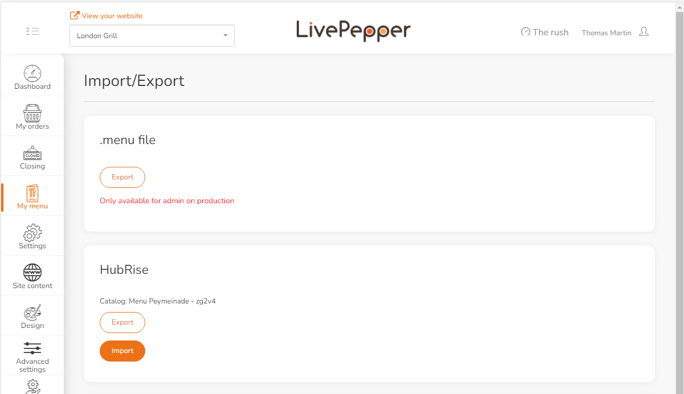

For LivePepper orders to be processed by your EPOS, it is essential to assign ref codes to each menu item, including skus, toppings, options, ingredients, and deals.

Some EPOS systems enable menu export to HubRise, facilitating the automatic population of your LivePepper menu with the correct ref codes. However, if your EPOS does not support menu push to HubRise, you will need to manually map ref codes, as described in [Map Ref Codes](/apps/livepepper/map-ref-codes). Consult your EPOS documentation on the HubRise website to verify.

---

**IMPORTANT NOTE:** Make sure to associate ref codes to every product and option in your catalog. LivePepper will not pull a HubRise catalog missing any ref codes.

---

To pull a HubRise catalog into LivePepper:

1. Log in to your LivePepper back office.
1. Click **My menu** > **Import / Export**.
1. In the **HubRise** section, click **Import**.
   
1. Enter your LivePepper password and click **Import from HubRise**.

---

**IMPORTANT NOTE:** Pulling a HubRise catalog will overwrite all existing products in LivePepper. This action cannot be reverted.

---

## Technical Details

### Option Lists

When importing from HubRise, each option list is categorised in LivePepper according to the following rules:

- **Variants**: single-choice list.
- **Ingredients**: multiple-choice list whose name starts with "Ingredients" or "Composition" (case-insensitive).
- **Toppings**: multiple-choice list whose name starts with "Extras" or "Toppings" (case-insensitive).
- **Options**: multiple-choice list whose name does not match any of the above prefixes.

LivePepper only supports one list for each of the first three categories. If multiple lists meet the same criteria, only one of them will be imported.

### Product and Option Order

When a catalog is imported from HubRise into LivePepper, option lists are not guaranteed to appear in the same order as in HubRise. LivePepper applies its own predefined order for option categories: **Variants** > **Ingredients** > **Toppings** > **Options**.

If you require a specific display order, check with the LivePepper team to confirm whether adjustments are possible with a custom design website.

Within each category, product items are imported in the same order as they are defined in HubRise.

