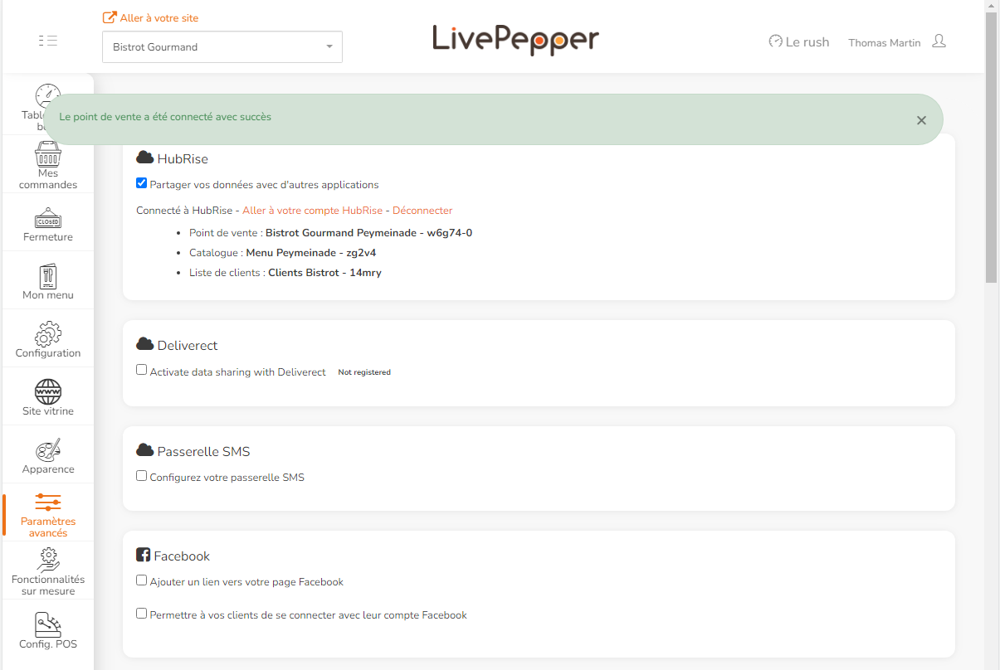

La connexion de LivePepper à HubRise s'effectue en quelques étapes simples. Si vous n'avez pas encore de compte HubRise, il sera créé automatiquement au cours du processus.

***

**REMARQUE IMPORTANTE :** Pour connecter un site internet LivePepper avec plusieurs points de vente, consultez cette [FAQ](/apps/livepepper/faqs/connect-shops-hubrise-accounts).

***

## Se connecter à LivePepper

Si vous n'avez pas de compte HubRise, suivez ces étapes :

1. Connectez-vous à votre back-office LivePepper.
2. Sélectionnez **Paramètres avancés** > **Modules**.
3. Sous HubRise, cochez la case **Partager vos données avec d'autres applications**.
4. Cliquez sur **Aller à votre compte HubRise**.
5. Lorsque la page de connexion à HubRise s'affiche, cliquez sur **Ou créez votre compte**.
6. Saisissez vos informations personnelles et cliquez sur **Créer un compte**.
7. Vérifiez que les noms de votre compte et de votre point de vente ont été correctement préremplis par LivePepper. Cliquez sur **Créer**.
8. Cliquez sur **Autoriser**.

Si vous avez déjà un compte HubRise, suivez ces étapes :

1. Connectez-vous à votre back-office LivePepper.
2. Sélectionnez **Paramètres avancés** > **Modules**.
3. Sous HubRise, cochez la case **Partager vos données avec d'autres applications**.
4. Cliquez sur **Aller à votre compte HubRise**.
5. Si vous y êtes invité, connectez-vous à votre profil utilisateur HubRise existant.
6. Sélectionnez le **point de vente** HubRise à connecter, puis cliquez sur **Autoriser**.

## Se déconnecter de LivePepper

Pour désactiver la connexion entre LivePepper et HubRise, suivez ces étapes :

1. Connectez-vous à votre back-office LivePepper.
2. Sélectionnez **Paramètres avancés** > **Modules**.
3. Sous HubRise, cliquez sur **Déconnecter**.
