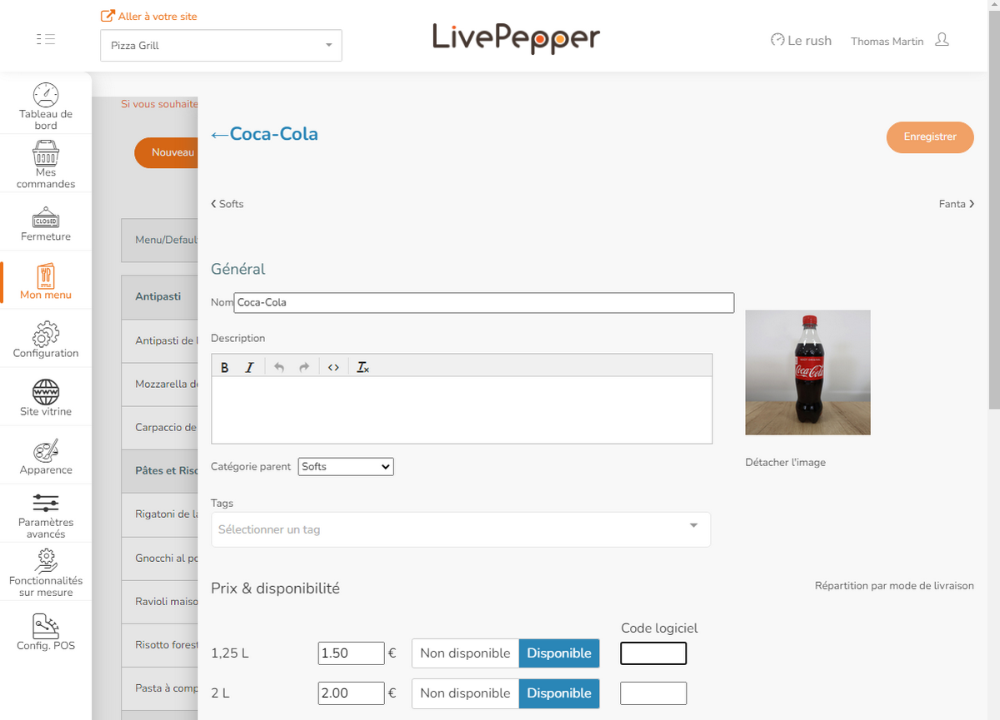
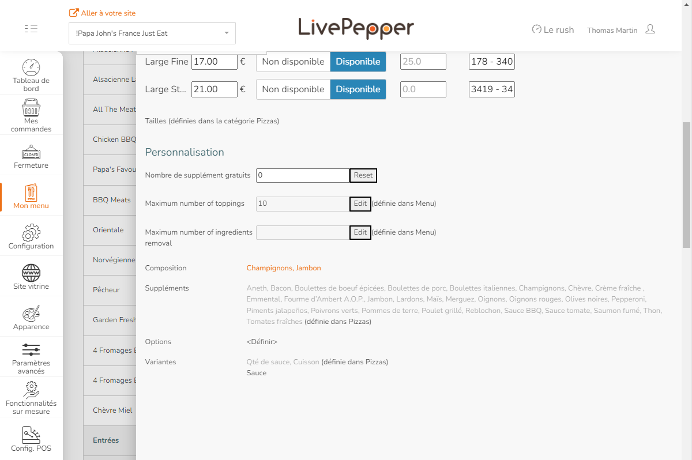
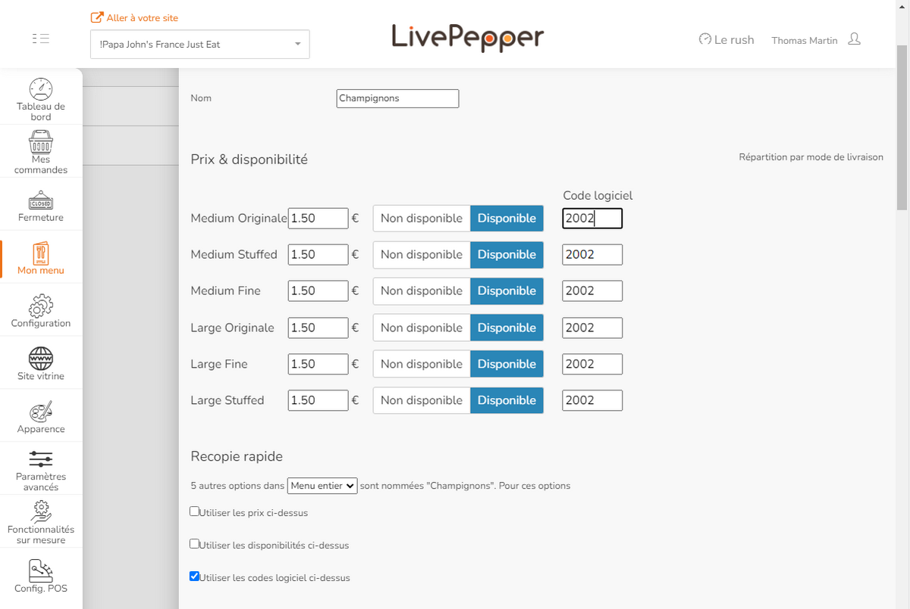

Pour recevoir correctement les commandes LivePepper dans votre logiciel de caisse, vous devez configurer des codes ref pour chaque article du catalogue, y compris les suppléments, les options, les ingrédients composants vos recettes, les variantes et les promotions. Dans certains cas, le logiciel de caisse nécessite également des codes ref pour les moyens de paiement, les types de service et les frais de livraison. Pour plus de détails, reportez-vous à la documentation de votre logiciel de caisse sur le site internet de HubRise.

Cette page explique comment configurer manuellement les codes ref dans LivePepper. Certains logiciels de caisse offrent la possibilité d'exporter leur menu vers HubRise, ce qui permet de renseigner automatiquement les bons codes ref des produits LivePepper. Pour plus de détails, voir [Récupérer le catalogue](/apps/livepepper/pull-catalog).

## Produits et SKUs

Chaque produit a un ou plusieurs SKU. Chaque SKU, correspondant à des variantes sur LivePepper, dispose d'un code ref qui doit être associé à l'article correspondant dans votre logiciel de caisse.

Pour mettre à jour le code ref de chaque variante, suivez ces étapes :

1. Dans votre back-office LivePepper, sélectionnez **Mon menu** > **Produits**.
2. Sélectionnez le produit à mettre à jour.
3. Pour chaque variante dans la section **Prix & Disponibilité**, mettez à jour le code ref sous la colonne **Code logiciel**.
4. Cliquez sur **Enregistrer** pour confirmer.

À la fin du processus, vous pouvez vérifier que tous les produits ont été associés en utilisant l'action personnalisée **Codes manquants pour ces produits** dans LivePepper. Pour plus d'informations, voir [Vérifier l'association de produits](/apps/livepepper/troubleshooting#verify-mapping).

## Suppléments, ingrédients et options

LivePepper prend en charge différents types de modifications optionnelles des produits, appelées variantes, suppléments, composition et options. Ces éléments peuvent être définis au niveau de la catégorie ou du produit.

Le tableau suivant fournit un aperçu de toutes ces fonctionnalités.

| Nom         | Description                                                                                | Niveau de définition | Exemple                                                    |
| ----------- | ------------------------------------------------------------------------------------------ | -------------------- | ---------------------------------------------------------- |
| Variante    | Choix différent pour un produit                                                            | Catégorie et Produit | Choisir une pizza avec une croûte fine ou pétrie à la main |
| Supplément  | Suppléments non disponibles par défaut que les clients peuvent ajouter à leur produit      | Catégorie            | Ajouter des champignons sur une pizza                      |
| Composition | Un ingrédient compostant votre recette, présent par défaut qui peut être retiré du produit | Produit              | Retirer des cornichons d'un cheeseburger                   |
| Option      | Service ou article optionnel ajouté au produit                                             | Catégorie            | Demander de couper la pizza                                |

Pour mettre à jour le code ref des suppléments ou des variantes définis au niveau du produit, suivez ces étapes :

1. Sélectionnez le produit.
2. Dans la section **Personnalisation**, sélectionnez l'élément que vous souhaitez mettre à jour.
   
3. Si un ingrédient ou une variante est utilisé dans d'autres produits et qu'ils partagent le même code ref, vous pouvez mettre à jour le code ref partout, en suivant ces étapes supplémentaires.
   - Dans la section **Recopie rapide**, indiquez si la modification s'applique au **Menu entier** ou à tous les produits d'une catégorie.
   - Sélectionnez **Utiliser les codes logiciel ci-dessus**.
     
4. Cliquez sur **Enregistrer** pour confirmer.

Pour mettre à jour le code ref des suppléments, options ou variantes définis au niveau de la catégorie, suivez ces étapes :

1. Dans votre back-office LivePepper, sélectionnez **Mon menu** > **Produits**.
2. Sélectionnez une catégorie.
3. Dans la section **Personnalisation**, sélectionnez l'article que vous souhaitez mettre à jour.
4. Si l'article est utilisé dans d'autres produits et qu'ils partagent le même code ref, vous pouvez mettre à jour le code ref partout, en suivant ces étapes supplémentaires.
   - Dans la section **Recopie rapide**, indiquez si la modification s'applique au **Menu entier** ou à tous les produits d'une catégorie.
   - Sélectionnez **Utiliser les codes logiciel ci-dessus**.
5. Cliquez sur **Enregistrer** pour confirmer.

À la fin du processus, vous pouvez vérifier si tous les attributs et valeurs de produits ont été associés. Pour plus d'informations, voir [Vérifier l'association de produits](/apps/livepepper/troubleshooting#verify-mapping).

## Promotions et remises

Les promotions LivePepper fournissent des réductions sur les produits ou sur l'ensemble de la commande. Afin que les commandes avec promotions soient correctement transmises à votre logiciel de caisse et aux autres applications connectées à HubRise, il est essentiel que les codes ref soient corrects.

Pour ajouter un code ref à une promotion, suivez ces étapes :

1. Dans votre back-office LivePepper, sélectionnez **Mon menu** > **Promotions**.
2. Trouvez la promotion à mettre à jour, puis sélectionnez **Modifier**.
3. Sous **Paramètres avancés**, saisissez le code ref dans le champ **Code logiciel**.
4. Cliquez sur **Enregistrer** pour confirmer.

À la fin du processus, vous pouvez vérifier si toutes les promotions ont été associées. Pour plus d'informations, voir [Vérifier l'association de produits](/apps/livepepper/troubleshooting#verify-mapping).

***

**REMARQUE IMPORTANTE :** En fonction de votre logiciel de caisse, les promotions peuvent lui être transmises même sans code ref. Vérifiez que vos promotions sont configurées de façon à répondre aux exigences de votre logiciel de caisse.

***

## Moyens de paiement

Les moyens de paiement que vous configurez dans LivePepper peuvent nécessiter un code ref. Pour le vérifier, reportez-vous à la documentation de votre logiciel de caisse sur le site internet de HubRise.

Pour ajouter un code ref à un moyen de paiement, suivez ces étapes :

1. Dans votre back-office LivePepper, sélectionnez **Configuration** > **Moyens de paiement**.
2. Cliquez sur le moyen de paiement à mettre à jour.
3. Cliquez sur l'icône de modification <InlineImage width="20" height="20"></InlineImage>.
4. Sous **Paramètres avancés**, saisissez le code ref dans le champ **Code logiciel**.
5. Cliquez sur **Enregistrer** pour confirmer.

## Types de service

Les types de service tels que la livraison, le retrait ou la consommation sur place peuvent nécessiter un code ref. Pour le vérifier, reportez-vous à la documentation de votre logiciel de caisse sur le site internet de HubRise.

Pour ajouter un code ref à un type de service, suivez ces étapes :

1. Dans votre back-office LivePepper, sélectionnez **Configuration** > **Paramètres livraison**.
2. Sous **Méthodes de livraison**, trouvez le type de service à mettre à jour et ajoutez le code ref dans le champ **Code logiciel**.
3. Cliquez sur **Enregistrer** pour confirmer.

## Frais de livraison

Si des frais de livraison s'appliquent pour le service proposé, un code ref peut être requis. Pour le vérifier, reportez-vous à la documentation de votre logiciel de caisse sur le site internet de HubRise.

Pour ajouter un code ref à des frais de livraison, suivez ces étapes :

1. Dans votre back-office LivePepper, sélectionnez **Configuration** > **Paramètres livraison**.
2. Sous **Frais de livraison**, saisissez le code ref dans le champ **Code logiciel des frais de livraison**.
3. Cliquez sur **Enregistrer** pour confirmer.
