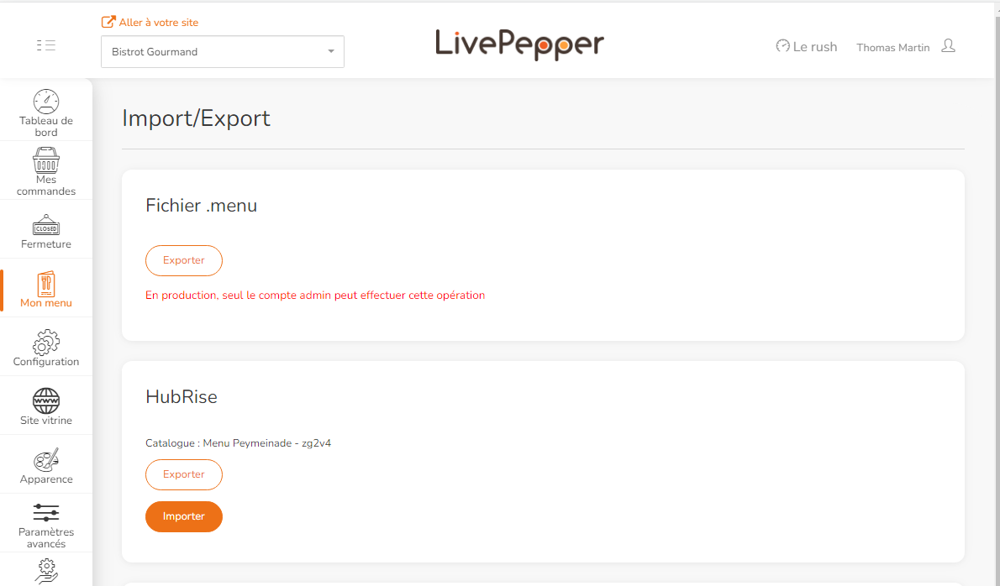

Pour que les commandes LivePepper soient traitées par votre logiciel de caisse, il est essentiel d'attribuer des codes ref à chaque article du menu, y compris les variantes, les suppléments, les options, les compositions et les promotions.

Certains logiciels de caisse permettent d'exporter des menus vers HubRise. Votre menu LivePepper est ainsi alimenté automatiquement avec les bons codes ref. Cependant, si votre logiciel de caisse ne prend pas en charge l'envoi de menu vers HubRise, vous devez associer manuellement les codes ref, comme indiqué dans la section [Associer les codes ref](/apps/livepepper/map-ref-codes). Pour le vérifier, reportez-vous à la documentation de votre logiciel de caisse sur le site internet de HubRise.

***

**REMARQUE IMPORTANTE :** Assurez-vous d'associer les codes ref à chaque produit et option de votre catalogue. LivePepper ne peut pas récupérer de catalogue HubRise s'il y manque des codes ref.

***

Pour récupérer un catalogue HubRise dans LivePepper :

1. Connectez-vous à votre back-office LivePepper.
2. Cliquez sur **Mon menu** > **Import/Export**.
3. Dans la section **HubRise**, cliquez sur **Importer**.
   
4. Saisissez votre mot de passe LivePepper et cliquez sur **Importer depuis HubRise**.

***

**REMARQUE IMPORTANTE :** La récupération d'un catalogue HubRise écrase tous les produits existants dans LivePepper. Cette action est irréversible.

***
