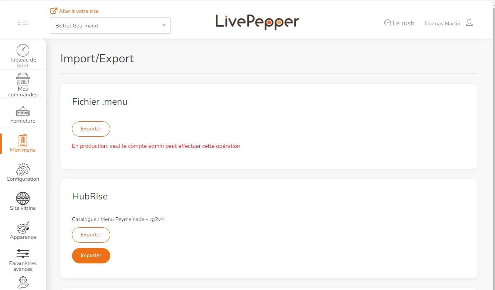

L'envoi de votre menu LivePepper dans HubRise vous permet de le partager avec d'autres applications connectées, par exemple Uber Eats ou Deliveroo.

Pour envoyer votre menu dans HubRise :

1. Connectez-vous à votre back-office LivePepper.
2. Accédez à **Mon menu** > **Import/Export**.
3. Dans la section **HubRise**, cliquez sur **Exporter**.
   
4. Une fois l'exportation terminée, une notification s'affiche. Le processus peut prendre un certain temps, en particulier pour les menus incluant un grand nombre d'images.

Notez que si des codes ref manquent dans votre menu, LivePepper génére automatiquement des codes ref uniques en utilisant les noms de produits ou d'options.
