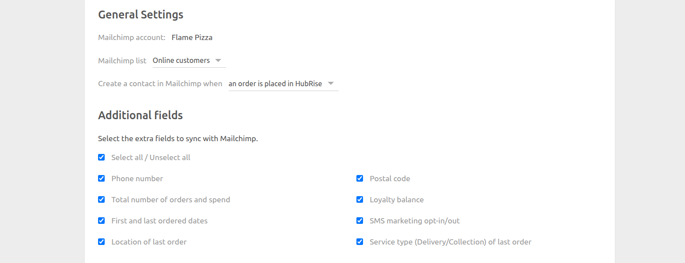

The configuration page allows you to customise the behaviour of Mailchimp Bridge based on your preferences.

## General Settings

- **Mailchimp account**: Displays the Mailchimp account connected to your HubRise location.

- **Mailchimp list**: Indicates the Mailchimp Audience where customers are exported. You can select the desired audience from the drop-down list. The selected audience is also displayed in the Mailchimp header, below your business name.

- **Create a contact in Mailchimp when**: Defines when a contact is created in Mailchimp. You can choose from:
  - **An order is placed in HubRise** – _Recommended_  
    When an order is placed, both customer details and order information are available, allowing more data to be attached to the Mailchimp member. See [Additional Fields](#additional-fields) for more information.
  - **A customer is added to HubRise** _(obsolete)_  
    This mode does not include order details, and is no longer recommended.

## Additional Fields {#additional-fields}

Additional information can be sent to Mailchimp when **An order is placed in HubRise** is selected.

All fields except **SMS marketing opt-in/out** are exported as merge fields in Mailchimp. The **SMS marketing opt-in/out** field is sent as a member tag.

For more details on how customers are synced with Mailchimp audience members, see [Sync Customers](/apps/mailchimp/sync-customers).

## Save the Configuration

To save the configuration, click **Save** at the top of the page.

## Reset the Configuration

If you need to reset the configuration, click **Reset the configuration** at the bottom of the page.
