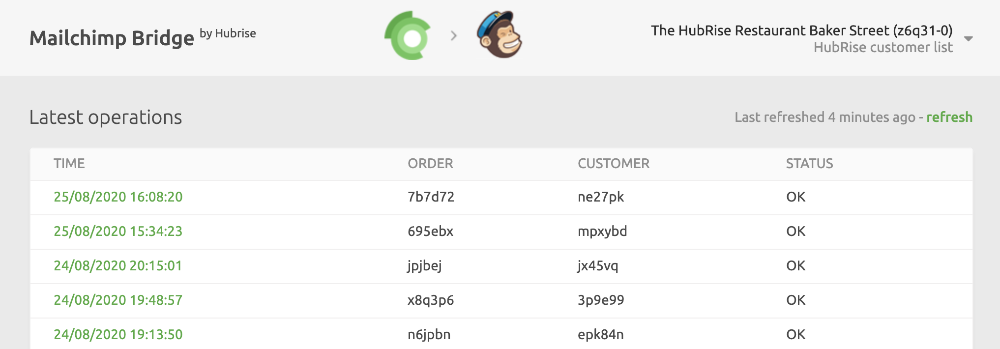

The main page on Mailchimp Bridge shows **Latest operations**, the HubRise requests sent to Mailchimp. The requests from HubRise to the Mailchimp Bridge and the request from Mailchimp Bridge to Mailchimp can be found here.

## Operations table

The **Latest operations** table might contain an **ORDER** and/or a **CUSTOMER** column depending on the configuration options chosen. For more information, see [Configurations Options](/apps/mailchimp/configuration/#configuration-options).

Operations which contain an entry in the **Customer** or the **Order** column, show where a customer's details was sent to Mailchimp. Other operations might be when an export of all HubRise customers is sent to Mailchimp.

You might also find automated **System request** entries. These can be ignored.

When clicked each operation opens and displays all the logs of the API requests exchanged between HubRise and Mailchimp via the Mailchimp Bridge. Information about each API request is contained in three columns:

- **Time**: The time the operation took place.
- **Direction**: The direction of the operation, i.e. whether it was data sent from HubRise to Mailchimp Bridge or whether it was data sent from Mailchimp Bridge to Mailchimp.
- **Status**: The status of the request. The value `OK` confirms that the request was successfully sent. The value `401` or any other value showing in red means that the request has failed.

Each log, when opened, is divided into two parts: Request and Response. The former displays the information sent in the request, and the latter the response received.

## Request from HubRise

The information contained in the **Request** and **Response** logs in the case of a request from HubRise to Mailchimp Bridge are in JSON format.

The request log for the request made from HubRise to Mailchimp Bridge contains the following data fields:

- `id`: the id for the specific request.
- `resource_type`: In respect of the interaction between the Mailchimp Bridge and HubRise, this will always be `customer' as Mailchimp Bridge only allows the transmission of customer data between Mailchimp and HubRise.
- `event_type`: When the customer is created for the first time in Mailchimp, this value will be `create` and any subsequent actions such as the placing of an order, will reflect as `update`.
- `customer_id`: The unique identifier or id of the specific customer.
- `customer_list_id`: The identifier of the list or audience in Mailchimp of which the specific customer will be a member of.
- `email`: The email address of the user.
- `first_name`: The first name of the customer.
- `last_name`: The last name of the customer.
- `phone`: The telephone number of the customer.
- `address_1`, `address_2`, `postal_code`, `city`, `state`, and `country`: The address of the customer.
- `sms_marketing`: This indicates whether the customer is signed up to receive sms marketing. A value of `true` indicates that the customer is signed up and a value of `false` indicates that the customer is not.
- `email_marketing`: This indicates whether the customer is signed up to receive email marketing. A value of `true` indicates that the customer is signed up and a value of `false` indicates that the customer is not.
- `nb_orders`: The number of orders the customer has placed. When the customer is first created, this value will be `0`.
- `order_total`: This is the value of the order placed by the customer.
- `first_order_date`: The date on which the customer placed the first order with the location. When the customer is first created, this value will be `null`.
- `last_order_date`: The date of the last order of the customer. When the customer is first created, this value will be `null`.

For more information on reading and understanding JSON documents, you can look at the [HubRise Documentation](/docs/hubrise-logs) on logs.

## Request to Mailchimp

In the case of a request made from Mailchimp Bridge to Mailchimp, the data is transferred as an URL Encoded Form. In this case the keys and values are encoded in key-value tuples separated by '&', with a '=' between the key and the value. Non-alphanumeric characters in both keys and values are percent encoded: this is the reason why this type is not suitable to use with binary data.

The request made from Mailchimp Bridge to Mailchimp contains the following data fields:

- `email_address`: The email address of the customer which is added to Mailchimp.
- `status`: Indicates whether the customer is subscribed to receive messages through the Mailchimp platform.
- `merge_fields`: Indicates which fields are merged on Mailchimp.
- `FNAME`: The first name of the customer.
- `LNAME`: The last name of the customer.

The response indicates what values were transferred to Mailchimp from Mailchimp Bridge and if the transfer was successful. A status code of 200 indicates that the transfer was successful, whereas other codes will indicate that the transfer was unsuccessful. In the case of an unsuccessful transfer, an error message will also be provided in the relevant response.

The response will contain the following data fields:

- `id`: The unique identifier of the response.
- `email_address`: The email address of the customer.
- `unique_email_id`: The unique identifier of the customer's email address.
- `status`: Indicates whether the customer is subscribed to receive communications through the Mailchimp platform.
- `FNAME`: The first name of the customer.
- `LNAME`: The last name of the customer.
