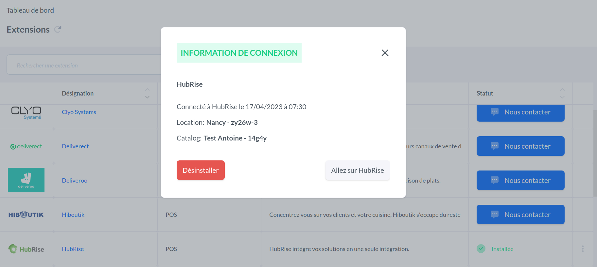

---

**REMARQUE IMPORTANTE :** Si vous ne possédez pas encore de compte HubRise, commencez par en ouvrir un sur la [page d'inscription à HubRise](https://manager.hubrise.com/signup). L'inscription ne prend que quelques minutes !

---

## Connecter Melba

Pour connecter Melba à HubRise, suivez les étapes suivantes :

1. Créez un compte HubRise. Pour plus d'information, consultez notre [Guide de démarrage](/docs/comment-demarrer).
1. Depuis le back-office de Melba, cliquez sur l'icône **EXTENSIONS** dans le menu à gauche.
1. Trouvez HubRise dans la liste des extensions, puis cliquez sur le bouton **Installer**. Une popup s'ouvre, cliquez sur **Connexion**. Vous êtes redirigé vers l'interface HubRise.
1. Si vous avez plusieurs points de vente, choisissez le point de vente à connecter. Si le point de vente sélectionné possède plusieurs listes de clients ou catalogues, cliquez sur **Suivant** pour afficher les listes déroulantes correspondantes, puis sélectionnez les options voulues.
1. Cliquez sur **Autoriser**.
1. Vous êtes redirigé vers l'interface de Melba, et le message **Vous êtes bien connecté à HubRise** s'affiche : la connexion est établie.

## Vérifier le statut de la connexion

Vous pouvez à tout moment vérifier le statut de votre connexion à HubRise :

1. Depuis le back-office de Melba, cliquez sur l'icône **EXTENSIONS** dans le menu à gauche.
1. Trouvez HubRise dans la liste des extensions. Si HubRise est connecté, vous voyez le label **Installée**. A droite de ce label, cliquez sur l'icône avec les 3 points verticaux, puis cliquez sur **Informations de connexion**.
1. Le nom et l'identifiant du point de vente et du catalogue HubRise connectés à Melba apparaissent dans la popup :
   

## Donner accès au support de Melba

Pour faciliter la prise en charge de vos demandes de support, nous vous recommandons de donner accès à votre compte HubRise à l'éditeur de la solution Melba.

Pour donner accès à Melba, procédez comme suit :

1. Depuis le back-office de HubRise, sélectionnez **CONFIGURATION** dans le menu de gauche.
1. Dans la section **Permissions**, ajoutez contact@foodmeup.io en sélectionnant l'option **Manager** dans la liste déroulante des rôles.
1. Cliquez sur l'icône **+** pour ajouter le nouvel utilisateur.

L'ajout d'un utilisateur est le moyen recommandé de donner accès à un tiers à votre point de vente. Le partage de mot de passe est déconseillé pour des raisons de sécurité.

## Contacter le support de Melba

Pour demander la connexion de Melba à HubRise, contactez l'équipe de support de Melba par email sur contact@foodmeup.io. Vous pouvez inclure support@hubrise.com en copie pour un suivi coordonné entre nos deux équipes.

Indiquez dans votre demande le nom de votre compte HubRise, son identifiant HubRise et le point de vente à connecter. Pour plus d'informations voir [Nom et identifiant du point de vente](/docs/points-de-vente#location-name-and-id).

## Déconnecter Melba

1. Depuis le back-office de Melba, cliquez sur l'icône **EXTENSIONS** dans le menu à gauche.
1. Trouvez HubRise dans la liste des extensions. Si HubRise est connecté, vous voyez le label **Installée**. A droite de ce label, cliquez sur l'icône avec les 3 points verticaux, puis cliquez sur **Désinstaller**.
1. Une popup s'ouvre, cliquez sur **Supprimer**.
1. Le message **Vous n'êtes plus connecté à HubRise** s'affiche : la déconnexion est réussie.
