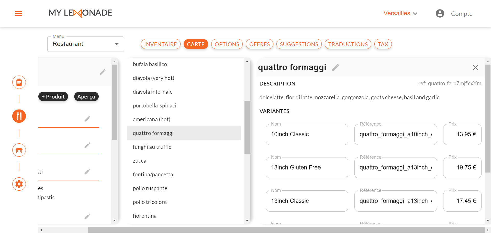
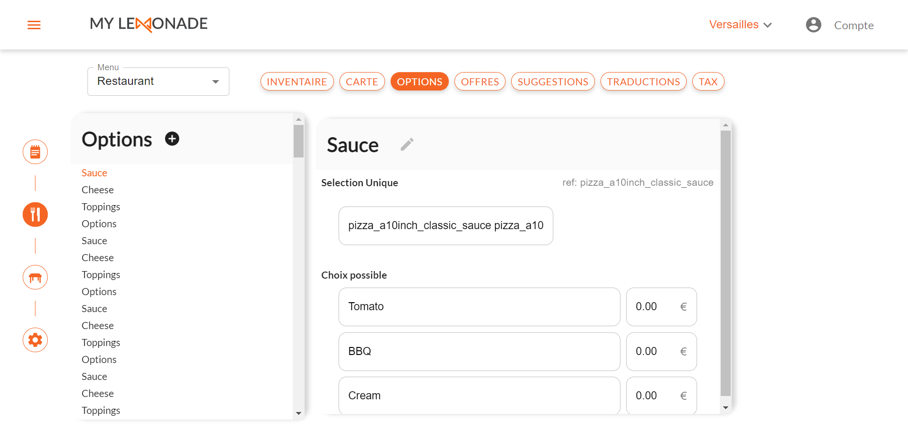
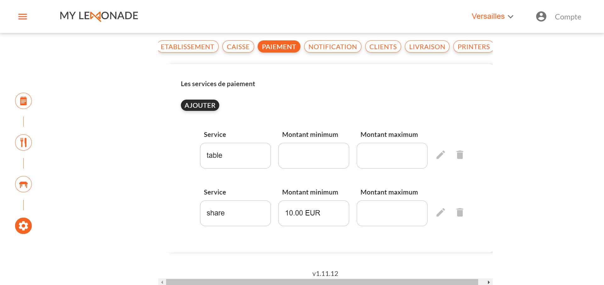
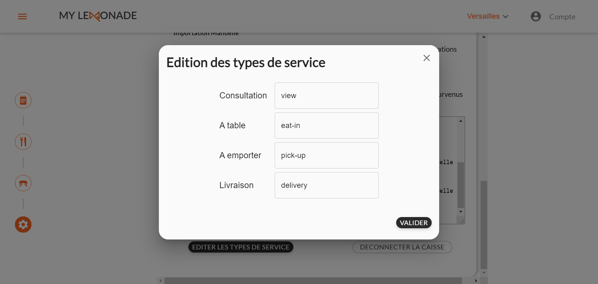

Une fois My Lemonade connecté à HubRise, vous devez configurer My Lemonade afin que les différents éléments présents dans les commandes envoyées soient bien identifiés par vos autres applications connectées, telles que votre solution d'encaissement.

## Importer le catalogue

À tout moment, vous pouvez importer manuellement le catalogue depuis HubRise :

1. Dans le menu latéral, cliquez sur **Paramètres**.
1. Sélectionnez l'onglet **Caisse**.
1. Cliquez sur **FORCER LA RÉIMPORTATION**.

---

**REMARQUE IMPORTANTE :** Le catalogue est importé automatiquement dans My Lemonade au moment de la connexion avec HubRise.

---

Vous pouvez configurer My Lemonade afin que les modifications faites sur le catalogue HubRise mettent à jour automatiquement le menu My Lemonade :

1. Dans le menu latéral, cliquez sur **Paramètres**.
1. Sélectionnez l'onglet **Caisse**.
1. Cochez l'option **Auto importation**.
   

## Exporter le catalogue

Vous pouvez configurer My Lemonade afin que les modifications faites sur le menu My Lemonade mettent à jour automatiquement le catalogue HubRise :

1. Dans le menu latéral, cliquez sur **Paramètres**.
1. Sélectionnez l'onglet **CAISSE**.
1. Cochez l'option **Auto exportation**.

## Produits

Un produit est toujours composé d'au moins une SKU. HubRise ignore le code ref du produit et prend en compte le code ref de la SKU. Suivez les étapes détaillées dans la [section suivante](/apps/my-lemonade/associer-codes-ref#skus) pour en retrouver le code ref.

## SKUs

Une SKU dans HubRise correspond à une variante dans My Lemonade. Pour retrouver le code ref d'une variante, suivez les étapes suivantes :

1. Dans le menu latéral, cliquez sur **Gestion du Menu**.
1. Dans la section **Carte**, sélectionnez la catégorie à laquelle appartient le produit.
1. Sélectionnez le produit désiré. Le code ref de la variante s'affiche dans la section **VARIANTES**, dans le champ **Référence**.
   

## Options

Pour retrouver le code ref d'une option, suivez les étapes suivantes :

1. Dans le menu latéral, cliquez sur **Gestion du Menu**.
1. Sélectionnez l'onglet **OPTIONS**.
1. Dans la section **Options**, sélectionnez l'option désirée. Le code ref s'affiche dans le champ **ref**.
   

## Promotions

Une promotion dans HubRise correspond à une offre dans My Lemonade. Pour retrouver le code ref d'une offre, suivez les étapes suivantes :

1. Dans le menu latéral, cliquez sur **Gestion du Menu**.
1. Sélectionnez l'onglet **OFFRES**.
1. Dans la section **Offres**, sélectionnez l'offre désirée. Le code ref s'affiche dans le champ **ref**.
   

## Méthodes de paiement

Une méthode de paiement dans HubRise correspond à un service de paiement dans My Lemonade. Pour retrouver le code ref d'un service de paiement, suivez les étapes suivantes :

1. Dans le menu latéral, cliquez sur **Paramètres**.
1. Sélectionnez l'onglet **PAIEMENT**. Le code ref s'affiche dans le champ **Service**.
   

## Types de service

Pour retrouver le code ref d'un type de service, suivez les étapes suivantes :

1. Dans le menu latéral, cliquez sur **Paramètres**.
1. Sélectionnez l'onglet **CAISSE**.
1. Cliquez sur **EDITER LES TYPES DE SERVICE**. Le code ref s'affiche dans le champ éditable.
   
