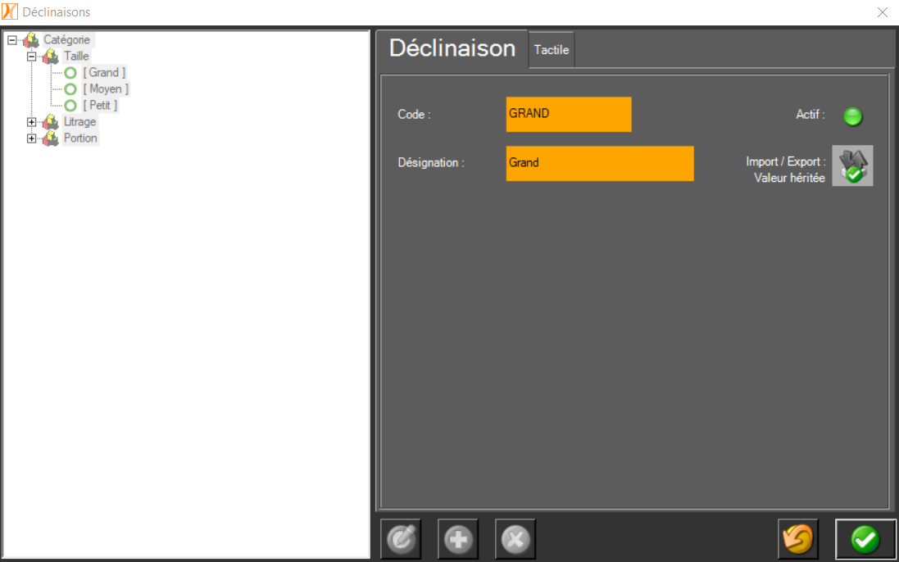
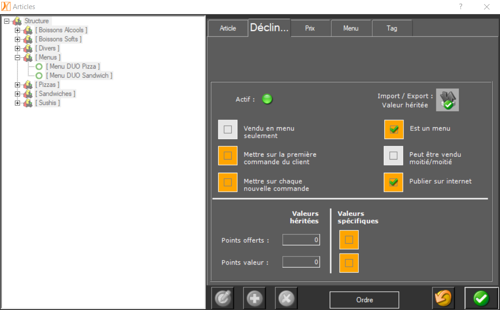

Une fois votre logiciel de caisse Nestor connecté à HubRise, une dernière étape de configuration est nécessaire. Les différents éléments présents dans Nestor sont identifiés par des codes ref. Vous devez indiquer ces codes ref dans les applications connectées à HubRise, afin que les commandes puissent être réceptionnées dans Nestor.

Il y a deux façons de procéder :

- Exporter le catalogue Nestor vers HubRise, puis importer ce catalogue dans les applications connectées qui le permettent.
- Saisir manuellement les codes ref.

Ces deux méthodes sont parfois complémentaires. Seules certaines applications connectées permettent l'import d'un catalogue depuis HubRise. Pour les autres, il faudra saisir manuellement les codes ref.

Cette page explique comment exporter un catalogue et trouver les codes ref depuis Nestor. Pour plus d'informations sur l'import d'un catalogue et la saisie des codes ref dans une application connectée, référez-vous à la documentation de l'application sur le site de HubRise.

## Exporter le catalogue(#export-catalog)

Nestor exporte le catalogue vers HubRise dans les deux cas suivants :

- Lorsque la connexion est établie.
- Lorsque le catalogue est modifié.

Il n'est pas possible d'exporter manuellement le catalogue.

Tous les articles créés dans Nestor ne sont pas systématiquement exportés vers HubRise. Pour activer la synchronisation d'un article particulier, suivez les étapes suivantes :

1. Dans la barre de menu de Nestor, sélectionnez **Gestion** > **Articles** > **Fiche articles**.
1. Sélectionnez l'article à synchroniser.
1. Naviguez vers l'onglet **Déclinaison**.
1. Cochez l'option **Publier sur internet**.
1. Validez la modification.
   

## SKUs

Une SKU (_Stock Keeping Unit_) dans HubRise est un article Nestor dans une déclinaison donnée. Par exemple, l'article _Margarita_ en déclinaison _Grande_ correspond à la SKU _Margarita Grande_.

Pour retrouver le code ref d'un SKU, deux cas peuvent se présenter selon que l'article a des déclinaisons ou non.

### Articles sans déclinaison(#no-modifiers)

1. Dans la barre de menu de Nestor, sélectionnez **Gestion** > **Articles** > **Fiche articles**.
1. Sélectionnez l'article désiré. Dans l'onglet **Article**, le code ref de la SKU s'affiche dans le champ **Code**.
   

### Articles avec déclinaisons

1. Suivez les mêmes étapes que dans la section précédente et notez le code présent dans le champ **Code**.
1. Fermez la fenêtre **Articles**.
1. Dans la barre de menu de Nestor, sélectionnez **Gestion** > **Déclinaisons** > **Fiche déclinaisons**.
1. Sélectionnez la déclinaison désirée. Dans l'onglet **Déclinaison**, le code ref s'affiche dans le champ **Code**.
1. Notez le code présent dans le champ **Code**.
1. Le code ref de la SKU est égal au code de l'article, suivi du caractère `|`, suivi du code de la déclinaison. Par exemple : un article _Pizza_ dont le code est `PIZ`, ayant une déclinaison _Grande_ dont le code est `GRA`, résulte en un code ref `PIZ|GRA`.
   

## Options

Les options dans HubRise correspondent aux ingrédients dans Nestor.

Pour retrouver le code ref d'une option, suivez les étapes suivantes :

1. Dans la barre de menu de Nestor, sélectionnez **Gestion** > **Ingrédients** > **Fiche ingrédients**.
1. Sélectionnez l'option désirée. Dans l'onglet **Ingrédient**, le code ref s'affiche dans le champ **Code**.
   

## Remises

Les remises dans HubRise correspondent aux offres promotionnelles dans Nestor. Celles-ci ne sont pas encore remontées dans l'export de catalogue vers HubRise, cette fonctionnalité est en cours de développement et sera disponible très prochainement. Vous pouvez néanmoins créer manuellement des remises dans votre système de commande, puis renseigner leur code ref en suivant la procédure ci-dessous.

Pour retrouver le code ref d'une remise, suivez les étapes suivantes :

1. Dans la barre de menu de Nestor, sélectionnez **Gestion** > **Offres promotionnelles**.
1. Sélectionnez la remise désirée. Dans l'onglet **Générale**, le code ref s'affiche dans le champ **Code**.
   

## Promotions

Les promotions dans HubRise correspondent aux menus dans Nestor. Pour retrouver le code ref d'un menu, suivez les mêmes étapes que pour un [article sans déclinaison](/apps/nestor/map-ref-codes#no-modifiers). Dans Nestor, un menu est considéré comme un article dont l'option **Est un menu**, dans l'onglet **Déclinaison**, est cochée.

## Méthodes de paiement

Les méthodes de paiement dans HubRise correspondent aux moyens de paiement dans Nestor. Leurs codes ref ne sont pas encore synchronisés, cette fonctionnalité est en cours de développement et sera disponible prochainement.

## Types de service

Un type de service dans HubRise correspond à la manière dont une commande doit être produite ou livrée. Cette notion n'est pas encore supportée par Nestor, mais elle pourrait être disponible prochainement.
