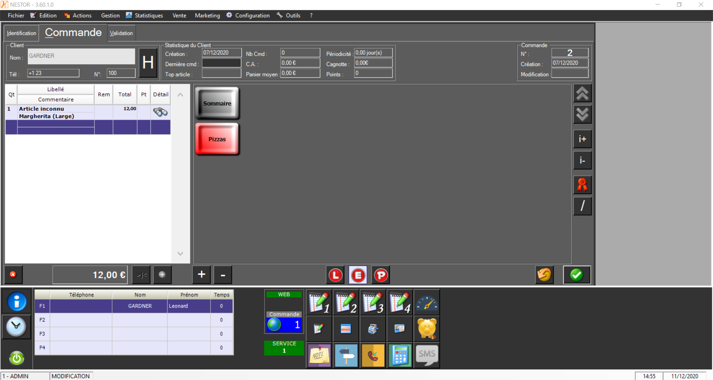
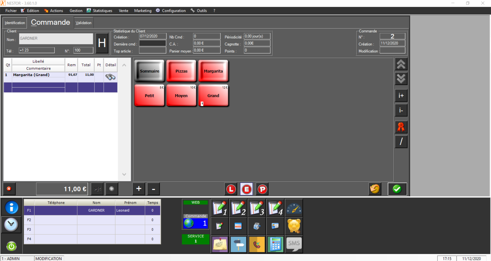

À partir du moment où Nestor est connecté à HubRise et le catalogue est synchronisé, plus aucune action n'est requise de votre part. Votre logiciel de caisse va recevoir automatiquement toutes les commandes envoyées à HubRise depuis d'autres applications.

## Recevoir des commandes

Nestor vérifie toutes les 20 secondes grâce à l'utilitaire WebNES si de nouvelles commandes ont été envoyées à HubRise. Une alerte visuelle et sonore vous signale l'arrivée d'une nouvelle commande dans Nestor.
   

Pour voir la liste des commandes en attente, cliquez sur l'alerte. Pour voir le détail de la commande et la valider, cliquez sur la ligne correspondante.
   

### Commande avec des articles inconnus

Dans le cas où une commande contient des produits dont le code ref n'est pas reconnu, ces derniers sont remplacés par des produits nommés **Article inconnu**. Si une commande contient une ou plusieurs de ces lignes, il n'est pas possible de valider la commande. Pour remédier à ce problème, suivez les étapes suivantes :
1. Sélectionnez votre commande pour en voir le détail. Certaines lignes intituées **Article inconnu** sont présentes.
1. Sélectionnez la dernière ligne vide. Votre menu apparaît.
   
1. Sélectionnez et ajoutez le produit correspondant en vous aidant de la description de la ligne **Article inconnu**.
1. Supprimez la ligne **Article inconnu** désormais remplacée.
   
1. Répétez ces étapes pour chaque ligne **Article inconnu**.
1. Lorsque toutes ces lignes sont supprimées, validez la commande.

Pour éviter que ce problème se reproduise, vérifiez les codes ref de vos produits. Les articles inconnus sont causés par des codes refs invalides. Pour trouver un code ref, consultez la page [Trouver les codes ref](/apps/nestor/map-ref-codes).

### Produits avec des prix différents

Dans le cas où une commande contient des produits dont le prix est différent de celui sauvegardé dans le catalogue de Nestor, il leur est attribué une remise en pourcentage. Par exemple, si une *Margarita Grande* à 11 euros est commandée et que ce produit est à 12 euros dans le catalogue de Nestor, un champ *Remise* égal à 91,67 sera présent dans le détail de la commande et le montant à régler sera de 11 euros.
   

### Enregistrement d'un client

Lorsque le client qui a créé une commande n'est pas connu de Nestor, une étape d'association du client apparaît avant celle de validation de la commande. Deux choix s'offrent alors à vous :
- Créer un nouveau client.
- Le rattacher à un client connu de Nestor. Dans ce cas, les informations du client seront écrasées par celles provenant d'HubRise.

Lors de cette étape, il vous est demandé de faire le même choix concernant l'adresse.
   

### Statut de la commande

Une commande a plusieurs statuts au cours de son cycle de vie :
1. *New* lorsqu'elle vient d'être créée.
1. *Received* lorsqu'elle a été reçue dans Nestor.
1. *Accepted* lorsqu'elle a été validée.

Après validation de la commande, la mise à jour du statut dans HubRise peut prendre jusqu'à 20 secondes.

### Détails de la commande

Vous pouvez retrouver toutes vos commandes en suivant les étapes suivantes.
1. Sélectionnez **Actions** dans la barre de menu.
1. Sélectionnez l'option **Carnet de commandes**. La fenêtre des commandes s'ouvre.
1. Sélectionnez l'onglet correspondant au type de commande que vous souhaitez visualiser : *En cours*, *Web*, *Annulées*, *Différées*, *Tickets / Factures*.
1. Double-cliquez sur la ligne correspondant à la commande désirée. La fenêtre détaillant ses informations s'ouvre.

**Fonctionnalité prévue :** Il n'est pour l'instant pas possible de savoir de quelle application (LivePepper, Uber Eats, etc.) provient la commande. Cette fonctionnalité est en cours de développement. Si elle est nécessaire à votre utilisation de Nestor, écrivez à info@svitex.com.

## Envoyer les commandes

Cette fonctionnalité est en cours de développement et sera disponible prochainement.

## Temps de préparation

Nestor permet de configurer les temps de préparation, dont la valeur par défaut est de 30 minutes. Trois paramètres indépendants correspondant aux types de commandes peuvent être changés :
- En livraison (*L*).
- À emporter (*E*).
- Sur place (*P*).

Notez que HubRise ne prend en compte que le temps de livraison, ce qui explique que seul le champ `delivery.door_time` ne soit envoyé dans la requête de mise à jour vers HubRise.

Pour accéder à ce panneau de configuration, sélectionnez le bouton avec un icône en forme d'horloge en bas à gauche de Nestor.
   