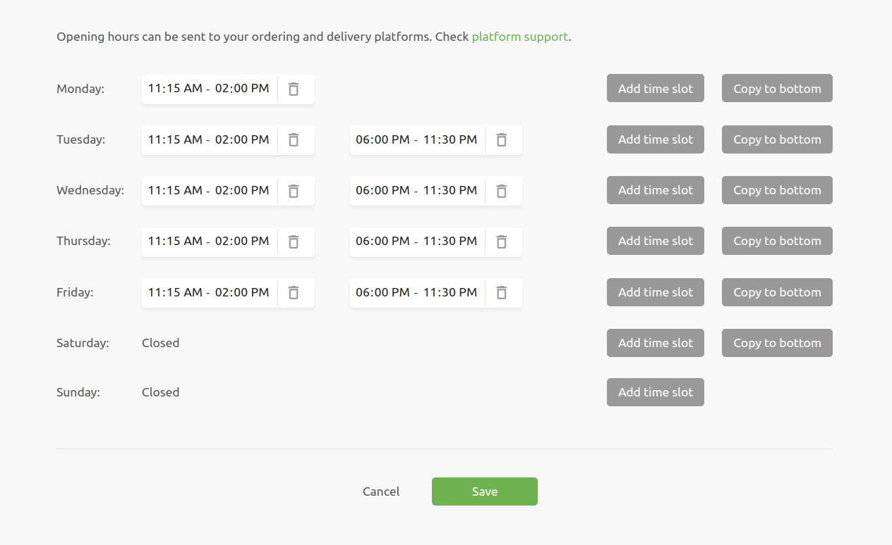

The **Opening Hours** page allows you to specify the times when your establishment is open for business on any connected ordering and delivery platforms
supporting this feature. See [Platform Support](#platform-support) for more information.

To navigate to the Opening Hours page, select the **Opening Hours** tab located at the top of the screen. On mobile devices, select it in the burger menu.

The interface provides a weekly schedule with options to specify time slots for each day.

## Manage Opening Hours

For each day of the week, you can specify multiple time slots when your establishment is open:

- To add a time slot, click the **Add time slot** button.
- To replicate the time slots to all remaining days of the week, use the **Copy to bottom** feature.
- To remove a time slot, click the trash bin icon next to it. The business is considered closed if no hours are specified for a given day.

## Edit Time Slots

Each time slot has two editable fields to enter the start and end time. These fields can be formatted in 12-hour or 24-hour time formats, depending on your browser settings. Click on any time field to edit the hours.

Time slots must not overlap, and their start and end times must be in chronological order. The cutoff time is 6am by default, meaning that any hour between midnight and 6am is considered to be the next day. The cutoff time can be changed by contacting HubRise support, if your establishment remains open through 6am.

## Save Changes

When you make any changes to the opening hours, the **Save** and **Cancel** buttons will appear at the bottom of the page. These buttons will disappear after you have either saved or reverted the changes.

- To apply your changes, click the **Save** button.
- To discard any changes, click the **Cancel** button or leave the page without saving.

## Platform Support {#platform-support}

Opening hours synchronisation is currently supported with:

- Deliveroo
- Uber Eats
- Just Eat, in markets using Flyt.

Ensure that the feature is enabled on the respective platform as described below.

### Just Eat Specifics

For Just Eat integrations, a quick eligibility check can be performed:

- Open the **Connections** page in the HubRise back office.
- Verify that the bridge listed is **Just Eat Flyt Bridge** rather than **Just Eat Takeaway Bridge**.

Only the Flyt Bridge supports opening hours synchronisation.

### Enable Synchronisation

To enable the synchronisation of opening hours to these platforms:

1. Open the platform's bridge, and navigate to the **Settings** page.
2. In the **Location** section, tick the checkbox labelled **Enable automatic opening hours push**.
3. Save the changes.

### Support for Other Apps

Other apps may support opening hours synchronisation. Refer to the documentation of the other app on the HubRise website, or contact HubRise support to verify.
