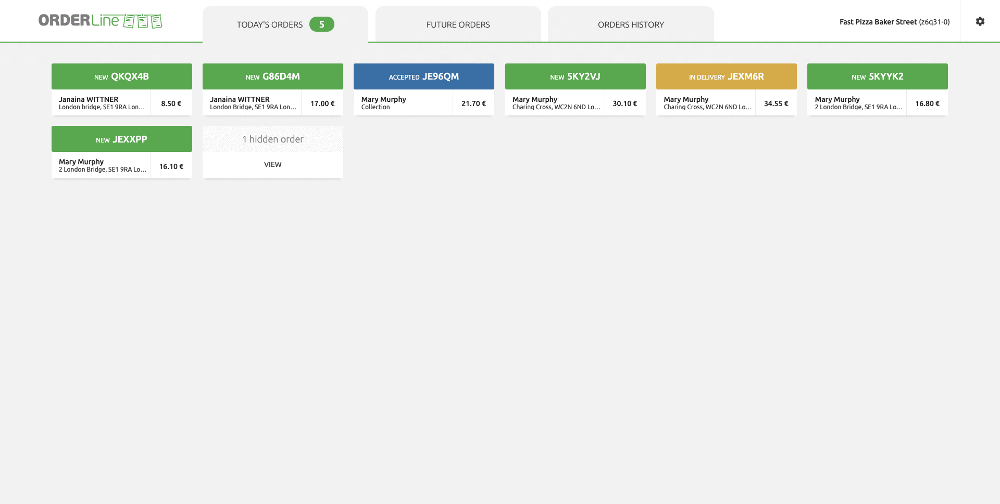
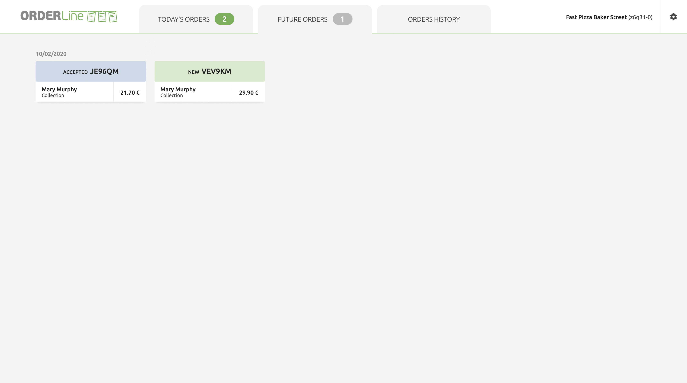
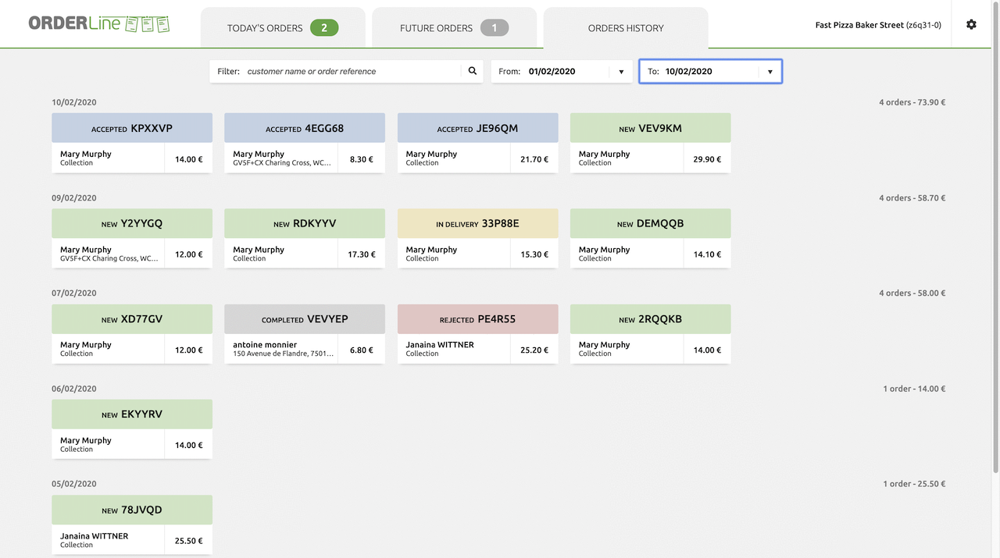
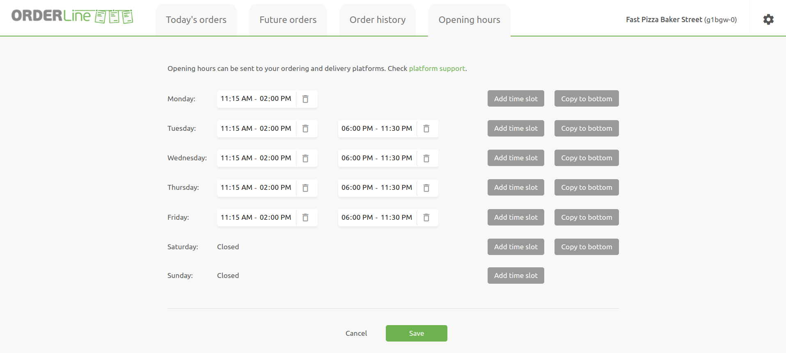

## Today's Orders

The **Today's Orders** tab displays all orders with a delivery date equal to today's date. Alongside, an easy-to-spot order counter reflects the count of orders currently in the **New** status.

Orders are sorted by their expected delivery or collection time, with the earliest orders at the beginning of the list.

Orders may be hidden depending on the **Hide Order** setting customisation. These orders can be seen from **Today's Orders** tab by selecting **VIEW** on the hidden order card. For more information, see [Order Status Flow](/apps/orderline/settings#order-status-flow).

## Future Orders

The **Future Orders** tab displays all orders with a delivery date greater than today's date. The order counter reflects the count of future orders currently in the **New** status.

## Orders History

OrderLine provides a comprehensive view of all orders: past, present, and future. To view this list, click **Order history**.

The orders are displayed starting with the most recent.

For a targeted search within your order history, you can use the available filters, which include:

- Customer name or order reference.
- Delivery date range.

## Opening Hours

The **Opening Hours** tab allows you to configure the operating times of your store. Opening hours can be synchronised with online ordering solutions or food ordering and delivery platforms connected to your HubRise account.

For more information on managing your opening hours, see [Opening Hours](/apps/orderline/opening-hours).
