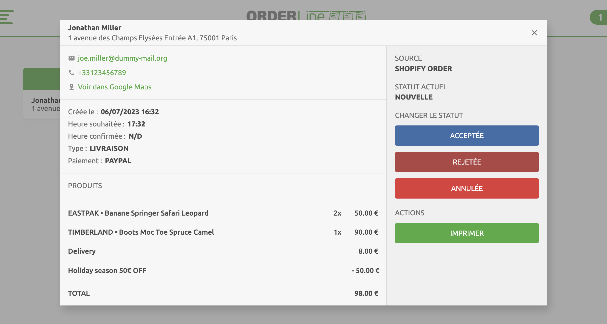

Vous pouvez personnaliser l'enchaînement des statuts afin d'adapter la gestion des commandes à votre activité. Cette section décrit l'enchaînement des statuts par défaut, ainsi que les actions permettant d'accepter ou d'imprimer les commandes. Pour personnaliser l'enchaînement, voir la rubrique [Définir l'enchaînement des statuts](/apps/orderline/parametres/#encha-nement-des-statuts-de-commande).

## Voir une commande

Pour consulter les détails d'une commande, cliquez sur la carte correspondante. Cliquez sur l'icône Fermer <InlineImage width="23" height="23"></InlineImage> ou n'importe où en dehors de la carte de commande pour refermer celle-ci.

La vue Carte de commande affiche toutes les informations nécessaires au traitement de la commande :

- L'adresse du client. Un lien **Afficher dans Google Maps** s'affiche si des coordonnées GPS ont été associées à la commande.
- La date et l'heure de création de la commande.
- La date et l'heure souhaitées de livraison ou de récupération par le client.
- La date et l'heure confirmées, qui correspondent à l'horaire souhaité sauf si vous l'avez modifié.
- Le type de commande. Les types possibles sont **LIVRAISON**, **RÉCUPÉRATION** et **SUR PLACE**.
- Liste des produits à préparer, avec les commentaires clients éventuels.
- Le statut de la commande. Vous pouvez modifier le statut d'une commande ou imprimer le reçu en sélectionnant le bouton correspondant.

## Accepter une commande

Pour accepter une commande, ouvrez la carte de la commande puis cliquez sur **ACCEPTÉE**.

Vous pouvez ajouter un message personnalisé destiné au client et ajuster le délai de livraison ; ces informations seront communiquées au client si vos applications connectées le permettent. Pour actualiser la date ou ajouter un commentaire, cliquez sur l'icône de stylo <InlineImage width="44" height="38"></InlineImage>, ajustez la date et l'heure, rédigez votre message, puis cliquez sur **ACCEPTÉE**. Si vos applications connectées le permettent, le client recevra alors un e-mail automatisé contenant votre message et la nouvelle heure de livraison.

---

**REMARQUE IMPORTANTE :** Les mises à jour des heures de livraison, ainsi que l'envoi des messages, doivent être pris en charge par une de vos applications connectées. Pour plus d'informations sur la configuration, voir la rubrique [Saisies complémentaires](/apps/orderline/parametres/#saisies-compl-mentaires).

---

Une fois la commande acceptée, son statut passe à **Acceptée**. Vous pouvez imprimer le reçu de la commande et modifier à nouveau le statut lorsque vous êtes prêt.

<video controls title="OrderLine Accept Order Example">
  <source src="./images/020-accept-order.webm" type="video/webm" />
</video>

## Rejeter une commande

Pour rejeter une commande, ouvrez la carte de la commande puis cliquez sur **REJETÉE**. Vous pouvez ajouter un commentaire lors du rejet de la commande. Pour plus d'informations, voir la rubrique [Saisies complémentaires](/apps/orderline/parametres/#saisies-compl-mentaires).

Lorsqu'une commande est rejetée, elle disparaît de l'onglet **Aujourd'hui** et devient masquée. Cliquez sur la carte masquée dans l'onglet **Aujourd'hui** pour visualiser les commandes masquées et les rouvrir si nécessaire.

<video controls title="OrderLine Reject Order Example">
  <source src="./images/021-reject-order.webm" type="video/webm" />
</video>

## Marquer une commande en livraison

Lorsque la commande doit être livrée au client, sélectionnez **EN LIVRAISON** pour la commande ayant le statut **Acceptée**.

<video controls title="OrderLine Order in Delivery Example">
  <source src="./images/022-order-set-status-in-delivery.webm" type="video/webm" />
</video>

## Terminer une commande

Les commandes ayant le statut **En livraison** peuvent être mises à jour comme suit :

- Une fois la commande livrée, cliquez sur **TERMINÉE**. Une fois la commande terminée, vous pouvez imprimer le reçu de la commande, mais vous ne pouvez plus modifier son statut.
- Si la commande n'a pas pu être livrée, cliquez sur **ÉCHEC LIVRAISON**.

Les commandes terminées sont, par défaut, masquées dans la liste **Aujourd'hui**. Cliquez sur la carte masquée dans l'onglet **Aujourd'hui** pour faire réapparaître la commande.

<video controls title="OrderLine Complete Order Example">
  <source src="./images/023-order-set-completed.webm" type="video/webm" />
</video>

## Imprimer une commande

OrderLine se connecte aux imprimantes reconnues par le système d'exploitation. L'impression des tickets passe par la boîte de dialogue d'impression.

Pour imprimer un reçu de commande sur une imprimante locale, procédez comme suit :

1. Ouvrez la carte de la commande.
1. Cliquez sur **IMPRIMER**.
1. Suivez les instructions indiquées dans la boîte de dialogue d'impression.

OrderLine peut également imprimer les reçus de commande de façon automatique dès la réception de la commande, sans passer par la boîte de dialogue d'impression. L'impression automatique nécessite que l'imprimante soit enregistrée dans Google Cloud Print. Pour plus de détails, voir la rubrique [Impression](/apps/orderline/parametres/#impression).

Pour une meilleure lisibilité, les reçus sont présentés sous forme de sections délimitées par un trait plein. Ces sections contiennent les mêmes informations que la carte de commande. Pour plus d'informations sur les cartes de commande, voir la rubrique [Visualiser une commande OrderLine](#voir-une-commande).

Les reçus contiennent les informations suivantes :

- Le type de commande. Les types possibles sont **LIVRAISON**, **RÉCUPÉRATION** ou **SUR PLACE**.
- Le mode de paiement.
- L'adresse et le commentaire de livraison, ainsi que les coordonnées GPS si elles sont présentes dans la commande.
- L'heure de livraison confirmée, qui correspond à l'heure de livraison réelle, si cette donnée est prise en charge par le logiciel de caisse. Pour plus d'informations, voir la rubrique [Saisies complémentaires](/apps/orderline/parametres/#saisies-compl-mentaires).
- Les menus et promotions sont énumérés avec leur nom, suivi de la liste des produits qu'elles contiennent.
- Les produits commandés par le client sont regroupés. Les options ajoutées ou supprimées sont indiquées dans une liste à puces :
  - Les articles standard retirés du produit sont biffés par un trait plein.
  - Options.
  - Garnitures ou autres suppléments.
- La référence indique le numéro de commande. La date et l'heure de livraison s'affichent uniquement si l'heure de livraison confirmée est différente de l'heure de livraison d'origine.
